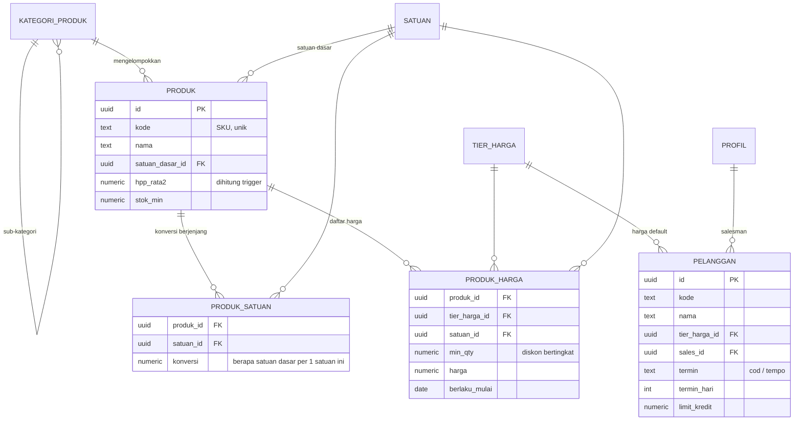
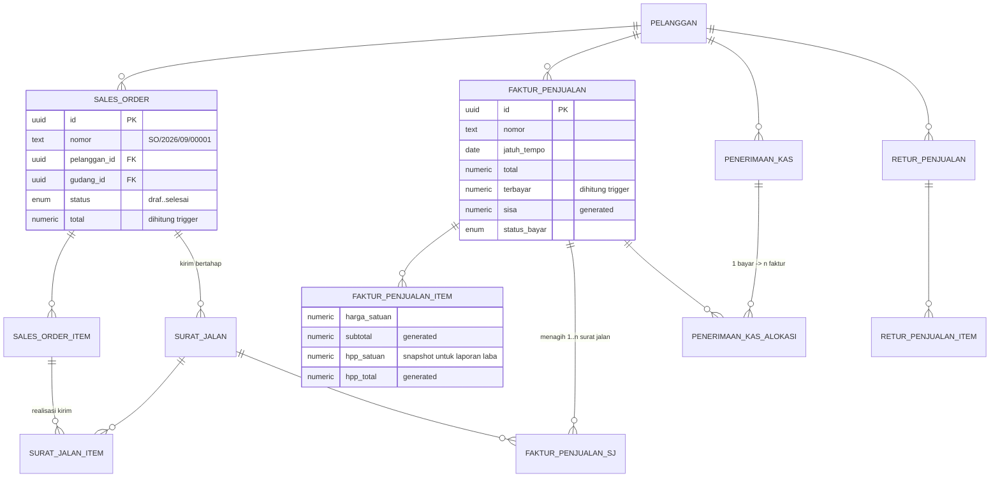
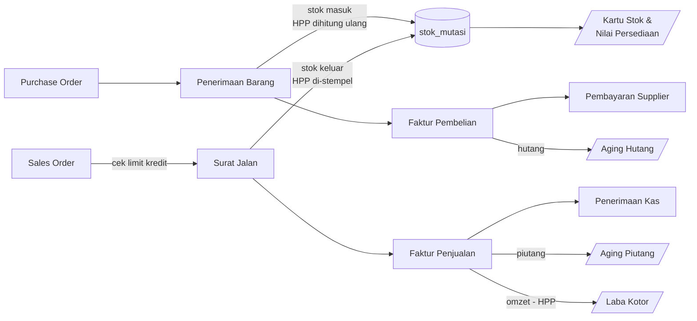

# Skema Database — Ayyubi Finance (Fase 1 & 2)

Postgres / Supabase. Penamaan tabel dan kolom memakai bahasa Indonesia
agar konsisten dengan istilah yang dipakai di lapangan.

Cakupan file ini: **Fase 1** (jual sampai terima uang) dan **Fase 2**
(beli, HPP, laba). CRM, akuntansi penuh, dan HR belum termasuk.

---

## 1. Ringkasan modul

| Migrasi | Isi |
|---|---|
| `0001_ekstensi_enum.sql` | Ekstensi, enum, penomoran dokumen otomatis |
| `0002_master_data.sql` | Profil, gudang, kategori, satuan, produk, satuan berjenjang, tier & daftar harga, pelanggan, supplier |
| `0003_inventori.sql` | Saldo stok, kartu stok, penyesuaian, transfer gudang |
| `0004_penjualan.sql` | SO → Surat Jalan → Faktur → Penerimaan Kas, retur jual |
| `0005_pembelian.sql` | PO → Penerimaan Barang → Faktur Beli → Pembayaran, retur beli |
| `0006_fungsi_trigger.sql` | HPP rata-rata bergerak, posting stok, total dokumen, limit kredit |
| `0007_view_laporan.sql` | Stok, kartu stok, aging piutang/hutang, laba kotor |
| `0008_rls.sql` | Row Level Security per peran |
| `0009_seed_awal.sql` | Satuan, tier harga, gudang, kategori awal |
| `0010_kas_bank.sql` | Akun kas/bank, saldo & kartu per akun -- **migrasi tambahan**, ditulis setelah 0001-0009 sudah dijalankan di database asli, jadi dirancang non-destruktif (backfill, bukan drop/replace) |

Total 40 tabel + 14 view. Migrasi 0010 dan seterusnya adalah tambahan
inkremental di atas skema Fase 1 & 2 -- selalu jalankan berurutan sesuai
nomor, jangan lompat.

---

## 2. ERD

### 2.1 Master data



### 2.2 Inventori — semua pergerakan bermuara ke sini


`STOK_MUTASI` adalah buku besar persediaan: **append-only**, tidak boleh
di-`UPDATE` atau `DELETE` (dijaga trigger). Tabel `STOK` hanyalah saldo
hasil rekap agar query cepat.

### 2.3 Siklus penjualan (Fase 1)



### 2.4 Siklus pembelian (Fase 2)


### 2.5 Alur dokumen dan dampaknya ke stok / uang



---

## 3. Keputusan desain yang perlu diketahui

**Satuan berjenjang.** Stok, HPP, dan seluruh kolom `qty_dasar` selalu
dalam **satuan dasar**. Setiap baris transaksi menyimpan `satuan_id` +
`konversi` yang dipakai saat itu, lalu `qty_dasar` di-*generate* otomatis
(`qty * konversi`). Konversi disalin ke baris transaksi, bukan dibaca
ulang dari master, supaya dokumen lama tidak berubah ketika master
satuan diedit.

**HPP rata-rata bergerak (moving average).** Dipelihara di
`produk.hpp_rata2` per produk, lintas gudang:

```
HPP_baru = (qty_lama × HPP_lama + qty_masuk × harga_masuk) / (qty_lama + qty_masuk)
```

Hanya barang **masuk** yang menggerakkan HPP. Barang keluar memakai HPP
yang berlaku saat itu dan menyimpannya di `stok_mutasi.hpp_satuan`.
Biaya angkut di penerimaan barang (`biaya_tambahan`) dialokasikan
proporsional terhadap nilai baris, jadi ongkos kirim ikut masuk HPP.

**Snapshot HPP di faktur.** `faktur_penjualan_item.hpp_satuan` diisi
sekali saat faktur dibuat. Tanpa ini, laporan laba bulan lalu akan
berubah setiap kali ada pembelian baru yang menggeser rata-rata.

**Posting stok baru terjadi saat status `selesai`.** Dokumen berstatus
`draf` boleh diedit bebas tanpa menyentuh stok. Pembatalan tidak
menghapus baris kartu stok, melainkan membuat **mutasi balik**.

**Stok minus ditolak.** Trigger memblokir mutasi keluar yang membuat
saldo gudang negatif, kecuali jenis `saldo_awal` (untuk migrasi data).
Kalau bisnisnya memperbolehkan jual-dulu-kirim-belakangan, longgarkan di
`fn_mutasi_sebelum()`.

**Limit kredit.** Dicek saat Sales Order disetujui, hanya untuk pelanggan
bertermin `tempo` dengan `limit_kredit > 0`.

**Non-PKP, tidak ada PPN.** Ayyubi Finance belum PKP, jadi kolom
`ppn_persen`/`ppn_nilai` tetap ada di skema (supaya tidak perlu migrasi
ulang kalau suatu saat jadi PKP) tapi **selalu 0** dan **disembunyikan
dari form**. `dpp` dan `total` di kode aplikasi jadi identik.

**Kanal penjualan (`kanal_penjualan`).** Ayyubi jualan lewat dua pola
sekaligus: canvassing (sales bawa barang, transaksi tuntas di tempat)
dan online (Tokopedia/Shopee/TikTok/WhatsApp). Kolom `kanal` di
`sales_order` dan `faktur_penjualan` menandai asal order, dipakai untuk
laporan omzet per kanal.

Pesanan online **tidak** membuat satu baris `pelanggan` per pembeli —
platform sudah memegang data itu, dan volumenya bisa ratusan per bulan.
Sebagai gantinya, seed (`0009`) menyediakan empat akun pelanggan
agregat (`SHOPEE`, `TOKPED`, `TIKTOK`, `WA-UMUM`); order online
menunjuk ke akun agregat kanalnya, dan nama penerima paket yang
sesungguhnya disimpan di `sales_order.nama_penerima` (bukan relasi ke
tabel `pelanggan`). Kalau ada pembeli WA yang jadi langganan tetap dan
perlu dilacak/ditagih sendiri, buat baris `pelanggan` khusus untuknya —
akun `WA-UMUM` hanya untuk transaksi lepas.

Yang **tidak** termasuk di sini: sinkronisasi otomatis via API
marketplace (ambil order langsung dari Shopee/Tokopedia/TikTok). Order
online tetap diinput manual oleh staf ke Sales Order. Integrasi API
per platform adalah pekerjaan terpisah yang jauh lebih besar (autentikasi
per platform, webhook, pemetaan SKU, throttling) — taruh di backlog
fase lanjut kalau volumenya sudah menjustifikasi.

**Nomor dokumen.** Format `PREFIX/YYYY/MM/00001`, dihasilkan
`generate_nomor()` dan direset tiap bulan. Kirim `nomor` sebagai `null`
dari aplikasi — trigger yang mengisi.

**Kas & Bank (`akun_kas_bank`, ditambah lewat 0010).** Sebelum ini,
`penerimaan_kas`/`pembayaran_supplier` cuma punya kolom teks bebas
`bank_nama` — uangnya tidak benar-benar tertaut ke rekening/kas manapun,
tidak ada cara melihat saldo per akun. Sekarang setiap transaksi WAJIB
menunjuk `akun_id`. Saldo per akun dihitung **live lewat view**
(`v_saldo_kas_bank` = `saldo_awal` + semua penerimaan − semua
pembayaran berstatus bukan `dibatalkan`/`ditolak`), bukan kolom saldo
tersimpan yang perlu trigger — sengaja dihindari karena sesi ini sudah
2 kali menemukan bug "lupa cabang pembalikan saat dibatalkan" pada
trigger posting bergaya lama; view yang dihitung ulang tiap query tidak
punya kelas bug itu sama sekali. `v_kartu_kas_bank` memakai pola
window-function yang sama seperti `v_kartu_stok` untuk saldo berjalan.
Kolom `bank_nama` lama di kedua tabel transaksi **dibiarkan** (bukan
di-drop) karena 0010 ditulis setelah database sudah berisi data uji
coba — lihat migrasi 0010 untuk detail backfill-nya.

---

## 4. Cara menjalankan

```bash
supabase db reset
```

Atau jalankan berurutan `0001` → `0009` di SQL Editor Supabase.

Setelah user pertama mendaftar, naikkan perannya:

```sql
update profil set peran = 'owner' where id = '<uuid-user>';
```

---

## 5. Contoh alur penuh (uji cepat)

```sql
-- 1. Produk dengan satuan berjenjang: PCS (dasar), LUSIN = 12, DUS = 144
insert into produk (kode, nama, kategori_id, satuan_dasar_id)
select 'SKU-001', 'Sabun Batang', k.id, s.id
from kategori_produk k, satuan s where k.kode = 'UMUM' and s.kode = 'PCS';

insert into produk_satuan (produk_id, satuan_id, konversi)
select p.id, s.id, v.konv
from produk p, satuan s,
     (values ('PCS', 1), ('LSN', 12), ('DUS', 144)) as v(kode, konv)
where p.kode = 'SKU-001' and s.kode = v.kode;

-- 2. Beli 10 DUS @ Rp 900.000 + ongkos angkut Rp 200.000
--    -> HPP per PCS = (9.000.000 + 200.000) / 1.440 = Rp 6.388,89
insert into penerimaan_barang (supplier_id, gudang_id, biaya_tambahan, status)
values ('<supplier>', '<gudang>', 200000, 'draf') returning id;

insert into penerimaan_barang_item (pb_id, produk_id, satuan_id, konversi, qty, harga_satuan)
values ('<pb>', '<produk>', '<satuan DUS>', 144, 10, 900000);

update penerimaan_barang set status = 'selesai' where id = '<pb>';  -- stok & HPP jalan

-- 3. Cek hasilnya
select kode, nama, qty, hpp_rata2, nilai_persediaan from v_stok_produk;
select * from v_kartu_stok order by tanggal, id;
```

---

## 6. Yang belum ada (sengaja ditunda)

| Kebutuhan | Fase |
|---|---|
| Pipeline CRM, kunjungan salesman, target & komisi | 3 |
| Batch / expired date / serial number | 3 |
| Stock opname terstruktur | 3 |
| COA, jurnal umum, neraca, arus kas | 4 |
| e-Faktur / perpajakan | 4 |
| Multi-cabang (dimensi di atas gudang) | 4 |

Kolom `produk.pakai_batch` sudah disiapkan sebagai penanda agar
penambahan batch di fase 3 tidak perlu mengubah struktur transaksi.
