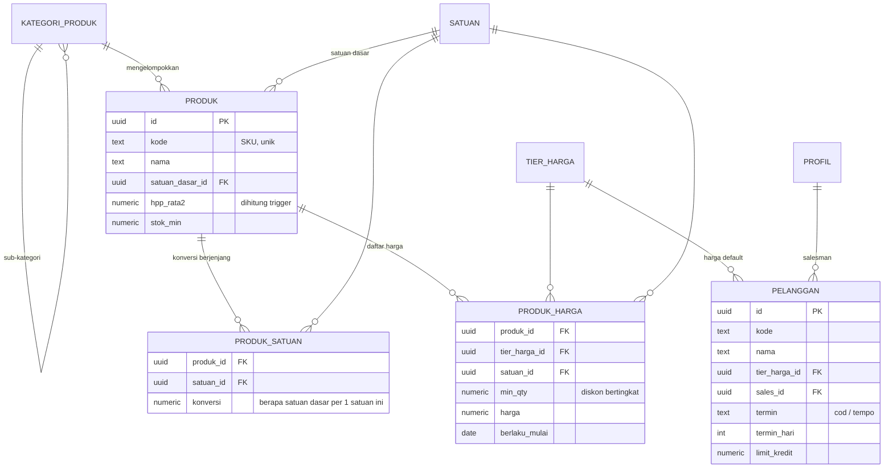
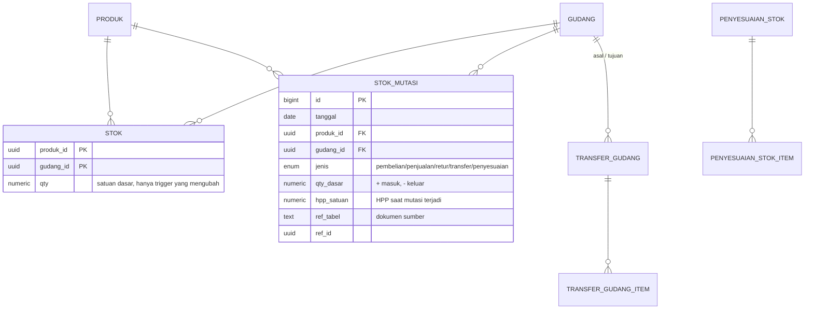
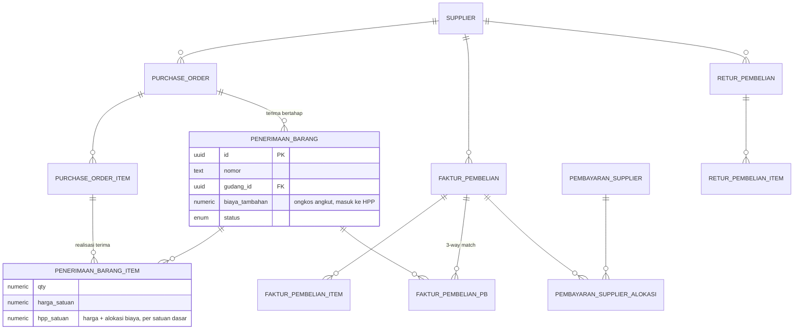
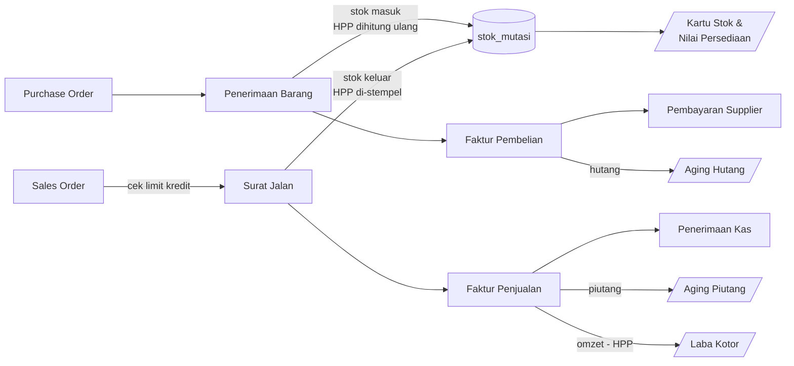

# Skema Database — Ayyubi Finance (Fase 1 & 2)

Postgres / Supabase. Penamaan tabel dan kolom memakai bahasa Indonesia
agar konsisten dengan istilah yang dipakai di lapangan.

Cakupan file ini: **Fase 1** (jual sampai terima uang) dan **Fase 2**
(beli, HPP, laba). CRM, akuntansi penuh, dan HR belum termasuk.

---

## 1. Ringkasan modul

| Migrasi | Isi |
|---|---|
| `0001_ekstensi_enum.sql` | Ekstensi, enum, penomoran dokumen otomatis |
| `0002_master_data.sql` | Profil, gudang, kategori, satuan, produk, satuan berjenjang, tier & daftar harga, pelanggan, supplier |
| `0003_inventori.sql` | Saldo stok, kartu stok, penyesuaian, transfer gudang |
| `0004_penjualan.sql` | SO → Surat Jalan → Faktur → Penerimaan Kas, retur jual |
| `0005_pembelian.sql` | PO → Penerimaan Barang → Faktur Beli → Pembayaran, retur beli |
| `0006_fungsi_trigger.sql` | HPP rata-rata bergerak, posting stok, total dokumen, limit kredit |
| `0007_view_laporan.sql` | Stok, kartu stok, aging piutang/hutang, laba kotor |
| `0008_rls.sql` | Row Level Security per peran |
| `0009_seed_awal.sql` | Satuan, tier harga, gudang, kategori awal |
| `0010_kas_bank.sql` | Akun kas/bank, saldo & kartu per akun -- **migrasi tambahan**, ditulis setelah 0001-0009 sudah dijalankan di database asli, jadi dirancang non-destruktif (backfill, bukan drop/replace) |
| `0011_pelanggan_crm.sql` | Field persiapan CRM di `pelanggan` + 4 tabel wilayah administratif (Provinsi/Kab-Kota/Kecamatan/Kelurahan), data resmi Kemendagri -- **butuh langkah tambahan**: 3 import CSV terpisah dari SQL (kab/kota, kecamatan, kelurahan), lihat README.md |
| `0012_pelanggan_tipe_sumber.sql` | Ganti total daftar `tipe_pelanggan` (Customer/Mitra/Horeka/Perusahaan, dari 5 nilai lama) + kolom `sumber` (ganti `kanal_akuisisi`) |

Total 44 tabel + 14 view (di luar ~91.600 baris data referensi wilayah).
Migrasi 0010 dan seterusnya adalah tambahan
inkremental di atas skema Fase 1 & 2 -- selalu jalankan berurutan sesuai
nomor, jangan lompat.

---

## 2. ERD

### 2.1 Master data



### 2.2 Inventori — semua pergerakan bermuara ke sini



`STOK_MUTASI` adalah buku besar persediaan: **append-only**, tidak boleh
di-`UPDATE` atau `DELETE` (dijaga trigger). Tabel `STOK` hanyalah saldo
hasil rekap agar query cepat.

### 2.3 Siklus penjualan (Fase 1)


### 2.4 Siklus pembelian (Fase 2)



### 2.5 Alur dokumen dan dampaknya ke stok / uang



---

## 3. Keputusan desain yang perlu diketahui

**Satuan berjenjang.** Stok, HPP, dan seluruh kolom `qty_dasar` selalu
dalam **satuan dasar**. Setiap baris transaksi menyimpan `satuan_id` +
`konversi` yang dipakai saat itu, lalu `qty_dasar` di-*generate* otomatis
(`qty * konversi`). Konversi disalin ke baris transaksi, bukan dibaca
ulang dari master, supaya dokumen lama tidak berubah ketika master
satuan diedit.

**HPP rata-rata bergerak (moving average).** Dipelihara di
`produk.hpp_rata2` per produk, lintas gudang:

```
HPP_baru = (qty_lama × HPP_lama + qty_masuk × harga_masuk) / (qty_lama + qty_masuk)
```

Hanya barang **masuk** yang menggerakkan HPP. Barang keluar memakai HPP
yang berlaku saat itu dan menyimpannya di `stok_mutasi.hpp_satuan`.
Biaya angkut di penerimaan barang (`biaya_tambahan`) dialokasikan
proporsional terhadap nilai baris, jadi ongkos kirim ikut masuk HPP.

**Snapshot HPP di faktur.** `faktur_penjualan_item.hpp_satuan` diisi
sekali saat faktur dibuat. Tanpa ini, laporan laba bulan lalu akan
berubah setiap kali ada pembelian baru yang menggeser rata-rata.

**Posting stok baru terjadi saat status `selesai`.** Dokumen berstatus
`draf` boleh diedit bebas tanpa menyentuh stok. Pembatalan tidak
menghapus baris kartu stok, melainkan membuat **mutasi balik**.

**Stok minus ditolak.** Trigger memblokir mutasi keluar yang membuat
saldo gudang negatif, kecuali jenis `saldo_awal` (untuk migrasi data).
Kalau bisnisnya memperbolehkan jual-dulu-kirim-belakangan, longgarkan di
`fn_mutasi_sebelum()`.

**Limit kredit.** Dicek saat Sales Order disetujui, hanya untuk pelanggan
bertermin `tempo` dengan `limit_kredit > 0`.

**Non-PKP, tidak ada PPN.** Ayyubi Finance belum PKP, jadi kolom
`ppn_persen`/`ppn_nilai` tetap ada di skema (supaya tidak perlu migrasi
ulang kalau suatu saat jadi PKP) tapi **selalu 0** dan **disembunyikan
dari form**. `dpp` dan `total` di kode aplikasi jadi identik.

**Kanal penjualan (`kanal_penjualan`).** Ayyubi jualan lewat dua pola
sekaligus: canvassing (sales bawa barang, transaksi tuntas di tempat)
dan online (Tokopedia/Shopee/TikTok/WhatsApp). Kolom `kanal` di
`sales_order` dan `faktur_penjualan` menandai asal order, dipakai untuk
laporan omzet per kanal.

Pesanan online **tidak** membuat satu baris `pelanggan` per pembeli —
platform sudah memegang data itu, dan volumenya bisa ratusan per bulan.
Sebagai gantinya, seed (`0009`) menyediakan empat akun pelanggan
agregat (`SHOPEE`, `TOKPED`, `TIKTOK`, `WA-UMUM`); order online
menunjuk ke akun agregat kanalnya, dan nama penerima paket yang
sesungguhnya disimpan di `sales_order.nama_penerima` (bukan relasi ke
tabel `pelanggan`). Kalau ada pembeli WA yang jadi langganan tetap dan
perlu dilacak/ditagih sendiri, buat baris `pelanggan` khusus untuknya —
akun `WA-UMUM` hanya untuk transaksi lepas.

Yang **tidak** termasuk di sini: sinkronisasi otomatis via API
marketplace (ambil order langsung dari Shopee/Tokopedia/TikTok). Order
online tetap diinput manual oleh staf ke Sales Order. Integrasi API
per platform adalah pekerjaan terpisah yang jauh lebih besar (autentikasi
per platform, webhook, pemetaan SKU, throttling) — taruh di backlog
fase lanjut kalau volumenya sudah menjustifikasi.

**Nomor dokumen.** Format `PREFIX/YYYY/MM/00001`, dihasilkan
`generate_nomor()` dan direset tiap bulan. Kirim `nomor` sebagai `null`
dari aplikasi — trigger yang mengisi.

**Kas & Bank (`akun_kas_bank`, ditambah lewat 0010).** Sebelum ini,
`penerimaan_kas`/`pembayaran_supplier` cuma punya kolom teks bebas
`bank_nama` — uangnya tidak benar-benar tertaut ke rekening/kas manapun,
tidak ada cara melihat saldo per akun. Sekarang setiap transaksi WAJIB
menunjuk `akun_id`. Saldo per akun dihitung **live lewat view**
(`v_saldo_kas_bank` = `saldo_awal` + semua penerimaan − semua
pembayaran berstatus bukan `dibatalkan`/`ditolak`), bukan kolom saldo
tersimpan yang perlu trigger — sengaja dihindari karena sesi ini sudah
2 kali menemukan bug "lupa cabang pembalikan saat dibatalkan" pada
trigger posting bergaya lama; view yang dihitung ulang tiap query tidak
punya kelas bug itu sama sekali. `v_kartu_kas_bank` memakai pola
window-function yang sama seperti `v_kartu_stok` untuk saldo berjalan.
Kolom `bank_nama` lama di kedua tabel transaksi **dibiarkan** (bukan
di-drop) karena 0010 ditulis setelah database sudah berisi data uji
coba — lihat migrasi 0010 untuk detail backfill-nya.

**Pelanggan: alamat berjenjang & field CRM (0011).** Dua kebutuhan
digabung jadi satu migrasi karena diminta di sesi yang sama:

1. *Field persiapan CRM* — `whatsapp`, `sosial_media`, `tanggal_lahir`,
   `kanal_akuisisi` (reuse enum `kanal_penjualan` — dari mana pelanggan
   ini pertama kali datang), `tag` (`text[]`, bebas: VIP/reseller/dst.).
   Semua nullable/opsional, murni supaya Fase 3 (CRM sungguhan —
   pipeline, follow-up, kampanye) tidak perlu migrasi "ubah struktur"
   yang menyakitkan setelah data pelanggan menumpuk. Yang **sengaja
   belum** ditambahkan karena butuh tabel/desain sendiri, bukan sekadar
   kolom: poin loyalti (perlu ledger earn/redeem), referral (FK
   self-referencing + UI pilih), tahap pipeline/status lead (itu
   `leads`/`opportunities`, bukan atribut pelanggan) — ditunda sampai
   Fase 3 benar-benar digarap.

2. *Alamat berjenjang resmi* — 4 tabel referensi (`wilayah_provinsi` →
   `wilayah_kabupaten_kota` → `wilayah_kecamatan` → `wilayah_kelurahan`),
   data asli Kemendagri (38 / 514 / 7.285 / 83.762 baris, dari
   `emsifa/api-wilayah-indonesia`), dropdown bertingkat di form
   Pelanggan. Dipilih ketimbang 4 kolom teks bebas karena tujuannya
   eksplisit: data untuk **analisis CRM & targeting iklan** ke depan —
   teks bebas ("Bandung" vs "Kota Bandung" vs "kota bdg") akan merusak
   agregasi itu. Kode wilayah dipakai apa adanya dari sumber (mis.
   `"32.73.01.1001"`) supaya gampang disinkronkan ulang kalau sumbernya
   update. Tabel `wilayah_*` murni referensi: RLS baca-saja untuk semua
   pengguna, tidak ada policy tulis sama sekali (aplikasi tidak pernah
   menulis ke situ). Data Kabupaten/Kota, Kecamatan, dan Kelurahan
   (91.561 baris gabungan) sengaja **tidak** ikut sebagai INSERT literal
   di migrasi — percobaan pertama (~280 KB SQL) gagal ditempel di SQL
   Editor Supabase ("request entity too large", batas Supabase sendiri).
   Disediakan sebagai 3 file CSV di `supabase/seed-data/`, diimpor lewat
   **Table Editor** satu per satu dengan urutan yang wajib (kab/kota →
   kecamatan → kelurahan, karena `kode`-nya foreign key berjenjang) —
   lihat README.md bagian atas untuk langkah lengkapnya. Hanya Provinsi
   (38 baris, kecil) yang tetap inline di migrasi sebagai SQL biasa.

Kolom `pelanggan.kota` (teks bebas, dari skema awal) **dibiarkan**
tidak dipakai lagi oleh form — digantikan `kabupaten_kode` yang
terstruktur — tapi tidak di-drop, pola yang sama dengan `bank_nama`.

**Tipe & Sumber pelanggan diganti total (0012).** `tipe_pelanggan`
sebelumnya 5 nilai (perorangan/toko/grosir/instansi/marketplace),
diganti jadi 4 (**Customer/Mitra/Horeka/Perusahaan**) — "Horeka"
(Hotel/Restoran/Kafe) ditambahkan karena Ayyubi bisnis F&B, segmen
B2B ini penting dan tidak tertangkap kategori lama. Postgres tidak
bisa menghapus nilai enum yang sudah dipakai (cuma bisa nambah), jadi
0012 bikin tipe enum baru lalu pindahkan data (peta nilai lama →
baru: perorangan/marketplace→customer, toko/grosir→mitra,
instansi→perusahaan), baru buang tipe lama — dibungkus DO block yang
mengecek dulu apakah enum lama masih ada, supaya migrasi ini aman
dijalankan berkali-kali tanpa salah petakan data yang sudah baru.

Kolom `kanal_akuisisi` (baru ditambah di 0011) **langsung di-drop**
(bukan dibiarkan) digantikan `sumber` (Relasi/Sosmed/Shopee/Tiktok/
Website/**Custom** + `sumber_custom` teks bebas kalau pilih Custom) —
konsepnya sama tapi daftar nilainya beda, dan kolom lama itu belum
sempat terpakai data sungguhan sama sekali (fiturnya baru saja jadi),
jadi drop langsung lebih bersih ketimbang menumpuk kolom mati. Ini
beda dari pola "jangan pernah drop" di kolom lain (`bank_nama`,
`kota`) yang sudah berpotensi ada datanya.

4 akun agregat marketplace dari seed 0009 (SHOPEE/TOKPED/TIKTOK/
WA-UMUM) ditata ulang: `tipe` jadi `customer`, `sumber` diisi sesuai
platform (Tokopedia & WhatsApp lewat `sumber = 'custom'` karena tidak
ada di daftar baku Sumber).

**ID pelanggan dijaga unik (`kode`, sudah `unique` sejak skema awal
0002) -- nomor HP SENGAJA tidak.** Sempat ditambah unique constraint
di `telepon` juga, tapi dibatalkan atas permintaan user: karena ID
sudah terstruktur & unik (prefix per Tipe + nomor urut, lihat bagian
prefix ID di bawah), itu dianggap cukup sebagai pembeda pelanggan --
nomor HP boleh sama (mis. satu keluarga/toko pakai nomor yang sama
untuk beberapa pelanggan berbeda). Di sisi form (`PelangganForm.tsx`),
pelanggaran unik ID dari Postgres (kode error `23505`) diterjemahkan
jadi pesan bahasa Indonesia yang jelas ("ID ... sudah dipakai
pelanggan lain") lewat `ramahkanErrorSimpan()`, bukan pesan teknis
Postgres apa adanya.

**Daftar Pelanggan: `v_limit_kredit` diganti `v_pelanggan_ringkas`
(0014).** Sejak form Pelanggan dipersingkat, Termin & Limit Kredit
tidak bisa diisi lagi lewat form (selalu default COD/0) -- kolom
Termin/Limit Kredit/Sisa Limit di daftar Pelanggan jadi percuma,
semua baris tampil "COD"/"-". `v_limit_kredit` cuma dipakai di SATU
tempat (`Pelanggan.tsx`), jadi aman diganti total lewat migrasi baru:
`drop view v_limit_kredit`, ganti `v_pelanggan_ringkas`.

Isi kolomnya sengaja dibuat mengikuti PERSIS field yang ada di form
Pelanggan (user: "cukup tampilkan semua yang tadi di input saja") --
`tipe`, `kontak_nama`, `sales_nama` (join ke `profil`), `telepon`,
`whatsapp`, `email`, `sumber`/`sumber_custom`, `tanggal_lahir`,
`sosial_media`. Dua pengecualian sengaja:
- **Piutang DIBUANG** -- user: "Master data tidak perlu ada piutang,
  piutang di munculkan di tempat lain" -- itu data transaksi, sudah
  ada tempatnya sendiri di halaman **Laporan Piutang**
  (`v_piutang_aging`), tidak perlu diulang di master data.
- **Alamat berjenjang digabung jadi satu kolom teks** (`alamat_lengkap`,
  lewat `concat_ws` + join ke 4 tabel `wilayah_*`) -- bukan 4 kolom
  wilayah terpisah seperti field-nya di form.

Tabelnya jadi lebar (12 kolom) -- `Table` sudah otomatis
`overflow-x-auto` (lihat `ui.tsx`), jadi discroll horizontal, bukan
dipotong/disembunyikan.

**Input uang pakai pemisah ribuan "1.000.000" (2026-09-05, murni
frontend, tanpa migrasi).** User tanya "Harga beli" di form Purchase
Order itu per satuan atau sudah gabungan -- jawabannya per satuan
(field DB namanya `harga_satuan`, subtotal dihitung trigger dari
`qty * harga_satuan`), diperjelas labelnya jadi "Harga beli / satuan"
(dan padanannya di SO/Retur: "Harga / satuan"). Sekalian diminta
format angka pakai titik ribuan biar tidak salah ketik nol.

Dibuat `InputAngka` di `src/components/ui.tsx` -- pembungkus `Input`
yang menampilkan angka terformat (`toLocaleString('id-ID')`, mis.
"6.500.000") sambil tetap menyimpan `number` biasa sebagai value.
Diketik live (bukan cuma format saat blur) -- posisi kursor dihitung
ulang berdasarkan jumlah DIGIT (bukan karakter) sebelum posisi
semula, supaya titik pemisah yang muncul/hilang saat mengetik tidak
mendorong kursor ke tempat salah. Value 0 ditampilkan kosong (bukan
"0") supaya gampang mulai ngetik dari nol tanpa masalah "0" nyangkut
di depan.

Dipasang HANYA di field nominal uang (bukan qty/persen/hari, yang
risiko salah-ketiknya beda dan biasanya angkanya kecil): Saldo awal
(Akun Kas & Bank), Harga beli/jual per satuan (PO, SO, Retur jual/beli,
harga jual Produk), Harga terima & Biaya tambahan (Penerimaan Barang),
Jumlah bayar per faktur (Penerimaan Kas, Pembayaran Supplier), HPP
(Penyesuaian Stok).

**Tutup 2 lubang customer journey: jendela evaluasi + kategori Ulang
Tahun (0036, 2026-09-08).** User membagikan framework customer journey
5 tahap (Onboarding -> Adopsi -> Evaluasi -> Retensi -> Advokasi) dari
bisnis lain, tanya sudah ada di aplikasi ini atau belum. Dianalisa
jujur per tahap (lihat percakapan) -- cuma Tahap 2 (Adopsi) yang benar-
benar terbangun lewat 0034/0035. Ditawarkan 2 celah termurah untuk
ditutup dulu, user pilih "Kerjakan" (keduanya):

1. **Jendela hari 15-45 KOSONG** untuk kategori "baru" -- pelanggan
   baru di hari ke-20 misalnya tidak dapat follow-up apa pun sampai
   nanti jatuh ke "Mulai Hilang" di hari 61. Ditambah 2 tahap: cek
   kepuasan (H+21..25) dan tips lanjutan (H+35..40) -- BUKAN survei
   NPS/CSAT formal (di luar cakupan migrasi data), tapi pesan WA
   percakapan biasa, konsisten dengan pola tahap lain.

2. **Kategori BARU "ulang_tahun"** -- memanfaatkan kolom
   `pelanggan.tanggal_lahir` yang sudah ada sejak 0011 tapi cuma
   tersimpan/ditampilkan, tidak pernah dipakai automasi apa pun.
   Constraint `kategori` di `tahapan_treatment_fu` diperlebar
   (`alter table ... drop constraint ... add constraint`) untuk
   menampung nilai baru ini.

Beda struktural dari 5 kategori lain: bukan hari-sejak-TRANSAKSI, tapi
hari-sejak-ULANG-TAHUN-TERAKHIR (0-364, berulang tiap tahun) --
dihitung frontend lewat `hariSejakUlangTahunTerakhir()` baru di
`TugasFollowUp.tsx`. Berlaku independen dari kategori RFM (pelanggan
Juara yang lagi ulang tahun tetap dapat tugas ulang tahun, terlepas
dari kategori RFM-nya saat itu), dan berlaku BAHKAN untuk pelanggan
yang belum pernah order sama sekali (beda dari `usePelangganUntukTugas()`
yang mensyaratkan minimal 1 transaksi) -- makanya dibuat hook query
terpisah `usePelangganUlangTahun()` yang query langsung ke tabel
`pelanggan`, bukan lewat `v_pelanggan_crm`. `pembeli_marketplace` tidak
punya kolom tanggal lahir sama sekali, jadi kategori ini cuma berlaku
untuk pelanggan Master Data.

`tugasId()` untuk kategori ini menyertakan TAHUN acuan (bukan tanggal
lengkap) supaya ulang tahun tahun ini dan tahun depan dianggap 2
kejadian terpisah yang masing-masing bisa ditandai selesai sendiri --
sama prinsipnya dengan `terakhir_order` di kategori mulai_hilang/tidur.

**Belum diverifikasi lewat browser di sesi ini** -- sesi login yang
dipakai untuk uji coba sebelumnya sudah kedaluwarsa. Sudah lolos
`tsc --noEmit` dan `vite build`, logika tanggal sudah ditelusuri manual
(termasuk kasus ulang tahun yang belum lewat tahun ini vs sudah lewat).
Mohon dicek: isi `tanggal_lahir` salah satu pelanggan ke tanggal hari
ini, refresh Tugas Follow-Up, harus muncul tugas "Ulang Tahun".

**Draf tahap treatment lanjutan -- nurture menuju Juara (0035,
2026-09-08).** Setelah 0034 dijalankan, user lihat panel Tahapan
Treatment isinya cuma 1 tahap per kategori (persis migrasi dari
kondisi lama): "setiap tahapan customer menjadi champions, itu pasti
gak dalam 1 kali FU mereka langsung jadi champions." Benar -- satu
sapaan H+1 tidak realistis membawa pembeli baru sampai jadi Juara (3x
order). Ditanya user mau isi sendiri atau dibuatkan draf dulu --
pilih dibuatkan draf, tinggal dikoreksi kalau kurang pas.

Migrasi ini MURNI TAMBAH DATA (insert baris baru ke `tahapan_treatment_fu`
yang sudah ada dari 0034, tidak ada perubahan skema) -- guard
`not exists` per kategori+label supaya aman dijalankan ulang dan
TIDAK menimpa tahap yang sudah sempat diedit user sendiri. Tahap
lanjutan yang ditambahkan (semua kata-katanya draf, silakan diedit
lewat panel kalau kurang pas):

- **baru**: H+1 sapa (sudah ada) → **H+7 cek pemakaian** → **H+14 ajak
  order lagi** selagi momentum pemakaian masih terasa.
- **naik_setia**: H+0 ucapan (sudah ada) → **H+20 ajak jadi pelanggan
  reguler/langganan bulanan**, dorongan menuju order ke-3.
- **naik_juara**: H+0 ucapan (sudah ada) → **H+20 aktivasi kode
  referral** -- menjaga hubungan setelah jadi Juara, sekalian buka
  jalur akuisisi pelanggan baru dari word of mouth.
- **mulai_hilang**: H+61 check-in (sudah ada) → **H+70 tindak lanjut**
  kalau check-in pertama belum direspons/order.
- **tidur**: H+121 tarik balik (sudah ada) → **H+150 penawaran
  terakhir** dengan insentif lebih kuat (voucher).

Semua jendela hari baru SENGAJA tidak tumpang tindih dengan tahap yang
sudah ada di kategori yang sama (ada jeda beberapa hari di antaranya)
supaya tidak muncul 2 tugas sekaligus untuk pelanggan yang sama di hari
yang sama.

**Tahapan treatment Follow-Up -- mengganti Aturan Jendela FU (0034,
2026-09-08).** Setelah 5 fitur "Kerjakan berurut" selesai dan user
mencoba langsung: "CRM saya masih belum puas ... timeline untuk FU
juga belum bisa saya atur dari dashboard." Diperjelas lewat tanya
jawab -- maksudnya bukan "kapan mulai" (itu yang 0033 kerjakan), tapi
**treatment**: beberapa titik sentuh berurutan dengan pesan WA
berbeda-beda per titik, mis. untuk pembeli baru: H+1 "sapa & cara
pakai", H+3 "cek kepuasan", H+7 "tawarkan repeat order". Sekaligus
menjawab permintaan lain di sesi yang sama: pesan WA yang tadinya
hardcode (`pesanUntuk()`) sekarang bisa diedit sendiri lewat UI.

**Tabel `pengaturan_tugas_fu` (0033) DIHAPUS di migrasi ini** -- baru
dibuat sehari sebelumnya, isinya masih nilai default seed (user cuma
sempat klik tombolnya, belum benar-benar mengubah angka), dan
sepenuhnya digantikan tabel baru `tahapan_treatment_fu`. Ini kasus
khusus (bukan pola umum "jangan pernah drop tabel produksi") --
migrasi kemarin belum sempat benar-benar dipakai.

Beda struktural dari 0033: satu baris di `tahapan_treatment_fu` = satu
TAHAP (bukan satu kategori) -- kolom `hari_min`/`hari_max` (jendela
H+N, sama seperti 0033) ditambah `label` (nama tahap, mis. "Sapa H+1")
dan `pesan_template` (isi pesan WA, placeholder `{nama}` diganti nama
pembeli/pelanggan saat dirender). Satu kategori bisa punya BANYAK baris
tahap -- itulah "treatment" yang diminta. Dikunci ke 5 kategori tugas
ASLI (baru/naik_setia/naik_juara/mulai_hilang/tidur), bukan 4 nilai
gabungan "naik_kelas" seperti 0033 -- soalnya naik_setia (order ke-2)
dan naik_juara (order ke-3) punya pesan beda meski jendela harinya
kebetulan sama; dengan model banyak-tahap, tidak perlu lagi digabung.
`jadikan_pelanggan` sengaja tidak dipindah ke sini -- pemicunya
kelengkapan data kontak, bukan jendela hari, tetap satu pesan tunggal
di kode seperti sebelumnya.

Frontend (`TugasFollowUp.tsx`): `tugasId()` sekarang diikat ke id TAHAP
(bukan cuma nama kategori) supaya H+1 dan H+3 pelanggan yang sama
dianggap 2 tugas terpisah, bisa ditandai selesai satu-satu. Kolom baru
"Tahap" di tabel tugas menampilkan label tahap yang cocok. Tombol
"Tahapan Treatment" (ganti nama dari "Aturan Jendela FU", admin/owner
saja) sekarang membuka panel penuh: tambah tahap baru, edit/hapus tahap
yang ada, toggle aktif/nonaktif per tahap, dan textarea untuk pesan WA
(pakai komponen `Textarea` dari `ui.tsx`, sudah ada sejak 0031).

**Belum diverifikasi lewat browser di sesi ini** -- sesi login yang
dipakai untuk uji coba sebelumnya sudah kedaluwarsa. Sudah lolos
`tsc --noEmit` dan `vite build`; mohon dicek sebagai admin/owner:
buka panel "Tahapan Treatment", tambah satu tahap baru untuk kategori
"baru" (mis. label "Cek Kepuasan H+7", hari 5-9), Simpan, lalu cek
pembeli yang cocok mendapat 2 tugas terpisah (H+1 dan H+7) di daftar
Tugas Follow-Up dengan pesan WA yang berbeda.

**Aturan Tugas Follow-Up bisa diatur sendiri (0033, 2026-09-08).**
Fitur #5 -- TERAKHIR dari 5 yang disepakati "Kerjakan berurut",
lanjutan fitur #4 (Catatan FU jadi riwayat, 0032, entri di bawah).
Sebelumnya 4 jendela hari-sejak-transaksi yang menentukan kapan
seorang pelanggan/pembeli marketplace masuk daftar Tugas Follow-Up
(`JENDELA_BARU`/`JENDELA_NAIK_KELAS`/`JENDELA_MULAI_HILANG`/
`JENDELA_TIDUR` di `TugasFollowUp.tsx`) HARDCODE di kode -- mengubah
cadence FU (mis. "mulai_hilang" dari 60 hari jadi 45 hari) butuh
deploy baru, padahal itu murni keputusan bisnis, bukan keputusan
teknis.

Tabel baru `pengaturan_tugas_fu`: satu baris per kategori jendela
(baru/naik_kelas/mulai_hilang/tidur), kolom `hari_min`/`hari_max`,
di-seed dengan angka yang SAMA PERSIS dengan konstanta lama -- migrasi
ini murni "memindahkan tempat penyimpanan", tidak mengubah perilaku
apa pun sampai ada yang benar-benar mengedit lewat UI. `JENDELA_DEFAULT`
di frontend tetap disimpan sebagai FALLBACK (dipakai sebelum data
pengaturan selesai dimuat), bukan lagi sumber kebenaran.

RLS: semua yang aktif boleh BACA (jendelanya dipakai untuk menyusun
daftar tugas yang dilihat semua sales), tapi MENGUBAH dibatasi
admin/owner saja (`is_admin()`, sama seperti pembatasan master data
lain di 0008) -- cadence follow-up adalah keputusan kebijakan, bukan
sesuatu yang harusnya bisa diubah sales biasa.

Frontend: tombol "Aturan Jendela FU" (cuma tampil untuk admin/owner)
di halaman Tugas Follow-Up membuka panel 4 kartu kecil -- Input angka
hari min/maks per kategori, satu tombol Simpan yang meng-update
keempatnya sekaligus.

**Belum diverifikasi lewat browser di sesi ini** -- sesi login yang
dipakai untuk uji coba sebelumnya sudah kedaluwarsa. Sudah lolos
`tsc --noEmit` dan `vite build`; mohon dicek sebagai admin/owner:
ubah salah satu jendela (mis. "Mulai Hilang" dari 61-65 jadi 30-35),
Simpan, lalu cek daftar Tugas Follow-Up ikut berubah sesuai jendela
baru.

**Catatan FU jadi riwayat multi-entry (0032, 2026-09-08).** Fitur #4
dari 5 -- lanjutan "Kerjakan berurut" setelah fitur #3 (Tiket, 0031,
entri di bawah). Masalah nyata: kolom `pembeli_marketplace.catatan`
cuma satu baris teks bebas -- tiap kali diedit, isi lamanya HILANG,
tidak ada jejak "apa yang pernah dicatat sebelumnya, kapan, oleh
siapa". Untuk follow-up itu masalah nyata: sales berikutnya yang
pegang akun ini kehilangan konteks percakapan sebelumnya.

Desain yang dipilih SENGAJA tidak mengubah cara sales mengedit
catatan sama sekali -- tetap satu kolom `catatan`, tetap diedit lewat
form inline yang sudah ada. Perubahan murni di belakang layar lewat
trigger baru (`fn_catatan_riwayat_pembeli_mp`, AFTER UPDATE): setiap
kali `catatan` berubah nilainya (dan tidak kosong), nilai BARU
otomatis disalin jadi satu baris baru di tabel `catatan_riwayat`.
Sales tidak perlu belajar UI baru -- riwayatnya terkumpul otomatis
dari kebiasaan kerja yang sudah ada. Catatan lama yang sudah ada
sebelum migrasi ini di-backfill jadi entri riwayat pertama.

`entitas_tipe`/`entitas_id` polymorphic mengikuti pola yang sama
dengan `riwayat_follow_up` (0029) -- disiapkan untuk `pelanggan` juga,
walau trigger yang aktif sekarang baru untuk `pembeli_marketplace`
(satu-satunya tempat kolom `catatan` benar-benar dipakai user lewat UI
saat ini -- `pelanggan.catatan` ada di skema tapi belum pernah
disurfacekan ke UI mana pun).

Frontend: ikon jam kecil di sebelah teks catatan (kolom "Catatan FU",
Pembeli Marketplace) membuka panel kecil berisi riwayat -- isi, kapan
(tanggal+jam lewat formatter baru `tanggalWaktu()` di `format.ts`), dan
siapa yang mengubahnya (join `profil`) -- dimuat on-demand (baru fetch
saat ikon diklik, bukan sekaligus untuk semua baris) supaya tidak
menambah beban query saat tabel berisi ratusan pembeli.

**Belum diverifikasi lewat browser di sesi ini** -- sesi login yang
dipakai untuk uji coba sebelumnya sudah kedaluwarsa. Sudah lolos
`tsc --noEmit` dan `vite build`; mohon dicek: edit catatan pembeli 2x
dengan isi berbeda, lalu klik ikon riwayat -- harus muncul kedua isi
lama & baru dengan waktu yang tepat.

**Tiket -- lacak komplain/pertanyaan/retur pelanggan sampai tuntas
(0031, 2026-09-08).** Fitur #3 dari 5 -- lanjutan "Kerjakan berurut"
setelah fitur #2 (Grafik Pelanggan Aktif per Bulan, 0030, entri di
bawah). Diadaptasi dari fitur "Tickets" pada CRM omnichannel pihak
ketiga.

Beda dengan Retur Penjualan (0004, murni transaksi barang/nilai
keuangan): Tiket untuk MELACAK PENANGANAN keluhan sampai tuntas --
komplain kualitas produk, salah kirim, pertanyaan, dst. -- yang belum
tentu berujung retur barang. `faktur_id` di sini cuma REFERENSI opsional
(bukan trigger apa pun ke stok/keuangan); kalau ujungnya memang retur,
retur barangnya tetap dicatat terpisah lewat halaman Retur Penjualan
seperti biasa -- sengaja tidak digabung supaya tidak menambah
kerumitan pada alur retur yang sudah ada.

Tabel baru `tiket`: `pelanggan_id`, `faktur_id` (opsional), `judul`,
`deskripsi`, `status` (terbuka/diproses/selesai/dibatalkan),
`prioritas` (rendah/sedang/tinggi), `ditugaskan_ke`/`dibuat_oleh`
(keduanya referensi `profil`). Penomoran pakai `generate_nomor()` yang
SAMA dengan dokumen lain (SO/PO/Faktur dst., lihat 0001/0006), prefix
`TKT` -- format "TKT/2026/09/00001" -- supaya tidak menambah fungsi
baru untuk hal yang sudah ada polanya.

Halaman baru: **Tiket** (daftar, filter status & periode, cari nomor/
judul) dan form buat/edit gabungan (pola sama seperti Akun Kas & Bank --
satu form untuk baru maupun ubah, bukan alur draf->approve seperti
Sales Order karena Tiket tidak punya baris item). Pelanggan & faktur
terkait dipilih lewat `Combobox` yang sudah ada; faktur discope ke
pelanggan yang sedang dipilih (baru bisa dicari setelah pelanggan
dipilih). Ditambah komponen `Textarea` baru di `ui.tsx` (dulu semua
field multi-baris di aplikasi ini "dipaksa" jadi `Input` satu baris --
deskripsi tiket wajar lebih dari satu kalimat, jadi dibuatkan padanan
`Input` yang men-support banyak baris, style konsisten) dan hook
`useProfilAktif()` di `lib/queries.ts` untuk selector "Ditugaskan ke".

**Belum diverifikasi lewat browser di sesi ini** -- sesi login yang
dipakai untuk uji coba sebelumnya sudah kedaluwarsa. Sudah lolos
`tsc --noEmit` dan `vite build`; mohon dicek alur buat tiket baru ->
ubah status -> lihat lagi di daftar, setelah migrasi dijalankan dan
login ulang.

**Dasbor: grafik "Pelanggan Aktif per Bulan" (0030, 2026-09-08).**
Fitur #2 dari 5 -- lanjutan "Kerjakan berurut" setelah fitur #1
(Riwayat Follow-Up, 0029, entri di bawah). Diadaptasi dari dashboard
Analytics CRM omnichannel pihak ketiga yang punya "Historical MAU"
(Monthly Active Users) berbasis sesi chat -- Ayyubi tidak punya live
chat, tapi konsep intinya (berapa pelanggan unik yang aktif tiap
bulan) bisa dipetakan ke data transaksi yang sudah ada.

View baru `v_pelanggan_aktif_bulanan`: `count(distinct pelanggan_id)`
dari faktur penjualan tidak dibatalkan, dikelompokkan per bulan
kalender, MENGECUALIKAN `akun_agregat` (akun payung marketplace --
kalau ikut dihitung, satu akun agregat dengan puluhan pesanan/bulan
akan terhitung sebagai "1 pelanggan aktif" sama seperti pelanggan
individu, menyesatkan). Ditampilkan sebagai kartu grafik batang penuh
lebar di bawah grid Dasbor yang sudah ada, 6 bulan terakhir, bulan
tanpa pelanggan aktif diisi 0 (pola sama seperti `trenHarian`).

`GrafikBatang` (`components/Charts.tsx`) yang sebelumnya cuma dipakai
Laporan Omzet (selalu format Rupiah) diberi prop opsional
`formatNilai` supaya bisa dipakai ulang untuk data berbasis JUMLAH
(bukan uang) tanpa mengubah pemakaian lamanya (default tetap `rupiah`).

**Belum diverifikasi lewat browser di sesi ini** -- sesi login
Supabase yang dipakai untuk uji coba sebelumnya sudah kedaluwarsa saat
fitur ini selesai ditulis, dan view-nya sendiri baru ada setelah 0030
dijalankan. Sudah lolos `tsc --noEmit` dan `vite build`; mohon dicek
sekali lagi di browser (Dasbor, paling bawah) setelah migrasi
dijalankan dan login ulang.

**Tugas Follow-Up: tombol "Tandai Selesai" + halaman "Riwayat
Follow-Up" (0029, 2026-09-08).** Setelah PDF framework CRM disetujui
dan dianalisa vs. fitur CRM omnichannel pihak ketiga (2 screenshot
sidebar & dashboard Analytics dibandingkan), user setuju 5 fitur
diprioritaskan lalu bilang **"Kerjakan berurut"** -- ini fitur #1.

Sebelumnya halaman Tugas Follow-Up (Fase 2, entri di bawah) cuma daftar
tugas yang selalu dihitung ulang tiap render -- tidak ada cara menandai
tugas sudah selesai dikerjakan, jadi setiap buka halaman FU yang sudah
dihubungi kemarin tetap nongol lagi. Ditambah tabel baru
`riwayat_follow_up` (`tugas_id` unik, `kategori`, `entitas_tipe` +
`entitas_id` polymorphic -- bisa `pelanggan` atau
`pembeli_marketplace`, tanpa FK karena Postgres tidak dukung FK
kondisional -- `nama` disalin sebagai snapshot, `catatan` opsional,
`selesai_oleh`/`selesai_pada`).

`tugas_id` dirancang deterministik supaya idempotent: kategori
frekuensi (baru/naik_setia/naik_juara) cukup
`entitasTipe-kategori-entitasId` karena masing-masing cuma terjadi
sekali seumur hidup pelanggan; kategori recency (mulai_hilang/tidur)
menambahkan tanggal acuan (`terakhir_order`/`pesanan_terakhir`) karena
satu pelanggan bisa hilang-lalu-kembali berkali-kali dan tiap episode
harus bisa ditandai selesai secara independen. **Bug ditemukan &
diperbaiki sebelum sempat dipakai:** id versi lama cuma
`pelanggan-${id}` tanpa kategori -- kalau tidak diperbaiki, menandai
selesai tugas "Baru" bisa salah ikut menyembunyikan tugas "Mulai
Hilang" untuk orang yang sama di kemudian hari.

Klik "Tandai Selesai" membuka input catatan opsional inline (pola sama
seperti inline-edit di Pembeli Marketplace) lalu insert ke
`riwayat_follow_up`; daftar tugas otomatis memfilter yang sudah ada di
tabel ini. Halaman baru **Riwayat Follow-Up** (menu CRM ke-4) menampilkan
lognya -- tanggal, nama, kategori, catatan, siapa yang menyelesaikan
(join ke `profil`). "Tingkat Follow-Up Selesai" (rasio selesai vs.
total tugas yang pernah muncul) SENGAJA belum dihitung -- tugas yang
tidak pernah ditandai selesai tidak pernah tersimpan di mana pun
(dihitung ulang tiap hari dari data live), jadi belum ada baseline
"total tugas historis" untuk pembaginya.

**Framework CRM Fase 2: halaman "Tugas Follow-Up" (murni frontend,
2026-09-08).** Sebelumnya dikirim dokumen PDF "Framework CRM Ayyubi
Food" (di luar repo) berisi peta siklus pelanggan (Belum Kenal -> Baru
-> Setia -> Juara, dengan cabang risiko Mulai Hilang -> Tidur) dan 3
fase implementasi. User: "jalankan fase yang 1 dan fase 2, fase ke 3
setelah customer sudah banyak saja." Fase 1 (segmentasi otomatis,
tombol Chat, Jadikan Pelanggan) sudah ada dari sesi-sesi sebelumnya --
ini Fase 2.

Fase 2 SENGAJA bukan pengiriman otomatis (itu Fase 3, butuh WhatsApp
Business API -- lihat PDF untuk alasannya: verifikasi bisnis, template
disetujui Meta, biaya per pesan). Fase 2 cuma MENGUMPULKAN otomatis:
halaman baru `TugasFollowUp.tsx` (tab ketiga di menu CRM) menyusun
daftar "siapa perlu di-FU hari ini" dari `v_pelanggan_crm` +
`pembeli_marketplace`, lengkap dengan draf pesan siap kirim lewat
`tautanWa(telepon, pesan)` -- tinggal ditinjau, klik Chat.

6 kategori tugas, masing-masing dengan jendela hari SEMPIT (3-5 hari)
supaya tugas otomatis "hilang sendiri" dari daftar setelah lewat waktu
(tidak ada tabel "sudah di-FU atau belum" -- disengaja, MVP, lihat
komentar di kode):
- **Sapa Pembeli Baru**: 1x transaksi, 1-4 hari sejak order
- **Baru Jadi Setia**: TEPAT 2x transaksi (bukan >=2, supaya tidak
  berulang tiap kali order lagi), 0-3 hari
- **Baru Jadi Juara**: TEPAT 3x transaksi, 0-3 hari
- **Mulai Hilang**: 61-65 hari sejak transaksi terakhir (berapa pun
  jumlah transaksinya)
- **Berisiko Tidur**: 121-125 hari
- **Siap Dijadikan Pelanggan**: pembeli marketplace dengan nama+telepon+
  alamat lengkap tapi belum tertaut `pelanggan_id` -- TIDAK dibatasi
  jendela hari (tugas berdiri sampai ditindaklanjuti)

Jendela hari untuk pembeli marketplace dihitung di JS dari
`pesanan_terakhir` (logika SAMA PERSIS dengan `segmenPembeli()` di
`PembeliMarketplace.tsx`) karena tabel itu tidak punya kolom "hari
sejak order" siap pakai seperti `v_pelanggan_crm`. Diverifikasi lewat
browser: 8 kasus kategorisasi dicoba (termasuk kasus jebakan "5x
transaksi, 2 hari lalu" yang harus TIDAK masuk kategori manapun, karena
bukan transisi baru), dan `tautanWa()` dicoba dengan draf pesan
sungguhan -- ter-encode benar jadi URL `wa.me`.

**Pelanggan Baru: ID berikutnya disarankan otomatis, berurutan (murni
frontend, 2026-09-08).** User: "saya perlu tahu kode yang sebelumnya
itu apa" -- form "Pelanggan Baru" cuma pre-isi prefix polos ("CST-"),
sisanya diketik manual, jadi user harus buka daftar Pelanggan dulu buat
tahu nomor terakhir supaya yang baru berurutan.

`useKodeBerikutnya()` baru: ambil SEMUA kode berawalan prefix tipe yang
dipilih (`ilike('kode', 'CST-%')`), cari akhiran angkanya, pakai yang
terbesar +1 -- SENGAJA bukan `order('kode', {ascending:false}).limit(1)`
di database, karena urutan TEKS salah untuk angka ("CST-9" > "CST-10"
secara leksikografis, padahal 10 > 9). Baris dengan format aneh (mis.
sudah pernah diedit manual jadi bukan angka murni di belakang) dilewati
tanpa menggagalkan yang lain.

Saran ini otomatis mengisi field ID -- TAPI cuma kalau user belum
mengetik apa pun (ID masih persis prefix polos), supaya tidak menimpa
ID yang sedang diketik manual. Ganti Tipe pelanggan (beda prefix: CST-/
MTR-/HRK-/B2B-) otomatis memicu saran baru untuk prefix itu. Diverifikasi
lewat browser: logika hitung-angka-terbesar diuji dengan beberapa kasus
(urutan acak, format aneh diselingi, prefix berbeda tidak ikut
kehitung), dan query `ilike` asli dicoba langsung ke Supabase.

**Bug nyata ditemukan lewat keluhan berulang: `i18n.tsx` bikin HMR
cascade ke seluruh app -- dipecah jadi `i18nText.ts` (murni frontend,
2026-09-08).** User laporan fitur drag-scroll tabel (yang sebelumnya
sudah diperbaiki & diverifikasi) "belum diselesaikan". Ditelusuri
ULANG dari nol dengan curiga kode-nya sendiri salah:

1. Kode drag-scroll di `Table` (`ui.tsx`) diuji ulang dengan cara yang
   LEBIH ketat dari sebelumnya -- me-mount komponennya SUNGGUHAN lewat
   `ReactDOMClient.createRoot()` di browser (bukan replika HTML manual)
   lalu men-dispatch `MouseEvent` sungguhan (mousedown -> mousemove ->
   mouseup) di atasnya. Hasilnya BENAR: `scrollLeft` berubah sesuai
   arah seret, berhenti tepat saat mouse dilepas. Kode CSS layout-nya
   (rantai flex `min-w-0` di `Layout.tsx` -> `overflow-x-auto` di
   `Table`) juga diuji terpisah dan benar -- yang scroll adalah div
   pembungkus tabel, bukan `<main>` atau `<body>` (jadi bukan flex
   sizing bug yang umum terjadi).
2. Dicek `preview_logs` (output dev server) -- ketemu pola berulang
   PULUHAN kali sepanjang sesi: `hmr invalidate /src/lib/i18n.tsx
   Could not Fast Refresh ("tt" export is incompatible)`, diikuti `hmr
   update` untuk HAMPIR SEMUA file `src/pages/*.tsx` sekaligus.
   Penyebabnya: `i18n.tsx` mengekspor CAMPURAN komponen React
   (`I18nProvider`, `useI18n`) DAN fungsi/konstanta biasa (`tt`,
   `KAMUS`, `TEKS`) dalam satu file -- react-refresh (plugin Fast
   Refresh Vite) MENOLAK hot-reload file semacam ini, dan tiap kali
   kamus `TEKS` diedit (sangat sering sepanjang sesi dwibahasa ini),
   Vite terpaksa memaksa "soft patch" ke puluhan modul sekaligus tanpa
   reload halaman yang bersih -- state JS di browser jadi rawan basi
   setelah puluhan siklus itu berturut-turut, walau KODE SUMBERNYA
   sendiri benar.

Diperbaiki dengan memisah file: `src/lib/i18nText.ts` baru (murni data
& fungsi, TANPA satu pun komponen React -- `Bahasa`, `KAMUS`, `TEKS`,
`KunciTerjemahan`, `bahasaTersimpan`, `setBahasaAktif`, `tt`).
`i18n.tsx` dipangkas jadi cuma `I18nProvider`/`useI18n` (murni
komponen, sekarang eligible React Fast Refresh), meng-impor data dari
`i18nText.ts`. Ke-43 halaman yang sebelumnya `import { tt } from
'@/lib/i18n'` dialihkan ke `'@/lib/i18nText'` (mekanis, `sed` massal --
tidak ada file yang mencampur `tt` dengan `useI18n`/`I18nProvider`
dalam satu import, jadi aman). Dibuktikan lewat `preview_logs`: edit
percobaan di `i18nText.ts` sekarang memicu **`page reload`** yang
bersih (bukan lagi `hmr invalidate ... incompatible` + cascade) --
persis fallback Vite yang benar untuk file data biasa. Ke depan,
mengedit kamus terjemahan tidak lagi mengganggu drag-scroll atau
state JS lain yang sedang berjalan di halaman manapun.

Ditest ulang: `tsc`/`vite build` bersih, 49 halaman & komponen
di-import ulang satu per satu di browser (semua OK), dan `tt()`/`KAMUS`
dari lokasi baru diverifikasi masih menerjemahkan dengan benar.

**Dwibahasa TAHAP 2: sapuan menyeluruh SEMUA halaman (murni frontend,
2026-09-08).** User: "cek juga semua halaman. semuanya yang belum bisa."
Rollout dwibahasa TAHAP 1 memang sengaja cuma "chrome" aplikasi (lihat
catatan kepala `i18n.tsx`) -- isi halamannya menyusul, dan ini
penyusulannya.

Disisir lewat script (`scan`/`kurang-kamus`/`error-kurang` di scratchpad
sesi): semua `tt('...')`, `placeholder=`, `toast()`, `new Error()`,
`window.confirm()`, dan teks mentah di dalam `<h1>/<h2>/<p>/<span>` di
49 halaman + komponen. Hasil:

- **2 perbaikan terpusat** (sekali edit, kena semua halaman):
  `PesanError` sekarang menerjemahkan pesannya (`tt(pesanKesalahan(...))`)
  -- ini menutup SEMUA `new Error('...')` buatan sendiri di ~20 halaman
  sekaligus, sementara error teknis Supabase (Inggris) lewat apa adanya
  karena tidak ada entrinya. (`toast()` ternyata SUDAH diterjemahkan
  saat render di `Toaster`, dan placeholder `Input`/`Combobox` juga
  sudah -- jadi keduanya cuma kurang entri kamus, bukan kurang kode.)
- **62 pembungkusan `tt()`** di 24 file: 44 teks JSX + 18
  `window.confirm()`, dikerjakan lewat script transformasi konservatif
  (cuma menyentuh blok teks murni tanpa JSX/interpolasi di dalamnya),
  sisanya manual untuk yang bercampur `<span>`/`${...}`.
- **~130 entri kamus baru**: judul halaman (Kas & Bank, Kartu Stok,
  Laporan Omzet, ...), teks bantuan, 30 pesan validasi, konfirmasi
  hapus/batal, dan placeholder.
- Teks dengan angka/nama di tengahnya (mis. "3 pesanan berhasil
  diimpor.") diubah pakai pola placeholder `{n}`/`{nama}`/`{kode}` +
  `.replace()` supaya kalimat utuhnya bisa masuk kamus, bukan dipecah
  jadi potongan yang tidak nyambung kalau dibalik urutannya di Inggris.

Yang SENGAJA tidak ikut: halaman CETAK (Invoice, Label pengiriman) --
itu untuk pembeli/kurir Indonesia (keputusan lama, lihat kepala
`i18n.tsx`); nama merek "Ayyubi Finance"; dan satu error internal
developer (`useAuth harus dipakai di dalam AuthProvider`) yang tidak
pernah tampil ke user.

Diverifikasi: `tsc` bersih, `vite build` bersih, 38 sampel teks dicek
lewat browser dengan bahasa dipaksa 'en' (semua benar diterjemahkan),
dan 28 halaman yang tersentuh script di-import ulang satu per satu di
browser untuk memastikan tidak ada JSX yang rusak akibat transformasi
otomatis.

**Kamus dwibahasa lanjutan: teks yang RENDER TANPA `tt()` sama sekali
(murni frontend, 2026-09-08).** Setelah 36 teks di atas ditambahkan,
user masih lihat "Customer Segments" (h1, sudah benar) tapi subjudul
& kartu segmen (Juara/Setia/dst.) di bawahnya TETAP Indonesia: "masih
belum nih". Beda akar masalah dari yang di atas -- di sini teksnya
BUKAN cuma kurang entri kamus, tapi memang tidak pernah dibungkus
`tt()` sama sekali di kode `CrmPelanggan.tsx` (halaman lama, dari sesi
sebelum dwibahasa ada) dan `PembeliMarketplace.tsx` (ikut mencontoh pola
yang sama tanpa sadar copy bug-nya): `<p>{s.label}</p>` dan
`title={s.jelas}` langsung dari array `SEGMEN`, bukan lewat `tt(s.label)`
-- beda dari badge di tabelnya yang otomatis diterjemahkan lewat
komponen `Badge` (makanya kelihatan tertukar: badge di tabel benar,
tapi kartu ringkasan & tooltip-nya salah).

Diperbaiki di KEDUA file (`CrmPelanggan.tsx` & `PembeliMarketplace.tsx`):
subjudul halaman, `s.label`/`s.jelas` di kartu segmen, dan
`INFO_SEGMEN[segmenAktif].label`/`.jelas` di teks "Menampilkan segmen"
sekarang semua lewat `tt()`. Ditambah 2 gap serupa yang ketemu sambil
menyisir: subjudul `SuratJalan.tsx` dan judul "Pelanggan Baru" +
catatan prefill di `PelangganForm.tsx` (halaman ini bahkan belum
pernah `import tt` sama sekali). Semua diverifikasi ulang lewat browser
dengan `localStorage` bahasa di-set 'en'.

**Temuan tambahan, BELUM diperbaiki (di luar cakupan sesi ini):** pola
`<p className="text-sm text-muted-foreground">TEKS MENTAH</p>` yang
sama juga ada di banyak halaman LAIN yang tidak disentuh sesi ini --
`AkunKasBank.tsx`, `LaporanOmzet.tsx`, `PenerimaanBarang.tsx`,
`PenerimaanBarangForm.tsx`, `Produk.tsx`, `SuratJalanForm.tsx`, dan
beberapa lagi (~20 file, ditemukan lewat `awk` menyisir semua
`src/pages/*.tsx`). Ini gap dari rollout dwibahasa TAHAP 1 yang memang
sengaja dibatasi ke "chrome" aplikasi (lihat catatan di kepala file
`i18n.tsx`) -- bukan regresi baru, tapi tetap PR yang sama: subjudul
tidak diterjemahkan. Sengaja tidak ikut disapu di sini karena di luar
apa yang diminta user (halaman Pembeli Marketplace/CRM) -- ditunggu
konfirmasi kalau mau sekalian dibereskan.

**Kamus dwibahasa: 36 teks baru yang sempat terlewat (murni frontend,
2026-09-08).** User di tab Pembeli Marketplace (toggle bahasa di EN):
"untu bahasan sebagian halaman masih belum bener-benar di terapkan."
Benar -- SEMUA fitur yang dibangun di sesi ini (Impor Pesanan lanjutan,
Pembeli Marketplace, kolom "Status Marketplace" di Faktur) sudah
dibungkus `tt()`, tapi terjemahan Inggrisnya TIDAK PERNAH ditambahkan ke
kamus `TEKS` -- `tt()` cuma jatuh balik ke teks Indonesia asli kalau
tidak ketemu entrinya (aman, tidak error/kosong, tapi diam-diam tidak
pernah benar-benar diterjemahkan).

Diaudit lewat script bash yang membandingkan tiap pemanggilan `tt('...')`
di `ImporPesanan.tsx`/`PembeliMarketplace.tsx`/`FakturPenjualan.tsx`/
`SalesOrder.tsx`/`SuratJalan.tsx`/`CrmPelanggan.tsx` terhadap kunci yang
sudah ada di `TEKS` -- 36 teks ketemu belum punya terjemahan (termasuk
judul halaman "Pembeli Marketplace", "CRM Pelanggan", header kolom
"Jml. Pesanan"/"Total Belanja"/"Catatan FU", tombol "Hapus"/"Perbarui"/
"Jadikan Pelanggan", dan beberapa paragraf penjelasan panjang). Semua
ditambahkan, diverifikasi lewat browser dengan `localStorage` bahasa
di-set 'en' langsung (bukan cuma dibaca kodenya) -- 14 sampel dicek,
semua benar diterjemahkan.

**Semua tabel bisa digeser pakai mouse (klik-tahan-tarik), bukan cuma
scrollbar (murni frontend, 2026-09-08).** User di tab Pembeli
Marketplace (tabelnya lebar -- banyak kolom + alamat tersensor
panjang): "gak bisa di geser ke kanan nih kalau pakai mouse." Benar --
`overflow-x-auto` browser cuma bisa discroll lewat scrollbar bawah/
shift+scroll wheel/trackpad; mouse biasa tidak bisa "menyeret" konten
seperti di touchscreen.

Ditambah drag-to-scroll di komponen bersama `Table` (`ui.tsx`) --
klik-tahan di atas teks tabel lalu tarik kiri/kanan, otomatis
menggeser (`scrollLeft = mulaiScroll - deltaX`, listener mousemove/
mouseup dipasang di `window` supaya tetap jalan walau kursor sempat
keluar dari area tabel saat menyeret). Elemen interaktif (tombol/
tautan/input/select) SENGAJA dikecualikan dari pemicu drag lewat
`target.closest(...)` -- kalau tidak, mengeklik tombol "Hapus" dkk. di
dalam tabel bisa malah dianggap awal drag dan klik-nya batal.
Diverifikasi lewat simulasi event mouse langsung di browser: drag
menggeser scroll dengan arah yang benar, berhenti tepat saat mouse
dilepas, dan tidak terpicu kalau mulai dari atas tombol.

Dipasang di komponen bersama (bukan per halaman) -- otomatis berlaku
di SEMUA tabel aplikasi sekaligus, bukan cuma Pembeli Marketplace.

**Pembeli Marketplace: tombol "Jadikan Pelanggan" -- promosikan ke
Master Data (0028, 2026-09-08).** User: "saya ingin agar bisa
memindahkan marketplace buyer yang sekiranya sudah lengkap nomor HP
dan alamat ke Master data. agar kedepannya transaksi bisa dipindahkan
melalui WA." Didiskusikan dulu desainnya sebelum dibuat (user setuju
pendapat berikut):

1. **Tidak bikin jalur insert baru ke `pelanggan`** -- tombol "Jadikan
   Pelanggan" (aktif kalau Nama+Telepon+Alamat lengkap, lihat
   `siapDijadikanPelanggan()`) navigasi ke form "Pelanggan Baru" yang
   SUDAH ADA (`PelangganForm.tsx`), dipre-isi lewat `location.state`
   react-router (Nama -> Nama, Telepon -> **WhatsApp** [bukan Telepon --
   field itu tersembunyi untuk tipe "customer", cuma dipakai
   horeka/perusahaan], Alamat -> Alamat, kanal -> Sumber). User tetap
   sempat meninjau/melengkapi (wilayah, tier harga, sales) sebelum
   Simpan -- bukan langsung tercatat diam-diam.
2. **Riwayat transaksi lama TIDAK dipindah/ditulis ulang** -- Sales
   Order/Faktur yang sudah ada tetap di bawah akun agregat marketplace
   (data keuangan final, mengubahnya berisiko & tidak perlu). Pelanggan
   baru ini murni untuk transaksi ke depan lewat WA.
3. **Baris di Pembeli Marketplace TIDAK dihapus setelah dipromosikan**
   -- kolom baru `pelanggan_id` (0028) menautkannya. Begitu tertaut,
   Aksi-nya berubah jadi link read-only "✓ Sudah jadi Pelanggan" (bukan
   Edit/Hapus/Chat lagi) -- riwayat jumlah pesanan & total belanja era
   marketplace-nya tetap kelihatan sebagai referensi, sekaligus mencegah
   satu orang punya 2 record aktif (satu di sini, satu di Master Data).

Setelah `pelanggan` baru berhasil dibuat, `PelangganForm.tsx` langsung
meng-update `pembeli_marketplace.pelanggan_id` (best-effort -- kalau
gagal, pelanggan tetap tersimpan, cuma toast peringatan, tidak
membatalkan penyimpanan).

**Pembeli Marketplace: telepon bisa diedit + tombol Chat, tampilan
disamakan CRM Pelanggan (0027, 2026-09-08).** User koreksi: "Sepertinya
kamu belum paham maksud saya... saya akan mencari nomor HP, Nama dan
alamatnya agar bisa di FU" -- alasan utama tab ini dibuat justru supaya
`telepon` bisa DICARI & DIISI manual (karena TikTok tidak
menyertakannya di export, lihat 0025), bukan malah dikunci dari
editing seperti keputusan awal di 0024. User juga minta tampilannya
disamakan CRM Pelanggan, termasuk tombol Chat.

Diperbaiki: kolom Telepon sekarang bisa diedit sama seperti Nama/
Alamat/Catatan (ikut ditandai `diedit_manual` biar tidak ketimpa
sinkronisasi berikutnya -- proteksi yang sama sudah ada utk nama/alamat,
belum konsisten dipasang di telepon). Tombol "Chat" (gaya sama persis
seperti `CrmPelanggan.tsx` -- ikon `MessageCircle`, `variant="outline"
size="sm"`) muncul di kolom Aksi begitu telepon terisi & valid. Urutan
elemen halaman disamakan CRM Pelanggan: Judul -> kartu segmen -> cari
-> catatan penyaring -> tabel (sebelumnya field pencarian+Sinkronkan
ditaruh di baris judul, beda dari pola CRM).

**Validasi ambang 60/120 hari di CRM -- KEPUTUSAN: tetap dipakai, sudah
dicek ke data nyata (murni analisis, tidak ada kode berubah selain 1
catatan UI, 2026-09-08).** User tanya jujur soal ambang 60/120
hari & 2/3 transaksi di segmentasi RFM (0019): "dari mana perhitungan
ini? apakah sudah riset atau cuma ditambahkan saja?" -- jawaban jujur:
itu ASUMSI generik siklus belanja F&B ±1 bulan, BUKAN hasil analisis
data Ayyubi sendiri (komentar di 0019 memang bilang "asumsi").

Dicek ke data nyata lewat 2 query yang dijalankan user:

1. **Pelanggan individu (canvassing, `not akun_agregat`)**: cuma **1
   pelanggan** yang pernah punya transaksi berulang (3x, jarak 1-2
   hari) -- sampel terlalu kecil (n=1) untuk kesimpulan statistik apa
   pun, kemungkinan itu transaksi uji coba sistem, bukan pola beli
   alami.

2. **Pembeli marketplace** (kunci username, 783 pembeli unik dari
   pesanan TikTok): **760/783 (97%) cuma belanja SEKALI seumur hidup**
   -- wajar untuk trafik iklan/FYP TikTok (beda karakter dengan
   pelanggan canvassing yang punya hubungan dagang berkelanjutan).
   Dari 32 pasangan "beli ulang" yang ada, **SEMUANYA terjadi dalam
   0-30 hari** (median 1 hari!), **NOL** yang di rentang 31-120 hari.

**Kesimpulan:** angka "beli ulang dalam hitungan hari" di data
marketplace itu kemungkinan besar BUKAN pelanggan kembali berbelanja,
melainkan SATU checkout yang dipecah TikTok jadi beberapa nomor
pesanan terpisah (lazim kalau barang dikirim dari gudang/kurir
berbeda) -- bukan sinyal loyalitas asli. Karena itu:

- Data marketplace TIDAK BISA dipakai menggantikan ambang 60/120 hari
  CRM Pelanggan -- populasi pembelinya beda karakter sama sekali
  (impulse-buy iklan vs hubungan dagang canvassing), dan distribusinya
  sendiri kosong sama sekali di rentang 31-120 hari (tidak ada sinyal
  buat dikalibrasi).
- Data pelanggan individu (n=1) juga jelas tidak cukup untuk mengubah
  apa pun.
- **Keputusan: 60/120 hari & ambang 2/3 transaksi TETAP seperti semula**
  di `v_pelanggan_crm` (0019) dan `segmenPembeli()` (Pembeli
  Marketplace) -- bukan karena "sudah pasti benar", tapi karena belum
  ada bukti data yang cukup kuat untuk menggantinya dengan angka lain
  yang lebih baik. Revisit lagi setelah beberapa bulan transaksi
  canvassing riil terkumpul.
- Ditambah SATU catatan di UI (`PembeliMarketplace.tsx`) yang
  menjelaskan temuan #2 di atas -- supaya user tidak salah baca "Juara"
  di situ sebagai bukti loyalitas kalau ternyata cuma checkout
  terpecah.

**Pembeli Marketplace: pindah ke menu CRM + bug nama angka polos jadi
kunci dedup (0026, 2026-09-08).** Dua hal sekaligus setelah segmentasi
RFM ditambahkan:

1. User tanya kenapa tab ini ada di menu Master Data, bukan CRM --
   masuk akal, apalagi setelah dapat segmentasi Juara/Setia/dst. yang
   sama seperti CRM Pelanggan. Dipindah: menu "CRM" (`Layout.tsx`)
   sekarang punya 2 tab -- "Segmen Pelanggan" dan "Pembeli Marketplace"
   -- bukan lagi digabung ke menu "Master".

2. Screenshot user menunjukkan baris dengan "Nama" = "100"/"1400" --
   BUG YANG SAMA seperti yang sudah diperbaiki di daftar SO/SJ/Faktur
   (`terlihatSepertiNama()`, 2026-09-07) muncul lagi, kali ini lebih
   parah: karena telepon SEMUA pesanan TikTok kosong (0025), angka
   sampah itu bukan cuma salah tampil tapi jadi KUNCI DEDUP itu sendiri
   (`kunci`) untuk baris-baris ini. Fungsi SQL baru `terlihat_seperti_
   nama()` (logika sama persis versi TypeScript-nya) dipasang di
   `sinkron_pembeli_marketplace()` -- pesanan yang nama_penerima-nya
   cuma angka TIDAK dipakai jadi nama atau kunci; kalau pesanan itu
   juga tidak punya telepon, otomatis tidak ikut disinkronkan sama
   sekali (lebih baik tidak muncul daripada muncul dengan identitas
   yang jelas salah). Baris yang sudah kadung tersimpan dari
   sinkronisasi sebelumnya dibersihkan sekali di migrasi ini (kecuali
   yang sudah pernah diedit manual).

**Pembeli Marketplace: segmentasi RFM juga (murni frontend, 2026-09-08).**
User perhatikan CRM Pelanggan tidak menghitung transaksi marketplace
sama sekali (kartu Juara/Setia/dst. semua 0 kecuali 1 pelanggan biasa)
-- dijelaskan itu disengaja: `CrmPelanggan.tsx` sengaja filter
`akun_agregat = false` ("akun agregat marketplace bukan orang, tidak
bisa di-follow up"), karena kalau akun agregat ikut dihitung, dia jadi
"Juara" tunggal yang mewakili ratusan pembeli berbeda sekaligus --
menyesatkan. User setuju ditambahkan segmentasi serupa ke tab Pembeli
Marketplace, dihitung PER PEMBELI INDIVIDU (bukan per akun agregat).

`segmenPembeli()` baru di `PembeliMarketplace.tsx` -- logika RFM SAMA
PERSIS seperti view `v_pelanggan_crm` (0019): >120 hari sejak pesanan
terakhir -> tidur, >60 hari -> mulai_hilang, >=3 pesanan -> juara, =2 ->
setia, selain itu -> baru. Dihitung di frontend dari `jumlah_pesanan`/
`pesanan_terakhir` yang SUDAH tersimpan di `pembeli_marketplace` (dari
sinkronisasi 0024/0025) -- tidak perlu view/migrasi database baru,
datanya sudah di tangan. Label/warna badge di-reuse dari `INFO_SEGMEN`
(`CrmPelanggan.tsx`) supaya konsisten visual dengan CRM Pelanggan biasa
-- termasuk kartu ringkasan & klik-untuk-menyaring yang sama persis.

**Pembeli Marketplace: kunci dedup pakai username kalau telepon kosong
(0025, 2026-09-08).** User klik "Sinkronkan dari Pesanan" (fitur 0024
di bawah) -- hasilnya 0 baris untuk 877 pesanan TikTok yang sudah
diimpor. Diverifikasi lewat query yang dijalankan user sendiri: SEMUA
877 baris `sales_order` punya `telepon_penerima` KOSONG. Ternyata
TikTok (kemungkinan juga Shopee) tidak menyertakan nomor HP pembeli di
file export Seller Centre SAMA SEKALI -- alasan privasi yang sama
dengan kenapa usernamenya disensor. Desain 0024 yang mengandalkan
telepon sebagai SATU-SATUNYA kunci dedup jadi tidak berguna untuk
kasus nyata ini.

Kolom baru `kunci` (bukan lagi `telepon` langsung) jadi kunci unique --
diisi nomor telepon ternormalisasi KALAU ADA, kalau tidak (kasus paling
umum sekarang) jatuh ke username/nama penerima (lowercase+trim)
sebagai cadangan. Username yang disensor platform tetap KONSISTEN
untuk akun yang sama, jadi tetap bisa dipakai membedakan satu pembeli
dari yang lain walau bukan identitas asli -- risiko kecil (dua pembeli
beda kebetulan tersensor identik akan tergabung) diterima demi punya
cara mengelompokkan sama sekali. Kolom `telepon` sendiri dibuat boleh
kosong (`drop not null`) -- tetap kolom tampilan, dipakai kalau
suatu saat platform menyertakannya atau diisi manual.

**Tab baru "Pembeli Marketplace" -- bisa diedit & dihapus, untuk
follow-up manual (0024, 2026-09-08).** User tanya kenapa pembeli
Shopee/TikTok tidak masuk Master Data > Customer -- dijelaskan itu
disengaja (0015: pesanan marketplace pakai satu akun agregat per
kanal, individual buyer tidak dibuatkan Customer sendiri, biar Master
Data tidak penuh pembeli sekali-beli). User lalu minta: "buat saja
dengan tabnya sendiri. dan buat agar bisa di edit dan di hapus. Karena
saya berencara mencari datanya dengan cara manual agar bisa di FU."

Tabel baru `pembeli_marketplace` -- BUKAN sumber data transaksi (Sales
Order/Faktur tetap pakai akun agregat seperti biasa), murni daftar
kerja/CRM buat follow-up. Kunci alaminya (kanal, telepon) -- BUKAN
nomor pesanan, karena satu pembeli sering pesan berkali-kali. Nomor
telepon dinormalisasi lewat fungsi SQL `normalkan_telepon()` (logika
SAMA seperti `normalkanNomorWa()` di `src/lib/whatsapp.ts` -- format
bebas jadi "62xxxxxxxxxx"), supaya "0812..." dan "+62 812..." dari
pesanan berbeda dianggap pembeli yang sama.

Diisi lewat tombol "Sinkronkan dari Pesanan" (fungsi
`sinkron_pembeli_marketplace()`) yang menarik data dari `sales_order`
yang SUDAH ada -- bukan otomatis setiap kali `penjualan_cepat` jalan,
supaya tidak menambah kerumitan fungsi itu (sudah beberapa kali
diperluas sesi ini). User klik kapan pun mau data terbaru.

Kolom `nama`/`alamat` bisa diedit manual (mis. mengganti username yang
disensor platform "m***adam_" dengan nama asli hasil riset). Kolom
`diedit_manual` MELINDUNGI hasil edit itu dari KETIMPA sinkronisasi
berikutnya -- kalau sudah pernah diedit, sync cuma memperbarui angka
(jumlah pesanan, total belanja, tanggal terakhir), bukan nama/alamat.
`telepon` sengaja TIDAK bisa diedit dari UI (itu kunci pencocokan ke
data asli). Hapus di tab ini cuma menghapus baris follow-up-nya --
Sales Order/Surat Jalan/Faktur ASLI tidak ikut terhapus.

**Catatan lucu:** migrasi ini (dan 0022/0023 sebelumnya) ternyata SUDAH
ada di database live begitu dicek langsung lewat query, padahal belum
sempat dikonfirmasi "sudah dijalankan" oleh user di chat -- kemungkinan
user menjalankannya sendiri lewat SQL Editor segera setelah filenya
tersedia, tanpa perlu diminta.

**Impor Pesanan: status yang berubah bisa diperbarui, bukan cuma
ditolak dobel (0023, 2026-09-08).** User tanya: "kalau misalkan ada
orderan yang statusnya berubah, apakah akan terupdate otomatis?" --
jawabannya waktu itu TIDAK. Upload ulang file dengan status yang sudah
berubah (mis. "Dikirim" jadi "Selesai") SELALU ditolak seluruhnya oleh
pengunci dedup (unique constraint) -- status yang tersimpan tetap yang
lama, tidak pernah ikut diperbarui. Ini gap nyata: paket yang tadinya
"Dikirim" (piutang) lalu "Selesai" di TikTok tidak akan pernah otomatis
ditandai Lunas tanpa campur tangan manual.

Ditambah fungsi baru `perbarui_status_impor_marketplace()` (0023) --
BUKAN membuat SO/Surat Jalan/Faktur baru (itu cuma boleh sekali, lewat
`penjualan_cepat`), cuma: (1) memperbarui `status_platform` yang
tersimpan di `pesanan_marketplace_impor` ke nilai baru dari file, dan
(2) kalau status barunya "Selesai"/"Completed" dan faktur terkait belum
lunas serta akun kas/bank tujuan diisi, faktur ditandai Lunas dengan
cara yang sama seperti saat impor pertama (Penerimaan Kas sejumlah
SISA tagihan -- bukan asal total, jaga-jaga kalau sudah dibayar
sebagian). Butuh policy UPDATE baru di `pesanan_marketplace_impor`
(sebelumnya di 0021 cuma ada select & insert).

Di frontend (`ImporPesanan.tsx`): `sudahDiimpor` diubah dari `Set` jadi
`Map<nomor, status_platform_tersimpan>` supaya bisa dibandingkan
dengan status di file yang baru diunggah. Pesanan yang statusnya
berbeda dari yang tersimpan (`pesananStatusBerubah`) muncul di Card
terpisah "Perbarui Status Pesanan yang Sudah Diimpor" -- checkbox per
baris, tombol "Perbarui X Status" sendiri, TIDAK tercampur dengan alur
impor pesanan baru di atasnya (beda RPC, beda efek: yang ini cuma
update, bukan bikin dokumen baru).

**Bug nyata: pengecekan dedup impor diam-diam bisa kosong untuk batch
besar (murni frontend, 2026-09-08).** User impor 877 pesanan TikTok --
820 berhasil, 57 gagal dengan pesan Postgres mentah "duplicate key
value violates unique constraint
pesanan_marketplace_impor_kanal_nomor_pesanan_platform_key". User
tanya artinya apa.

Ditelusuri ke `lanjutKePencocokan()` (langkah "Cocokkan Kolom" ->
"Pencocokan Produk"): query dedup `pesanan_marketplace_impor.in(...)`
untuk SEMUA nomor pesanan dalam satu file TIDAK MENGECEK error-nya
(`const { data: dup } = await supabase...` -- pola sama seperti bug
"[object Object]" yang pernah diperbaiki di `pesanKesalahan`, cuma di
tempat lain). Kalau query itu gagal apa pun sebabnya (batch besar,
timeout, dll.), `dup` jadi `undefined`, `sudahDiimpor` jadi Set KOSONG
-- SEMUA pesanan (termasuk yang SUDAH pernah diimpor) kelihatan "siap"
di layar Pratinjau, ikut tercentang otomatis, baru gagal belakangan di
`penjualan_cepat` lewat constraint unique database (yang tetap benar
menolaknya -- TIDAK ada stok/penjualan tercatat dobel, cuma pesan
errornya jadi teks Postgres mentah yang membingungkan alih-alih badge
"Sudah pernah diimpor" yang jelas).

Dua perbaikan: (1) error dari query dedup sekarang DICEK
(`if (errDup) throw errDup`) dan query dipecah per 200 nomor sekaligus
(bukan satu query raksasa untuk semua nomor dalam file) supaya lebih
tahan untuk batch besar; (2) untuk kasus tepi kalau tetap ada yang lolos
sampai `penjualan_cepat` (race condition, dua tab dibuka bersamaan),
`pesanKesalahanImpor()` baru mendeteksi kode Postgres `23505`
(unique_violation) dan tampilkan "Nomor pesanan ini sudah pernah
diimpor sebelumnya -- dilewati supaya tidak tercatat dobel." alih-alih
teks constraint mentah.

**Impor Pesanan: alamat bisa dipetakan per bagian (murni frontend,
2026-09-08).** User tunjukkan layar pemetaan kolom export TikTok Shop --
alamatnya SUDAH dipecah platform jadi banyak kolom terpisah (Zipcode,
Country, Province, Regency and City, Districts, Villages, Detail
Address, Additional address information), bukan satu kolom "Alamat"
utuh seperti asumsi awal. Sebelumnya cuma ada SATU bidang
`alamat_kirim` -- kalau dipetakan ke salah satu kolom itu saja, bagian
lainnya (kelurahan/kecamatan/kota/provinsi) hilang, tidak pernah masuk
ke Sales Order/Surat Jalan.

Ditambah 6 bidang opsional baru (`alamat_detail`, `alamat_kelurahan`,
`alamat_kecamatan`, `alamat_kota`, `alamat_provinsi`, `alamat_kodepos`,
`alamat_tambahan`) di `DAFTAR_BIDANG` (`importPesanan.ts`). Fungsi baru
`gabungAlamat()` menggabungkan bagian-bagian itu jadi satu baris teks
lengkap (format Indonesia baku: detail jalan -> kelurahan -> kecamatan
-> kota -> provinsi -> kode pos), dipakai kalau ADA salah satu bagian
yang dipetakan. Kolom "Alamat Lengkap" (`alamat_kirim`) lama tetap ada
sebagai fallback -- dipakai apa adanya kalau file SUDAH satu kolom utuh
(mis. export Shopee), supaya perilaku lama tidak berubah.

Urutan field di `DAFTAR_BIDANG` SENGAJA taruh bagian-bagian spesifik
SEBELUM "Alamat Lengkap" -- `tebakPemetaan()` jalan berurutan sesuai
array ini, dan keyword generik `alamat` di "Alamat Lengkap" akan
keburu mencomot header seperti "Alamat Detail" kalau ditaruh duluan.
Diverifikasi lewat browser dengan sampel header TikTok Shop asli
(Inggris) DAN Shopee (Indonesia, satu kolom) -- keduanya ketebak dan
tergabung dengan benar.

**Impor Pesanan: ikut status ASLI marketplace, bukan istilah aplikasi
sendiri (0022, 2026-09-07).** Setelah fitur "Selesai -> Lunas"
di bawah selesai, user protes: "kenapa statusnya tidak mengikuti yang
ada di marketplace saja, dari pada buat versi sendiri malah bingung.
kalau ikut status yang di MP kita jadi tahu paket ini statusnya apa."

Sebelumnya kolom "Keterangan" di layar pratinjau punya istilah sendiri
("Lolos cek", "Status tidak diizinkan", badge "-> Lunas") yang berjalan
BERDAMPINGAN dengan kolom "Status di File" (teks asli platform) --
dua kosakata soal hal yang sama, membingungkan. Diperbaiki dengan
prinsip: teks status yang tampil di mana pun HARUS persis kata-kata
platform (Shopee/TikTok), aplikasi cuma boleh memberi WARNA pada teks
itu (`variantStatusPlatform` di `importPesanan.ts`) dan kalimat
penjelas AKIBAT-nya (bukan nama status baru) -- "Diimpor & langsung
Lunas" / "Diimpor, jadi piutang" / "Status ini tidak diimpor otomatis
-- centang manual kalau yakin" / "Sudah pernah diimpor, dilewati".
Logika keamanan di baliknya (`statusAmanDiimpor`/`statusSudahFinal`,
exact-match allowlist -- lihat catatan bug "Perlu dikirim" di bawah)
TIDAK diubah, cuma cara MENYAMPAIKANNYA yang dirapikan jadi satu
kosakata (punya platform), bukan dua yang bersaing.

Supaya "kita jadi tahu paket ini statusnya apa" juga berlaku SETELAH
diimpor (bukan cuma sekilas di layar pratinjau lalu hilang), kolom
baru `status_platform text` ditambah ke `pesanan_marketplace_impor`
dan `penjualan_cepat` dapat parameter ke-14 `p_status_platform` yang
mengisinya di transaksi yang sama saat faktur dibuat.

**Catatan koreksi:** awalnya perubahan ini ditaruh langsung di 0021
(dikira belum dijalankan). Ternyata 0021 SUDAH jalan di produksi --
ketahuan dari error langsung di UI, "column
pesanan_marketplace_impor_1.status_platform does not exist", begitu
Faktur Penjualan dibuka. 0021 dikembalikan ke bentuk aslinya, kolom +
parameter baru ini dipindah ke migrasi TERPISAH `0022_status_platform_
impor.sql` -- supaya riwayat migrasi tetap sinkron dengan yang
sungguhan sudah jalan di database. Halaman Faktur Penjualan sekarang punya
kolom "Status Marketplace" yang menampilkan badge status asli ini
(join ke `pesanan_marketplace_impor` lewat `faktur_id`) untuk faktur
berkanal Shopee/TikTok -- jadi statusnya tetap bisa dilihat kapan pun,
tanpa buka lagi file Excel-nya.

**Impor Pesanan: status "Selesai" langsung ditandai Lunas (2026-09-07,
murni frontend).** User tanya kenapa faktur hasil impor semuanya
"Unpaid" -- dijelaskan itu memang sengaja (marketplace mencairkan dana
belakangan, jadi belum tentu lunas), tapi user minta pengecualian:
"yang memang produknya sudah terkonfirmasi selesai dari tiktok atau
shopeenya, maka statusnya langsung paid."

Masuk akal: "Selesai"/"Completed" di Shopee/TikTok berarti sudah lewat
masa komplain/retur -- dananya praktis pasti cair, beda dengan
"Dikirim"/"Shipped" yang cuma berarti barang sudah keluar gudang tapi
paket masih bisa diretur pembeli.

`KATA_STATUS_SELESAI` baru (subset dari `KATA_STATUS_AMAN` yang sudah
ada) -- cuma `['selesai', 'completed']`, BUKAN seluruh status yang aman
diimpor. Diverifikasi lewat browser: Selesai/Completed -> aman diimpor
DAN ditandai lunas; Dikirim/Shipped/Sudah Dikirim -> aman diimpor tapi
TETAP piutang; Perlu Dikirim/Dibatalkan -> tidak diimpor sama sekali.

Kalau ada pesanan berstatus final dalam batch, muncul pemilih "akun kas/
bank tujuan" (dipakai `penjualan_cepat`'s `p_akun_id` yang sudah ada
sejak 0020/0021 -- tidak perlu migrasi baru). Tiap baris di tabel
pratinjau dapat badge tambahan "-> Lunas" supaya kelihatan jelas SEBELUM
diproses, bukan kejutan sesudahnya.

**Bug lama, dampak luas: pesan error jadi "[object Object]" di ~47
halaman (2026-09-07, murni frontend).** Ditemukan waktu debug fitur
Impor Pesanan -- panel "gagal" menampilkan `585316933850793241:
[object Object]` alih-alih pesan error yang sebenarnya. Diverifikasi
langsung lewat browser (bukan tebak dari baca kode): error dari
`supabase.rpc()`/query manapun bentuknya OBJEK BIASA `{code, message,
details, hint}` (PostgrestError), **BUKAN instance `Error`** --
`error instanceof Error` selalu `false`. Pola `error instanceof Error
? error.message : String(error)` yang dipakai di komponen `PesanError`
(dan disalin ke halaman Impor Pesanan) jatuh ke `String(objek biasa)`
yang cuma mencetak "[object Object]" -- pesan aslinya yang berguna
(mis. "invalid input syntax for type uuid...") selama ini terbuang di
SETIAP halaman yang menampilkan error lewat `<PesanError>` (47 file).

Diperbaiki SEKALI secara terpusat: `pesanKesalahan(err: unknown)` baru
di `src/lib/format.ts` -- coba `instanceof Error` dulu, lalu cek
properti `.message` di objek biasa (menutup kasus Postgrest), lalu
string apa adanya, baru fallback `JSON.stringify`/`String`. `PesanError`
di `ui.tsx` diubah pakai fungsi ini -- otomatis membetulkan SEMUA 47
halaman sekaligus tanpa menyentuh satu pun filenya (pola yang sama
seperti perbaikan tema/dwibahasa sebelumnya: perbaiki di komponen
bersama, bukan di tiap tempat pakai).

Diverifikasi lewat browser dengan error Supabase asli (RPC dengan uuid
tidak valid): pesan aslinya sekarang tampil benar. Juga diuji kasus lain
(Error biasa, string polos, objek tanpa `.message`, `null`) -- semua
ditangani wajar, tidak ada yang balik ke "[object Object]".

**Impor Pesanan Marketplace dari file export Shopee/TikTok (0021,
2026-09-07).** User: "tidak mungkin saya input satu-satu orderan dari
Shopee." Ditawarkan dua jalur -- impor file (bisa langsung dikerjakan)
vs sambungan API resmi Shopee/TikTok (butuh Anda daftar developer &
approval di pihak platform dulu, di luar kendali saya, plus perlu server
backend baru buat menyimpan API secret dengan aman). User pilih impor
file dulu.

**Kenapa TIDAK hardcode nama kolom Shopee/TikTok**: saya tidak punya
sampel file export TERBARU dari kedua platform buat dipastikan formatnya,
dan format begitu memang berubah dari waktu ke waktu. Solusinya: baca
file APA ADANYA, tebak pemetaan kolom lewat daftar kata kunci umum
(`tebakanPemetaan` di `src/lib/importPesanan.ts`), user WAJIB
konfirmasi/perbaiki pemetaannya di layar sebelum apa pun diproses. Kalau
formatnya berubah nanti, tebakannya meleset -- user pilih manual, bukan
aplikasi salah baca diam-diam.

Alur 4 langkah di halaman baru `/impor-pesanan`:
1. **Unggah** -- pilih kanal (Shopee/TikTok) + file `.xlsx`/`.xls`/`.csv`.
2. **Cocokkan Kolom** -- user konfirmasi pemetaan (Nomor Pesanan, Qty,
   Subtotal Baris, dst. wajib; sisanya opsional).
3. **Cocokkan Produk** -- tiap produk unik dari file (dikunci SKU, atau
   nama kalau SKU kosong) dicocokkan ke `produk` (exact match kode dulu,
   fallback ilike nama). Yang tidak cocok/ambigu WAJIB dipilih manual
   lewat Combobox yang sama dipakai form lain -- tidak pernah menebak
   produk secara diam-diam (salah pilih produk = salah motong stok).
4. **Pratinjau & Proses** -- tabel semua pesanan dengan status: siap /
   sudah pernah diimpor / ada produk belum cocok / status platform
   asing (mis. "Dibatalkan", "Menunggu Pembayaran" -- default TIDAK
   tercentang). Baru diproses setelah user tekan tombol, satu per satu
   lewat RPC `penjualan_cepat` yang sudah ada.

Keputusan desain lain:
- **Harga per satuan dihitung dari `subtotal baris / qty`**, bukan minta
  user memetakan "harga satuan" -- soalnya ambigu apakah kolom itu sudah
  bersih diskon seller atau belum. Subtotal per baris jauh lebih jarang
  ambigu di export marketplace manapun.
- **Filter status pakai ALLOWLIST** (`statusAmanDiimpor`), bukan
  blocklist -- status platform yang tidak dikenali (bisa jadi istilah
  baru dari platform) default TIDAK dicentang, bukan lolos diam-diam.
  User tetap bisa centang manual kalau yakin.
- **Faktur hasil impor SENGAJA dibiarkan piutang** (`p_akun_id = null`)
  -- Shopee/TikTok mencairkan dana secara batch belakangan, bukan
  langsung per pesanan, jadi tidak bisa langsung dianggap "lunas".
  Direkonsiliasi lewat Penerimaan Kas seperti biasa saat pencairan masuk.
- **Dedup 2 lapis**: dicek dari sisi klien dulu (supaya kelihatan di
  pratinjau, bukan baru gagal di tengah proses), TAPI penjaga
  sesungguhnya ada di database -- constraint unique di tabel baru
  `pesanan_marketplace_impor` (kanal + nomor_pesanan_platform), dicek
  DI DALAM transaksi yang sama dengan pembuatan SO/Surat
  Jalan/Faktur (lihat detail di 0021). Kalau constraint kena, SELURUH
  transaksi ikut batal termasuk potongan stok -- tidak mungkin nyangkut
  setengah jadi.
- `penjualan_cepat` (0020) di-drop lalu dibuat ulang (bukan cuma
  create-or-replace) karena menambah parameter mengubah signature-nya --
  create-or-replace tidak bisa mengubah signature fungsi yang sudah ada.

**Keamanan dependensi**: paket `xlsx` versi npm registry punya 2 celah
keamanan level TINGGI tanpa perbaikan (`No fix available` di npm audit)
-- ini kebijakan SheetJS sendiri (menolak update tag npm karena
sengketa dengan kebijakan unpublish npm), BUKAN kelalaian mereka;
versi yang sudah diperbaiki cuma dirilis lewat CDN mereka sendiri.
Dipasang dari `https://cdn.sheetjs.com/xlsx-0.20.3/xlsx-0.20.3.tgz`
(cara resmi yang didokumentasikan SheetJS), bukan `npm install xlsx`
biasa -- `npm audit` sekarang 0 masalah untuk paket ini. Library-nya
juga dimuat lewat **dynamic import di dalam `bacaFile()`**, bukan
di-import statis di atas file -- ~400KB itu jadi bundle terpisah yang
cuma diunduh kalau halaman ini benar-benar dibuka, tidak ikut
membengkakkan bundle awal yang dimuat tiap kali aplikasi dibuka.

Diverifikasi langsung di browser (bukan cuma dites lewat kode): file
CSV & XLSX asli sama-sama terbaca benar, pengelompokan multi-item per
nomor pesanan bekerja, harga efektif terhitung benar dari subtotal,
parsing tanggal DD/MM/YYYY tepat, dan status "Dibatalkan" otomatis
tidak lolos filter aman.

**Dwibahasa tahap 2: isi halaman ikut (2026-09-07, murni frontend).**
Tahap 1 baru mencakup "chrome" (sidebar, topbar, login, Dasbor). Tahap
ini menutup isi halaman: judul kolom tabel, label form, placeholder,
pesan kosong, notifikasi, isi dropdown, tombol, dan badge status.

Volumenya diukur DULU sebelum memilih cara: ~700 kemunculan teks, tapi
hanya ~350 kalimat yang benar-benar unik (kolom "Nama"/"Tanggal"/"Total"
berulang di belasan halaman). Itu yang menentukan dua keputusan berikut:

1. **Kunci kamus = kalimat Indonesianya sendiri** (`tt('Jatuh tempo')`),
   bukan kunci bernama seperti `t('faktur.kolom.jatuhTempo')`. Satu entri
   otomatis menutup semua pengulangan, JSX tetap terbaca, konstanta yang
   sudah ada tinggal dibungkus di tempat pakai (`tt(LABEL_STATUS[x])`),
   dan kalimat yang belum diterjemahkan AMAN -- `tt()` mengembalikan teks
   Indonesia aslinya, bukan kunci mentah atau string kosong.

2. **Terjemahan dilakukan DI DALAM komponen bersama**, bukan di ~700
   tempat pemakaian. `Th`, `Label`, `Badge`, `CardTitle`, `Button`,
   `KondisiKosong`, placeholder `Input`, dan `<option>` di `Select`
   menerjemahkan children/prop-nya sendiri, jadi 40+ file halaman TIDAK
   perlu disentuh sama sekali untuk kategori-kategori itu.
   - Pakai `React.Children.map` (bukan `.map` biasa) supaya key tiap anak
     tetap ditangani React.
   - `Button` dengan `asChild`: teksnya ada di dalam `<Link>`, jadi
     elemennya di-clone dengan isi terjemahan.
   - **`Td` SENGAJA tidak ikut** -- isinya data milik user (nama
     pelanggan, catatan), bukan label aplikasi. Itu tidak boleh
     diterjemahkan.
   - Toast diterjemahkan saat DIRENDER di `Toaster`, bukan saat `toast()`
     dipanggil -- `toast()` fungsi modul biasa, tidak bisa pakai hook.

Yang tersisa dan tidak bisa lewat komponen bersama: judul `<h1>` dan
subjudul `<p>` tiap halaman (elemen HTML biasa). Untuk itu `tt()` juga
diekspor sebagai fungsi modul (tanpa hook) yang membaca bahasa aktif dari
variabel modul -- aman di sini karena `I18nProvider` membungkus seluruh
aplikasi sehingga subtree ikut render ulang saat bahasa diganti, dan
sudah dicek tidak ada `React.memo` di codebase. Catatan itu ditulis di
`lib/i18n.tsx` supaya kalau nanti ada komponen di-memo, orang tahu
komponen itu harus ikut `useI18n()`.

Halaman cetak tetap tidak terpengaruh: hanya memakai `Button`/`Spinner`
untuk toolbar layar (yang `print:hidden`), bukan isi dokumennya.

**Tema disebar ke SELURUH halaman (2026-09-07, murni frontend).** Setelah
Dasbor di-review dan disetujui, tema disebar ke ~41 halaman lain. Sengaja
dikerjakan lewat komponen bersama semaksimal mungkin, bukan tempel-tempel
per halaman:

- **`Card` di `ui.tsx`** diubah sekali (`rounded-lg border shadow-sm` ->
  `rounded-2xl border-none` + bayangan lembut) -- otomatis mengubah SEMUA
  kartu di semua halaman. Ini leverage terbesarnya. Sengaja TANPA
  `overflow-hidden`: dropdown Combobox di form dirender absolut di dalam
  Card, kalau di-clip malah tidak kelihatan.
- **`Thead`**: latar `bg-muted/50` dihapus. Tabel biasanya jadi elemen
  paling atas di dalam Card, dan bidang abu bersudut siku itu menonjol
  keluar dari sudut kartu yang sekarang lebih membulat. Garis bawah saja
  sudah cukup memisah, sekaligus lebih dekat ke gaya daftar di referensi.
- Sisanya mekanis lewat `sed` (diverifikasi polanya dulu sebelum
  dijalankan): 42 judul halaman `text-xl font-semibold` ->
  `text-2xl font-bold tracking-tight` (menyamai Dasbor), dan 20 tombol
  CTA `<Button asChild>` -> `variant="pill"`. Satu kemunculan
  `text-xl font-semibold` yang BUKAN judul (angka di kartu segmen CRM)
  sengaja dikecualikan; nomor dokumen di halaman detail tetap
  `font-mono text-lg` karena memang bukan judul halaman biasa.
- `GAYA_KARTU` lokal di Dasbor dihapus -- sudah jadi bawaan `Card`.
- **Halaman cetak (Invoice, Label) tidak ikut**: sudah diperiksa, mereka
  memakai markup sendiri dan tidak menyentuh `Card`/`Thead`. Memang
  disengaja sejak awal -- bayangan & sudut membulat boros tinta dan jelek
  saat dicetak.

**Menu 25 -> 9: halaman sealur digabung jadi tab (2026-09-07, murni
frontend).** User: "sebelum deploy ada solusi buat ini agar tidak scroll
terlalu panjang?" -- sidebar punya 25 menu dalam 8 grup, butuh ~1.100px
tinggi sementara layar laptop cuma menyediakan ~750px. Diberikan 4 opsi
(grup dilipat / ciut jadi ikon / rapatkan saja / kurangi jumlah menu),
user memilih yang paling besar: **kurangi jumlah menu**.

Sekarang jadi 9 menu: Dasbor, Penjualan Cepat, Penjualan, Pembelian,
Inventori, Kas & Bank, CRM, Master, Laporan. Halaman yang sealur jadi
TAB di dalamnya (mis. menu "Penjualan" berisi tab Sales Order / Surat
Jalan / Faktur / Penerimaan Kas / Retur).

Keputusan teknis penting: **URL tiap halaman TIDAK diubah sama sekali.**
Alternatifnya adalah menyarangkan rute (mis. `/penjualan/sales-order`),
tapi itu berarti membongkar ~40 file -- setiap tautan internal, tombol
"Kembali" di form, tautan dari kartu Dasbor & dropdown notifikasi, dan
halaman cetak. Terlalu berisiko untuk keuntungan yang murni tampilan.
Yang dilakukan: tab bar dirender di `Layout.tsx` berdasarkan rute yang
sedang aktif, jadi **22 file halaman tidak disentuh sama sekali** dan
tiap halaman tetap punya alamatnya sendiri (bisa di-bookmark, tombol
back browser tetap wajar).

Detail lain:
- Tab cuma muncul di halaman DAFTAR (rute persis sama), bukan di halaman
  detail/form seperti `/sales-order/123` -- di sana sudah ada tombol
  Kembali dan judul dokumennya sendiri.
- Menu aktif dicocokkan ke SEMUA tab di dalamnya (termasuk halaman
  detailnya), jadi buka `/surat-jalan/123` tetap menyorot menu
  "Penjualan".
- Tujuan klik menu = tab pertama yang boleh dilihat perannya. Sales yang
  tidak boleh lihat Omzet mendarat langsung di Piutang saat klik
  "Laporan", bukan ke halaman kosong.
- Ikon tiap menu sekarang unik. Sebelumnya banyak yang kembar (4 menu
  pakai ikon grafik, 3 pakai ikon gudang, 2 pakai dompet) -- tidak
  masalah waktu ada tulisannya, tapi jadi masalah kalau nanti mau
  dibuat mode ikon saja.

Terukur di browser: menu tidak perlu discroll lagi, bahkan di viewport
pendek 660px sekalipun.

**Font sungguhan dimuat + cursor:pointer di semua elemen klik (2026-09-07,
murni frontend).** User kirim crop sidebar referensi: "yang ini belum di
saman dan cursornya juga... Typografinya belum di samakan." Ditemukan
bug nyata sambil investigasi: `tailwind.config.js` MENDEKLARASIKAN
`Inter` sebagai font, tapi **tidak pernah dimuat** di `index.html` --
tidak ada `<link>` maupun `@font-face` -- jadi selama ini browser diam-
diam jatuh ke font sistem (Segoe UI dst.), bukan Inter. Diganti ke
**Plus Jakarta Sans** (dimuat via Google Fonts di `index.html`,
weight 400-800) -- bentuk hurufnya yang geometris-membulat paling
cocok dengan referensi. Diverifikasi via `document.fonts` di browser
(bukan cuma dicek dari kode) -- weight yang benar-benar dipakai di
halaman berstatus "loaded", bukan cuma "declared".

Untuk cursor: elemen `<button>` custom (toggle bahasa, lonceng
notifikasi, profil, hasil pencarian, tab Laporan Laba/Omzet, kartu
segmen CRM) tidak otomatis dapat `cursor: pointer` dari browser --
beda dari `<a>` yang otomatis dapat. Ditambah `cursor-pointer`
eksplisit di semua tempat itu, plus ke `buttonVariants` (komponen
`Button` bersama) supaya SEMUA tombol di seluruh aplikasi ikut
konsisten, bukan cuma yang ditunjuk user.

**Reskin tema (gaya "Donezo") + 3 kartu Dasbor baru + dwibahasa tahap 1
(2026-09-07, murni frontend, tanpa migrasi).** User kirim gambar
referensi dashboard SaaS (kartu bulat, gradasi hijau tua, grafik
kapsul, donut gauge) dan minta disesuaikan. Dikerjakan bertahap dengan
preview dulu sebelum menyebar ke semua halaman (lihat percakapan) --
ringkasannya:

- **Token tema global** (`index.css`, `tailwind.config.js`): latar jadi
  abu-abu hangat (bukan putih polos), radius dasar naik (0.65rem →
  0.85rem), token warna baru `primary-dark`/`primary-soft` -- SATU hue
  yang sama dengan hijau logo (100), bukan warna baru yang lepas dari
  brand.
- **Shell aplikasi** (`Layout.tsx`): sidebar jadi putih bersih (bukan
  glass), nav aktif jadi pill hijau solid. Ditambah **topbar** baru:
  search global (BUKAN dekorasi -- mencari produk/pelanggan/supplier
  sungguhan pakai `cari*` yang sudah ada, klik hasil langsung navigasi),
  lonceng notifikasi (BUKAN ikon mati -- menghitung produk perlu
  restock + piutang lewat jatuh tempo dari data yang sudah ada, bukan
  sistem notifikasi baru), dan profil (avatar+nama+peran) dipindah dari
  bawah sidebar ke pojok kanan atas dengan dropdown "Keluar". User
  sempat tanya kenapa amplop/pesan di referensi tidak ada -- sengaja,
  karena app ini tidak punya sistem pesan; ikon yang tidak berfungsi
  apa-apa saat diklik dianggap lebih buruk daripada tidak ada.
- **Grafik baru** (`Charts.tsx`, aditif -- tidak mengubah `GrafikArea`/
  `GrafikBatang`/`Sparkline` yang sudah dipakai halaman lain):
  `GrafikKapsul` (batang ujung membulat + motif diagonal untuk hari
  kosong + tooltip permanen di batang puncak) dan `GrafikDonut` (ring
  gauge tebal untuk metrik persentase).
- **Dasbor** (`Dashboard.tsx`) dirombak total mengikuti bahasa visual
  referensi, plus ditambah 3 kartu baru (dari 7 jadi 10 kotak, matching
  jumlah di referensi) -- SEMUA data asli, bukan widget project-
  management yang di-copy mentah:
  - *Jatuh tempo terdekat* -- 5 faktur belum lunas, jatuh tempo
    terdekat dulu, merah kalau sudah lewat.
  - *Pelanggan teratas* -- 5 omzet tertinggi dari `v_pelanggan_crm`,
    badge segmen RFM (reuse `INFO_SEGMEN`, baru di-export dari
    `CrmPelanggan.tsx`).
  - *Saldo Kas & Bank* -- kartu aksen gelap (padanan "Time Tracker" di
    referensi), total + rincian per akun dari `v_saldo_kas_bank`.
- **Dwibahasa TAHAP 1** (`src/lib/i18n.tsx`, context React polos --
  belum pakai library, tidak ada di `package.json` sebelumnya). User
  tanya bisa dwibahasa, ditanya balik cakupannya lewat AskUserQuestion:
  disepakati **chrome dulu** (sidebar, topbar, login), BUKAN semua
  halaman -- menerjemahkan tiap kolom tabel/judul form di ~50 halaman
  transaksi butuh menyentuh tiap file, beda skala dari kerja tema. Toggle
  ID/EN di topbar & halaman login, persist ke `localStorage`. **Dokumen
  cetak (Invoice, Label) sengaja TIDAK ikut toggle** -- itu diserahkan
  ke pembeli/kurir Indonesia, tetap Bahasa Indonesia berapa pun bahasa
  UI staf yang sedang login.

Belum diterapkan ke halaman lain (Sales Order, Stok, Laporan, dst.) --
menunggu review Dasbor dari user sebelum disebar, sesuai kesepakatan di
awal (preview dulu, bukan langsung semua).

**Filter periode di daftar transaksi + Laporan Omzet per
bulan/kuartal/tahun (2026-09-07, murni frontend, tanpa migrasi).**
User: "di setiap menu pengiriman dan penjualan belum ada sortir
perbulan... saya juga ingin agar bisa melihat penjualan hari ini,
kemarin, minggu lalu, bulan dan tanggal custom." Dua kebutuhan
berbeda, ditangani terpisah:

1. **Filter tanggal di daftar** -- komponen bersama baru
   `src/components/FilterPeriode.tsx`: dropdown preset (Semua/Hari
   ini/Kemarin/Minggu ini/Minggu lalu/Bulan ini/Bulan lalu/Custom),
   custom munculkan 2 input tanggal. Dipasang di kelima daftar
   transaksi Penjualan & Pengiriman: Sales Order, Surat Jalan, Faktur
   Penjualan, Penerimaan Kas, Retur Penjualan (`.gte/.lte('tanggal',
   ...)`, masuk `queryKey` react-query). Sekalian ditambah baris
   "Total" di footer tabel (Sales Order/Faktur/Penerimaan Kas/Retur --
   Surat Jalan dilewati karena tidak punya kolom nominal) yang menjumlah
   baris yang SEDANG TAMPIL, dengan label jujur "Total 100 X teratas
   yang tampil" kalau kena batas `limit(100)`, supaya tidak terkesan
   itu total keseluruhan periode padahal cuma dari 100 baris pertama.
   Untuk sortir/agregat omzet SUNGGUHAN per periode, itu tugas laporan
   di bawah, bukan penjumlahan daftar yang dibatasi limit.

2. **Laporan Omzet baru** (`/laporan/omzet`, menu Laporan, gated
   owner/admin sama seperti Laba Kotor) -- mengambil SEMUA baris dari
   view `v_penjualan_harian` yang sudah ada (harian, otomatis di luar
   faktur `dibatalkan`), lalu dikelompokkan di JS jadi per
   Bulan/Kuartal/Tahun (toggle, pola sama seperti tab "Per
   produk/pelanggan" di Laporan Laba). Ditampilkan: kartu ringkasan
   (omzet periode terakhir + delta% vs sebelumnya, total & margin
   keseluruhan), grafik batang, dan tabel dengan kolom delta% per baris
   vs periode sebelumnya (kronologis, meski tabelnya tampil terbaru-dulu).
   Ditambah `GrafikBatang` di `Charts.tsx` (SVG polos, pola sama seperti
   `GrafikArea` yang sudah ada) -- label sumbu-X otomatis ditipiskan
   kalau batangnya >12 biar tidak numpuk.

**Retur Penjualan: item dari Faktur asal ikut tertarik otomatis
(2026-09-07, murni frontend, tanpa migrasi).** User lihat retur draf
kosong (padahal Faktur asal sudah dipilih) dan tanya: "produk return
kenapa gak otomatis terisi saat invoicenya di tarik?" -- pertanyaan yang
sama semangatnya dengan audit 0018 dulu ("kalau datanya diambil ikut
semua dong"), kali ini soal dokumen SUMBER (Faktur), bukan master data.

Root cause: `retur_penjualan.faktur_id` cuma dipakai sebagai referensi
tercatat, item fakturnya tidak pernah disalin -- user harus cari lagi
tiap produk secara manual meski faktur aslinya sudah jelas.

Ditambah `muatItemDariFaktur()` -- menyalin produk/satuan/qty dari
`faktur_penjualan_item`, dengan `harga_satuan` dihitung BALIK dari
`subtotal / qty` (bukan `harga_satuan` mentah), supaya diskon% dan
diskon Rp yang sudah diberikan saat jual ikut kebawa ke nilai retur.
Dipanggil di 2 tempat:
- **Otomatis** begitu draf retur baru selesai disimpan dengan Faktur
  asal terpilih (`FormBaru.simpan()`) -- ini yang menjawab "kenapa
  gak otomatis" secara harfiah.
- **Tombol manual** "Muat Item dari Faktur ..." di halaman edit --
  untuk retur yang sudah kadung dibuat kosong sebelum perbaikan ini
  (termasuk RJ/2026/09/00001 yang dilaporkan user), dan sebagai jalan
  pintas kalau auto-load gagal (mis. sesi request kepotong). Dedup by
  `produk_id` supaya diklik ulang tidak menduplikasi baris yang sudah
  ada.

Qty & item hasil salinan tetap bisa dihapus/disesuaikan selama status
masih draf (pola sama seperti SJ→Faktur: full copy dulu, disunting
manual sebelum diposting) -- retur sebagian tinggal hapus baris yang
tidak diretur atau tambah manual dengan qty berbeda.

**Cetak label massal untuk Surat Jalan (2026-09-07, murni frontend,
tanpa migrasi).** User lihat daftar Surat Jalan lalu tanya: "gimana
kalau ada 100 orderan sehari, masa harus print satu satu?" -- benar,
alur sebelumnya cuma ada cetak per-dokumen (buka SJ, klik Cetak, kembali,
ulangi 100x).

Solusinya BUKAN dokumen baru, cuma cara menyajikan yang sudah ada:
- Markup satu kartu label A6 dipindah dari `SuratJalanCetak.tsx` ke
  komponen bersama `src/components/LabelSuratJalan.tsx`, supaya cetak
  satuan dan cetak massal selalu identik tampilannya (tidak ada dua
  versi yang bisa menyimpang).
- Halaman baru `SuratJalanCetakMassal.tsx` (`/surat-jalan/cetak-massal?id=uuid1,uuid2,...`)
  mengambil banyak SJ + itemnya sekaligus (`select ... in (ids)`, 2
  query total, bukan N+1), lalu render tiap label berurutan dalam SATU
  halaman React. `@page` di CSS print berlaku sama untuk setiap halaman
  fisik dalam satu print job, dan setiap kartu dipisah `break-after:
  page` (kecuali yang terakhir, supaya tidak ada halaman kosong nyasar
  di ujung) -- hasilnya dialog print browser cuma muncul SEKALI dan
  mencetak semua label berurutan dalam ukuran A6 yang sama.
- Di `SuratJalan.tsx` (daftar), ditambah kolom checkbox + "pilih semua"
  + tombol "Cetak N Label" yang membuka halaman cetak massal di tab
  baru dengan id-id terpilih. Seleksi otomatis dikosongkan tiap kali
  filter/pencarian berubah, supaya tidak ada id tercentang yang sudah
  tidak kelihatan di layar.

**Penjualan Cepat: baris yang lupa ditekan Tambah tetap ikut diproses +
diskon nominal (0020 diperbarui, 2026-09-07).** User tes langsung dan
lapor: mengisi 1 baris barang lengkap, tapi saat "Proses Penjualan"
ditekan muncul error "Belum ada barang yang ditambahkan" padahal (dari
sudut pandang dia) sudah ditambahkan.

Root cause BUKAN bug logika -- validasinya benar. Yang terjadi: baris
"tambah" itu punya state terpisah dari daftar `baris[]` yang sudah
dikonfirmasi; isi form baris (produk/qty/harga) TIDAK otomatis masuk ke
daftar sampai tombol **Tambah** ditekan. Preview "Total" yang muncul
live di kotak kecil terlihat seperti konfirmasi sudah tersimpan,
padahal cuma kalkulasi baris yang belum di-commit -- gampang membuat
user mengira sudah selesai lalu langsung klik Proses.

Diperbaiki dengan menghilangkan jebakannya, bukan menyalahkan user:
kalau baris "tambah" sudah lengkap diisi (produk+satuan+qty>0) saat
tombol **Proses Penjualan** ditekan, baris itu OTOMATIS ikut disertakan
-- tidak pernah diam-diam hilang. Baris yang belum ditekan Tambah tetap
ditampilkan di tabel dengan badge kuning "belum ditekan Tambah" + teks
peringatan, supaya jelas kelihatan sebelum diproses, bukan cuma diam-diam
bekerja di belakang layar.

Sekalian: user juga minta dukungan **diskon nominal tetap (Rp)**, bukan
cuma persen -- "saya juga kadang memberikan diskon harga tetap." Kolom
`diskon_nilai` ternyata SUDAH ADA di `sales_order_item`,
`purchase_order_item`, `faktur_penjualan_item` sejak migrasi 0004,
cuma belum pernah dipakai dari form manapun (audit ulang: SalesOrderForm,
PurchaseOrderForm, PenjualanCepat -- ketiganya cuma expose diskon%).
Ditambah field "Diskon (Rp)" di ketiga form itu, jalan berdampingan
dengan Diskon% (rumus subtotal persis kolom `generated` di DB:
`round(qty * harga * (1 - persen/100), 2) - nilai`). RPC
`penjualan_cepat` diperbarui supaya `diskon_nilai` per item ikut
disalin ke `sales_order_item` dan `faktur_penjualan_item` -- aman
dijalankan ulang (cuma `create or replace function`, tidak ada
perubahan tabel).

**Penjualan Cepat: 4 dokumen dari 1 layar (0020, 2026-09-07).** User:
"apakah ada yang bisa disederhanakan atau dipersingkat dari proses
ini?" Alur normal butuh 4 form berurutan (SO → Surat Jalan → Faktur →
Penerimaan Kas) -- masuk akal untuk kirim bertahap/tempo, tapi
berlebihan untuk penjualan B2C yang tuntas di tempat.

Dibuat fungsi `penjualan_cepat(...)` yang membuat keempatnya sekaligus.
**Dikerjakan sebagai fungsi Postgres, bukan 4 panggilan dari browser**,
karena keempat dokumen itu harus jadi SATU transaksi: kalau gagal di
tengah (koneksi putus, stok kurang), yang sudah terlanjur dibuat harus
ikut batal -- kalau tidak, bisa tersisa Surat Jalan yatim yang sudah
memotong stok tapi tidak punya faktur.

Urutan di dalam fungsi mengikuti arsitektur trigger yang sudah ada,
bukan menambah logika baru -- inilah kenapa urutannya terlihat berputar:

- `nomor` TIDAK diisi -- `fn_set_nomor()` (BEFORE INSERT) yang mengisi.
- Surat Jalan di-insert `'draf'` dulu, itemnya dimasukkan, BARU
  di-`update` ke `'selesai'`. Sebab `trg_posting_sj` adalah
  `after update of status` dan membaca `surat_jalan_item` -- kalau
  langsung di-insert `'selesai'`, trigger tidak pernah jalan dan stok
  tidak terpotong.
- `hpp_satuan` faktur tidak diisi -- `trg_snapshot_hpp` (BEFORE INSERT
  di `faktur_penjualan_item`) yang mengambilnya dari `produk.hpp_rata2`.
- Total header tidak dihitung manual -- `trg_subtotal_fp` →
  `trg_total_fp` yang menghitung. Karena itu `select total` untuk nilai
  Penerimaan Kas dilakukan SETELAH item di-insert.
- Status SO tidak di-set `'selesai'` manual -- `refresh_status_so()`
  yang menaikkannya begitu qty terkirim penuh.

`p_akun_id` null = sengaja dibiarkan jadi piutang (bayar menyusul lewat
Penerimaan Kas seperti biasa). Fungsi ini `security invoker`, jadi RLS
tetap berlaku persis seperti kalau user mengisi keempat form manual.
Alur 4 langkah yang lama TIDAK diubah dan tetap dipakai untuk kirim
bertahap / tempo.

**CRM tahap 1: segmentasi RFM + profil pelanggan 360° (0019,
2026-09-07).** Sebelum membangun, diriset dulu CRM yang ada di pasar
(HubSpot/Pipedrive/Zoho/Odoo global; Mekari Qontak/Barantum/Qiscus
lokal) dan pola CRM khusus distribusi/FMCG. Temuan kunci: untuk bisnis
dagang/distribusi, inti CRM BUKAN "pipeline penjualan" (itu pola bisnis
proyek/B2B besar) tapi **RFM** -- Recency/Frequency/Monetary. Semua
bahannya sudah ada di `faktur_penjualan`, jadi 0019 murni menambah 2
VIEW, tanpa tabel baru dan tanpa menambah beban input user:

- `v_pelanggan_crm` -- RFM per pelanggan + kolom `segmen` hasil CASE:
  `juara` (3+ transaksi, aktif), `setia` (2, aktif), `baru` (1, aktif),
  `mulai_hilang` (>60 hari), `tidur` (>120 hari), `belum_pernah`.
  Ambang 60/120 hari diasumsikan dari siklus belanja makanan ±1 bulan;
  kalau pola riil beda, cukup ubah 2 angka di CASE lalu jalankan ulang.
- `v_produk_favorit_pelanggan` -- agregasi produk per pelanggan, dipakai
  di halaman profil. Diagregasi di DB (bukan di browser) supaya tidak
  perlu menarik seluruh baris faktur item ke sisi klien.

UI: `/crm` (kartu hitungan per segmen yang bisa diklik untuk menyaring
+ tabel) dan `/crm/pelanggan/:id` (profil 360: ringkasan RFM, kontak,
produk favorit, riwayat faktur). Akun agregat marketplace & pelanggan
nonaktif DISARING dari daftar CRM -- akun agregat bukan orang, tidak
bisa di-follow up.

Tombol **Chat WA** pakai tautan `wa.me` biasa (`src/lib/whatsapp.ts`,
normalisasi 08xx -> 628xx) -- gratis, tanpa WhatsApp Business API.
**WA blast massal SENGAJA tidak dibangun**: itu wajib lewat penyedia
API resmi (Qontak/Qiscus), tidak bisa dibuat sendiri tanpa risiko
nomor diblokir. Kalau nanti perlu, berlangganan penyedia, jangan
bikin sendiri.

**Label pengiriman dirombak jadi format label kurir profesional
(2026-09-07, murni frontend).** User minta shipping card dibuat lebih
profesional: logo perusahaan jelas, logo ekspedisi jelas, nama & alamat
penerima/pengirim jelas -- "cari dari banyak referensi, pilih 1 yang
paling cocok". Referensi yang dipilih: **konvensi label thermal
kurir/marketplace Indonesia (Shopee/Tokopedia/JNE-style)**, karena (1)
kurir di sini sudah terbiasa membaca format itu, (2) hierarki
"penerima paling dominan" menekan risiko salah antar, (3) pas untuk
A6 yang memang ukuran label thermal standar.

Susunannya: header 2 logo besar (perusahaan kiri 15mm, ekspedisi kanan
15mm) -> bar hitam berisi nomor SJ + tanggal -> blok PENERIMA (nama
18px bold, telepon 14px bold, alamat 12px medium) -> blok PENGIRIM
ringkas 1 baris -> ISI PAKET (`flex-1` supaya bingkai label mengisi
penuh A6 walau itemnya sedikit) -> footer tipis. Kontras tinggi
(hitam-putih, abu-abu hanya untuk label section, tidak untuk data)
supaya tetap terbaca walau dicetak seadanya.

Verifikasi visual dilakukan lewat **mock HTML statis** yang disajikan
sementara dari `public/` lalu di-screenshot di browser -- karena
halaman cetak aslinya ada di balik login dan sesi kerja ini tidak
punya kredensial. Mock-nya dihapus lagi setelah desainnya cocok
(jangan biarkan tertinggal di `public/`).

**Logo ekspedisi asli (JNE/J&T/Paxel) dipasang di label SJ (2026-09-07,
murni frontend, tanpa migrasi).** User kirim 3 file logo dari
Downloads (`Logo JNE.jpg`, `Logo JNT.png`, `Logo Paxel.svg`) --
disalin ke `public/ekspedisi/{jne.jpg,jnt.png,paxel.svg}`. Ketiganya
sudah berlatar putih/transparan dari sumbernya, jadi TIDAK perlu edit
gambar apa pun supaya "ikut warna kertas resi" -- otomatis cocok
begitu ditempel di label yang sudah `bg-white`.

`sj.ekspedisi` adalah teks bebas (diisi manual di form SJ), jadi logo
dicocokkan lewat keyword-matching (`cariLogoEkspedisi()` di
`SuratJalanCetak.tsx`, cek `includes()` bukan persis sama) -- "JNE",
"jne reguler", "J&T", "JNT Express" dst. semua kena. Kalau tidak ada
yang cocok (ekspedisi lain, mis. SiCepat/AnterAja), tetap fallback ke
teks nama ekspedisi seperti semula -- tidak ada logo yang hilang
diam-diam. Tambah logo baru = tambah 1 baris di array
`LOGO_EKSPEDISI` + taruh file di `public/ekspedisi/`.

**Menu Gudang (master data) dibuat -- ternyata belum pernah ada UI-nya
sama sekali (2026-09-05).** User tanya "di mana saya bisa memasukkan
alamat gudang?" setelah fitur alamat-gudang-di-invoice ditambahkan --
dicek, sama seperti kasus Pelanggan/Supplier di awal sesi ini, ternyata
`gudang` MEMANG cuma bisa diisi/diedit lewat SQL manual, tidak ada
menu/form sama sekali di aplikasi (beda dari kolom `alamat` yang sudah
ada di skema sejak 0002, dan konsep `utama` yang sudah dipakai internal
lewat unique partial index -- tapi tidak ada UI untuk mengaturnya).
Dibuat `src/pages/Gudang.tsx` (list) + `GudangForm.tsx` (create/edit),
pola identik Supplier (kode/nama/alamat/aktif), plus checkbox "Jadikan
gudang utama" -- kalau dicentang, `simpan()` melepas status utama dari
gudang lain dulu (`update ... where utama=true and id <> ini`) sebelum
set yang sekarang, supaya konsisten dengan unique partial index
`uq_gudang_utama` di DB (yang cuma izinkan 1 baris `utama=true`).
Menu baru ini digating `peran: ['owner','admin']` (sama seperti
Supplier) -- pengaturan gudang dianggap keputusan administratif, bukan
operasional harian sales. **Pola berulang lagi (sudah beberapa kali di
sesi ini):** kalau user butuh mengisi suatu field master data dan
ternyata TIDAK ADA tempat untuk menginputnya di UI, itu sinyal ada
menu/form yang terlewat dibangun -- cek dulu sebelum menjawab "coba
cek menu X" kalau menu X itu sendiri belum tentu ada.

**Identitas toko di dokumen cetak: "Ayyubi Finance" -> "Ayyubi Food" +
alamat gudang utama (2026-09-05).** User koreksi: nama yang tampil di
kop dokumen ke pelanggan HARUS "Ayyubi Food" (brand dagangnya, sesuai
logo), bukan "Ayyubi Finance" (nama aplikasi/sistem internal ini --
dua identitas yang beda tapi sempat tertukar di kode). Sekalian minta
alamat gudang & nomor WA ditambah di kop, sejajar logo.

Konstanta identitas toko (`NAMA_TOKO`, `NOMOR_WA_TOKO`) DIPINDAH dari
`SuratJalanCetak.tsx` ke file bersama baru `src/lib/identitasToko.ts`
--diekspor, diimpor kedua halaman cetak (Invoice & SJ) supaya kalau
nomor WA-nya berubah lagi, cukup ubah 1 tempat, bukan 2. Alamat gudang
BUKAN hardcode -- diambil live dari `gudang` yang `utama = true` (kolom
`alamat` sudah ada dari skema awal, dan konsep "gudang utama" sudah
ada juga lewat unique partial index `uq_gudang_utama`, tidak perlu
migrasi baru). Pola ini (helper identitas 1 lokasi + data live kalau
memang ada sumbernya) yang dipakai kalau field serupa dibutuhkan lagi
di dokumen cetak lain nanti.

**Perbaikan kecil: kotak kosong saat rekening pembayaran tidak tampil
(2026-09-05).** User tunjuk kotak kosong kelihatan di layout saat
rekening tidak ada (invoice Lunas, atau belum ada akun Bank
terdaftar) -- karena `grid-cols-2` tetap mengalokasikan ruang kolom
kiri meski isinya `null`. Diganti jadi `flex justify-between` dengan
`ml-auto` di blok tanda tangan, supaya kalau kolom rekening tidak
dirender sama sekali, tanda tangan tetap rapi di kanan tanpa
menyisakan celah kosong yang kelihatan seperti kotak.

**Invoice: tambah info rekening pembayaran (data ASLI, bukan hardcode)
+ blok tanda tangan (2026-09-05).** User minta 2 tambahan di bagian
bawah Invoice: kiri = info rekening bank untuk transfer, kanan = tanda
tangan. Beda dari kasus "No. WA Pengirim" di Surat Jalan (harus
hardcode karena benar-benar tidak ada sumber data), rekening bank
SUDAH ADA datanya -- tabel `akun_kas_bank` (dari modul Kas & Bank,
0010) punya `bank_nama`/`nomor_rekening`/`atas_nama` untuk akun
`jenis = 'bank'`. `FakturPenjualanCetak.tsx` query semua akun bank
aktif dan tampilkan (bukan fabrikasi). Section ini HANYA muncul kalau
`faktur.sisa > 0` (masih ada tagihan) -- percuma minta transfer di
invoice yang sudah Lunas. Tanda tangan cuma teks generik "Hormat
kami, Ayyubi Finance" + garis kosong (tidak ada data nama penanggung
jawab/gambar tanda tangan tersimpan di sistem manapun untuk
ditampilkan sungguhan).

**Header/footer bawaan browser (tanggal+judul di atas, URL+nomor
halaman di bawah) TIDAK BISA dihilangkan lewat kode/CSS** -- itu
fitur "Headers and footers" di dialog print Chrome/Edge (biasanya di
bagian "More settings"), murni pengaturan browser si user, bukan
sesuatu yang bisa dikontrol dari halaman web. Solusinya: user matikan
sendiri centang itu di dialog print saat mau cetak dokumen bersih.

**Ketemu akar masalah "invoice masih jauh dari contoh": browser TIDAK
mencetak warna latar belakang secara default (2026-09-05,
`src/index.css`, murni CSS).** User bandingkan hasil cetak Invoice vs
contoh template -- band hijau, kop tabel berwarna, bar Total semuanya
HILANG TOTAL di hasil cetak (cuma warna teks yang tetap muncul, mis.
"INVOICE"/"LUNAS" tetap hijau). Ini BUKAN salah desain -- Chrome/Edge
secara default tidak mencetak `background-color`/gradient sama sekali
kecuali user mencentang "Background graphics" di dialog print (opsi
yang hampir tidak pernah disadari kebanyakan orang). Fix: aturan
global di `index.css` --
`@media print { * { print-color-adjust: exact !important; ... } }`
(plus prefix `-webkit-`) -- memaksa warna latar tetap tercetak apa pun
pengaturan browser pengguna. Berlaku otomatis untuk SEMUA halaman
cetak (Invoice sekarang, Surat Jalan, dan yang berikutnya) tanpa perlu
diulang per file. **Pelajaran:** kalau desain cetak yang mengandalkan
warna latar "hilang" di hasil print padahal kodenya benar, curigai
dulu `print-color-adjust` sebelum mengutak-atik warna/kelasnya.

**Label pengiriman SJ dirombak jadi Pengirim/Penerima (2026-09-05,
lanjutan cetak SJ, murni frontend).** User tunjuk 2 screenshot: hasil
cetak SJ sebelumnya, dan tampilan detail SJ di aplikasi (2 kolom info
"Dari SO/Ekspedisi/Telepon-WA penerima" vs "Gudang/Nama penerima/
Alamat kirim") sebagai contoh GAYA yang disukai. Instruksinya presisi:
ganti "Dari SO" jadi "Pengirim", "Telepon/WA penerima" (posisi kiri)
jadi "No. WA Pengirim", Ekspedisi pindah ke bawah nomor (bukan lagi
judul besar), "Gudang" diganti "Nama Penerima", dan "Nama penerima"
lama diganti "No Penerima" dipindah ke bawah Alamat. Hasil akhir:
header cuma nomor SJ + Ekspedisi + tanggal (bukan Ekspedisi sebagai
judul raksasa lagi), lalu grid 2 kolom murni Pengirim vs Penerima.

Nama & nomor WA pengirim (`NAMA_PENGIRIM`/`NOMOR_WA_PENGIRIM` di atas
komponen) HARDCODE, bukan dari database -- tidak ada tabel/kolom
pengaturan identitas toko di skema mana pun. User kasih nomornya
langsung di chat (082211369433) setelah ditanya (tidak dikarang).
Kalau nanti field serupa dibutuhkan di dokumen lain (Invoice, dst.),
pertimbangkan bikin 1 lokasi pengaturan bersama alih-alih hardcode
berulang di tiap file cetak.

**Print preview browser SELALU membesarkan halaman memenuhi jendela
preview, apa pun ukuran kertas sebenarnya (A6 vs A4 akan TERLIHAT sama
besar di situ)** -- user sempat curiga ukuran A6-nya tidak berfungsi
padahal cuma efek visual dialog print, bukan bug kode. Cara verifikasi
sungguhan: cek field "Ukuran kertas" di dialog print (biasanya
"Custom"/menampilkan mm-nya), atau simpan sebagai PDF dan lihat ukuran
halaman PDF-nya.

**Desain cetak Invoice dirombak sesuai contoh referensi (2026-09-05,
murni frontend).** User kirim screenshot template invoice (band hijau
di atas, "INVOICE" besar di kanan, baris info 3 kolom, tabel item
berkop warna, total digarisbawahi bar warna). Diterapkan ulang di
`FakturPenjualanCetak.tsx` dengan warna brand Ayyubi sendiri (pakai
utility `bg-primary`/`text-primary`/`text-primary-foreground` yang
sudah ada -- bukan warna hijau contoh langsung, supaya konsisten
dengan tema aplikasi yang sudah divalidasi CVD-safe) -- bukan tiru
persis warna templatenya. Field yang tidak ada padanan datanya di
sistem ini (metode pembayaran, tanda tangan "Accounts Manager", detail
kontak perusahaan) SENGAJA tidak dipaksakan ada -- tidak fabrikasi
data yang tidak dimiliki, cukup diganti kalimat penutup "Terima kasih"
generik. Status pembayaran (Lunas/Belum Bayar/Sebagian) ditonjolkan
sebagai pengganti "TOTAL DUE" di contoh (konsep beda: kita punya
status bayar bertingkat, bukan cuma "dibayar berapa").

**Ukuran kertas cetak: Surat Jalan A6, Invoice A4 (2026-09-05, murni
frontend).** User: label pengiriman (SJ) dicetak A6, invoice dicetak
A4. Diterapkan lewat `<style>{@media print { @page { size: ...; margin:
...; } }}</style>` inline di tiap komponen cetak (scoped per halaman,
bukan CSS global -- karena tiap dokumen cetak butuh ukuran kertas
beda, taruh di `index.css` akan berlaku salah untuk salah satu). Lebar
kontainer juga diset eksplisit pakai satuan mm (`w-[105mm]`/
`w-[210mm]`) supaya preview di layar sebelum print sudah proporsional
dengan ukuran kertas asli, bukan cuma benar pas dicetak.

Sekalian `SuratJalanCetak.tsx` dirapikan buat muat di A6 yang sempit:
font & padding diperkecil, blok "Kepada"+"Pengiriman" 2 kolom disatukan
jadi 1 kolom (2 kolom kepenuhan di lebar 105mm), field Gudang asal/
Sales Order dibuang (referensi internal, tidak perlu di label
pengiriman B2C), No. kendaraan/Sopir digabung ke blok Kepada.

**Cetak Surat Jalan disederhanakan untuk B2C + Invoice ditambah
(2026-09-05, lanjutan langsung dari cetak SJ, murni frontend).** User
kasih koreksi begitu lihat hasil cetak pertama: "untuk customer b2c,
tidak perlu ada surat jalan. yang perlu ada itu paket itu dikirim
pakai ekspedisi apa." Tiga perbaikan di `SuratJalanCetak.tsx`:
1. Header kiri cuma logo Ayyubi Food (dibuang teks "Ayyubi Finance /
   Dagang & Distribusi" di sampingnya).
2. Judul "SURAT JALAN" diganti nama ekspedisi (`sj.ekspedisi`) sebagai
   teks besar -- BELUM logo asli ekspedisi (JNE/J&T/dst.) karena tidak
   ada aset logo-nya di proyek ini; kalau user kirim file logo,
   tinggal ganti `<p>{sj.ekspedisi}</p>` jadi ``. Baris "Ekspedisi:
   ..." yang tadinya duplikat di blok "Pengiriman" juga dibuang karena
   sudah jadi judul.
3. Blok tanda tangan Pengirim/Penerima dihapus total.

Sekalian dibuat **Invoice** (`src/pages/FakturPenjualanCetak.tsx`,
route `faktur-penjualan/:id/cetak`) -- user tanya di mana invoice-nya,
ternyata belum ada versi cetaknya sama sekali (Faktur Penjualan
sendiri sebagai FITUR/menu sudah ada dari awal, cuma belum bisa
dicetak). Pola sama persis cetak SJ (route root di luar `Layout`,
tombol `print:hidden`, tombol "Cetak" di halaman detail buka tab
baru) -- isinya kop (cuma logo, tanpa tanda tangan, konsisten dengan
poin di atas), info pelanggan (nama, kontak, alamat gabungan via
nested embed ke 4 tabel wilayah lewat relasi `pelanggan`), tabel item
lengkap dengan harga/diskon/subtotal, dan ringkasan Subtotal/Total/
Terbayar/Sisa tagihan.

**Cetak Surat Jalan (2026-09-05, murni frontend, tanpa migrasi).** User:
"dimana saya bisa print orderan untuk saya serahkan ke jasa kirim" --
aplikasi ini belum punya fitur cetak/print sama sekali (dicek, tidak
ada `window.print`/`@media print` di mana pun sebelum ini). Dokumen
yang relevan untuk diserahkan ke kurir/jasa kirim adalah **Surat
Jalan** (bukan Sales Order -- SJ yang punya alamat kirim, nama/telepon
penerima, ekspedisi), jadi fitur cetak dipasang di situ.

Dibuat halaman baru `src/pages/SuratJalanCetak.tsx` di route
`surat-jalan/:id/cetak` -- SENGAJA didaftarkan sebagai route ROOT
terpisah di `App.tsx` (sejajar dengan `<Route element={<Layout />}>`,
bukan di dalamnya) supaya render TANPA sidebar/chrome aplikasi, cuma
kop surat + tabel item + kolom tanda tangan pengirim/penerima -- siap
cetak. Tombol "Kembali"/"Cetak" di halaman itu sendiri disembunyikan
saat print lewat utility bawaan Tailwind `print:hidden` (bukan CSS
custom). Link "Cetak" ditambah di halaman detail Surat Jalan, buka
tab baru (`target="_blank"`) supaya halaman detail aslinya tidak
hilang. Tetap butuh login (halaman ini ada di dalam gate sesi yang
sama, cuma di luar `Layout` -- akses tanpa session tetap kena redirect
ke Login seperti biasa).

**Ongkir pembelian sudah ADA, cuma beda halaman (dijelaskan ke user,
bukan fitur baru).** User: "saya juga tidak bisa isi ongkir untuk
pembelian" -- dicek, field "Biaya tambahan (ongkos angkut/bongkar)"
sudah ada dan berfungsi penuh (`penerimaan_barang.biaya_tambahan`,
sejak awal), TAPI letaknya di form **Penerimaan Barang** (saat barang
benar-benar diterima), bukan di **Purchase Order** (saat pesan) --
sengaja begitu karena ongkos riil biasanya baru diketahui saat barang
sampai, bukan saat pesan. User kemungkinan cuma belum sampai ke layar
Penerimaan Barang.

**Kolom "Total" live di baris tambah item (2026-09-05, murni frontend,
tanpa migrasi).** Lanjutan langsung dari penjelasan "Harga beli itu per
satuan" -- user minta ditambah kolom Total supaya kelihatan hasil
kali-nya sebelum klik Tambah, tidak perlu mengira-ngira sendiri.
Ditambah kolom "Total" (non-editable, cuma tampilan hasil hitung
`qty * harga_satuan * (1 - diskon_persen/100)`, format `rupiah()`)
di baris tambah item **Purchase Order, Sales Order, Retur Penjualan,
Retur Pembelian** -- 4 form yang punya pola "tambah baris item via
Combobox" yang identik. Retur (tidak punya Diskon%) hitungannya cuma
`qty * harga_satuan`. Grid kolom diperlebar 1 slot (`1fr`) untuk
menampung kolom baru ini. TIDAK diterapkan di Penerimaan Barang/
Penyesuaian Stok -- bentuk UI-nya beda (tabel baris-existing dengan sel
yang diedit langsung, bukan form tambah-baris-baru terpisah), butuh
pendekatan berbeda kalau nanti diminta.

**Script reset sebelum go-live (2026-09-05, `reset-sebelum-live.sql`).**
User: "ini kan masih uji coba ya, saya mau ketika deploy nanti,
angka-angka yang di input itu bisa 0 dulu semuanya." Diklarifikasi
dulu lewat AskUserQuestion (2 pertanyaan: master data ikut dihapus
atau tidak; saldo awal Kas & Bank ikut direset atau tidak) sebelum
menulis satu baris SQL pun -- ini operasi destruktif, salah asumsi di
sini jauh lebih mahal daripada di fitur biasa. Hasil: master data
(Produk/Pelanggan/Supplier/Kategori/Gudang/Akun Kas & Bank/Wilayah/
profil) TETAP, cuma transaksi & angka turunannya yang direset.

Dibuat `supabase/reset-sebelum-live.sql` -- **SENGAJA DI LUAR**
`supabase/migrations/`, supaya tidak ketiban dianggap bagian dari
urutan migrasi biasa (skrip ini destruktif & sekali-jalankan-saja,
beda sifat total dari migrasi skema yang idempotent by design). Isinya:
satu `TRUNCATE ... CASCADE` untuk 29 tabel transaksi (semua dokumen +
item + alokasi + stok_mutasi + stok + dokumen_counter, terverifikasi
lengkap lewat cross-check ke semua `create table` di seluruh file
migrasi), plus `UPDATE produk SET hpp_rata2 = 0` dan
`UPDATE akun_kas_bank SET saldo_awal = 0`. Dibungkus `begin`/`commit`
biar atomic. Didokumentasikan di README.md root sebagai section
terpisah "Sebelum mulai pakai sungguhan (go-live)", bukan di daftar
migrasi yang perlu dijalankan.

**PO/SO yang dibatalkan bisa dibuka lagi jadi Draf (2026-09-05, murni
frontend, tanpa migrasi).** User tunjuk PO berstatus "Dibatalkan"
(Total Rp 0, tidak pernah punya item) minta bisa diedit lagi. Dicek:
`Batalkan` HANYA bisa dipanggil dari status `draf` (bukan dari
`disetujui`/`sebagian`) -- artinya dokumen yang sampai ke status
`dibatalkan` PASTI belum pernah lewat proses Setujui (yang mengunci
stok/efek finansial), jadi aman dibuka lagi ke `draf` tanpa perlu
membalik efek apa pun. Ditambah tombol "Buka Lagi jadi Draf" untuk
status `dibatalkan` di **Purchase Order** dan **Sales Order** (2 form
yang punya pola draf->dibatalkan persis sama). Diperiksa juga
Penyesuaian Stok/Retur/Surat Jalan/Penerimaan Barang -- SENGAJA TIDAK
diberi tombol serupa, karena `dibatalkan` di situ dicapai dari status
`selesai` (bukan `draf`) yang berarti ADA efek stok nyata yang sudah
dibalik trigger -- membuka lagi ke draf di situ jauh lebih berisiko
(perlu re-apply efek, bukan sekadar ganti status).

**Audit menyeluruh: data master yang perlu "ikut" ke dokumen transaksi
(0018, 2026-09-05).** User minta prinsip umum, bukan cuma Sales Order:
"semua data yang ada di master data itu, ketika di orderan/pembelian,
mestinya kalau datanya diambil ikut semua dong, disesuaikan dengan
data apa yang perlu diambil." Diaudit SEMUA form yang memilih Pelanggan/
Supplier:
- **Purchase Order** -- sudah lengkap, cuma `termin_hari` yang relevan
  dari master Supplier (PO tidak butuh alamat, barang masuk KE kita).
- **Faktur Penjualan/Pembelian, Penerimaan Kas, Pembayaran Supplier,
  Retur Penjualan/Pembelian** -- pelanggan/supplier cuma dipilih untuk
  memfilter daftar dokumen outstanding (SJ/PB/faktur) yang mau
  digabung/dibayar/diretur -- tidak ada field alamat/kontak di
  tabelnya, jadi memang tidak ada yang perlu ditarik.
- **Surat Jalan** -- INI yang ketinggalan. Sudah ikut `alamat_kirim`
  dari SO (dari awal), tapi TIDAK ikut `nama_penerima`/
  `telepon_penerima` (field baru di SO dari 0017) -- padahal ini
  persis info yang dibutuhkan sopir/kurir (tahu serahkan ke siapa,
  bisa hubungi siapa kalau alamat susah dicari). 0018 menambah 2
  kolom itu ke `surat_jalan`, di-carry otomatis dari SO sumbernya
  (pola sama `alamat_kirim`), tetap bisa diedit manual di form Surat
  Jalan Baru kalau beda dari SO.

**Sales Order: pilih Pelanggan -> alamat kirim & telepon terisi
otomatis (0017, 2026-09-05).** User: "kita sudah buat master data
customer, kenapa saat pilih customer alamat dan nomor HP tidak terisi
otomatis?" -- benar, `pilihPelanggan()` di `SalesOrderForm.tsx`
sebelumnya cuma menarik `tier_harga_id`/`termin`/`termin_hari` dari
pelanggan terpilih, alamat & telepon dibiarkan kosong padahal datanya
sudah ada di master Pelanggan sejak 0011. Diperbaiki: query saat pilih
pelanggan diperluas, embed join ke 4 tabel `wilayah_*` (pola sama
`Supplier.tsx`) untuk menyusun `alamat_kirim` (concat alamat + nama
wilayah), dan ambil `whatsapp`/`telepon` untuk field baru
**Telepon/WA penerima**. Kolom itu belum ada di `sales_order` -- 0017
menambah `telepon_penerima` (pasangan `nama_penerima` yang sudah ada,
sama-sama field override kalau penerima beda dari akun pelanggan
terdaftar, mis. pesanan online). Auto-isi ini MENIMPA tanpa guard
kalau ganti pelanggan (konsisten dengan `tier_harga_id`/`termin` yang
memang sudah begitu dari awal di fungsi yang sama) -- field-nya tetap
bisa diedit manual setelah terisi.

**Alamat Supplier disamakan dengan Pelanggan -- wilayah berjenjang
(0016, 2026-09-05).** User: "input alamatnya di buat kaya bagian
customer ya". Tabel `supplier` belum punya kolom wilayah sama sekali
(beda dari `pelanggan` yang sudah dapat di 0011) -- 0016 menambah 4
kolom (`provinsi_kode`/`kabupaten_kode`/`kecamatan_kode`/
`kelurahan_kode`, referencing tabel `wilayah_*` yang sama, pola persis
0011). Kolom `kota` (teks bebas lama) DIBIARKAN tidak dipakai form
lagi, tidak di-drop -- pola sama seperti `pelanggan.kota` sebelumnya.

`SupplierForm.tsx` sekarang pakai 4 `Combobox` wilayah + Alamat, identik
strukturnya dengan `PelangganForm.tsx`. Karena logikanya (filter lokal
`cariOpsi`) sekarang dipakai 2 form, `buatCariWilayah()` DIPINDAH dari
`PelangganForm.tsx` ke `src/lib/queries.ts` (di-export, diimpor kedua
form) -- supaya tidak duplikasi kode.

Efek samping: daftar Supplier (`Supplier.tsx`) yang tadinya menampilkan
kolom "Kota" (teks bebas, bakal selalu kosong untuk supplier baru sejak
form-nya diganti) diubah embed join `kabupaten_kode(nama)` lewat
PostgREST, fallback ke `kota` lama kalau kosong -- supaya tidak
mengulang masalah "kolom selalu kosong" yang sudah pernah kejadian di
daftar Pelanggan.

**SKU Produk diprefix otomatis dari kode Kategori (2026-09-05, murni
frontend, tanpa migrasi).** User minta pola sama seperti prefix ID
Pelanggan per Tipe: pilih Kategori -> SKU otomatis diawali kode
kategorinya. `kategori_produk.kode` sudah ada dari skema awal (unique)
-- TIDAK perlu kolom baru, cukup ubah alur "+ Tambah kategori baru..."
di `ProdukForm.tsx`: sebelumnya `kode` auto-slugify dari nama lengkap
(bisa panjang, mis. "KERUPUK-PEDAS-ORIGINAL"), sekarang user ETIK
sendiri "Kode awal" pendek (mis. "MKR") terpisah dari Nama, dibatasi 10
karakter. Pilih/buat kategori -> field Kode (SKU) di form Produk Baru
auto-terisi `<kode>-` (fungsi `pilihKategori`, pola guard sama persis
`ubahTipe` di `PelangganForm.tsx` -- tidak menimpa kalau user sudah
ketik nomor). Kategori yang SUDAH ada dari sebelum perubahan ini
kode-nya tetap yang lama (hasil auto-slugify) -- tidak ada migrasi data,
cuma kategori baru ke depannya yang pakai kode pendek pilihan user.

**4 akun agregat marketplace disembunyikan dari daftar Pelanggan (0015).**
User lihat SHOPEE/TIKTOK/TOKPED/WA-UMUM tercampur di daftar Pelanggan,
minta dihapus -- setelah diklarifikasi (2x AskUserQuestion), maksudnya
BUKAN hapus permanen (4 akun ini masih dipakai alur pesanan online
sebagai pelanggan generik, lihat bagian "Kanal jualan dobel" di atas),
tapi disembunyikan dari TAMPILAN saja. Ditambah kolom
`pelanggan.akun_agregat boolean default false`, di-set `true` untuk
ke-4 kode itu, lalu difilter di `v_pelanggan_ringkas`
(`where pl.aktif and not pl.akun_agregat`). Kolom baru ini SENGAJA
bukan hardcode daftar kode di query (supaya kalau nanti nambah kanal
online baru, tinggal set flag-nya, tidak perlu ubah kode lagi). Pencarian
pelanggan di form transaksi lain (`cariPelanggan` combobox di SO/Faktur/
dst.) TIDAK disentuh -- itu query langsung ke tabel `pelanggan`, ke-4
akun ini harus tetap bisa dipilih di sana untuk pesanan online.

**Seluruh UI dikecilkan ke 80% (2026-09-04, `src/index.css`, murni
CSS).** User minta "font dll dikecilin ke 80%". Karena hampir semua
ukuran Tailwind (font, padding, gap, radius, ukuran ikon lucide via
`h-4 w-4` dst.) dalam satuan `rem`, cukup satu baris: `html { font-size:
80%; }` di `@layer base` -- seluruh tampilan ikut mengecil proporsional
tanpa perlu ganti className satu-satu di puluhan file. Border-width
(1px) dan efek blur (`backdrop-filter: blur(20px)`) TIDAK ikut mengecil
(itu bukan satuan rem) -- tapi itu memang tidak masalah, border 1px
tetap tajam itu wajar meski teks mengecil.

**Filter kolom (checklist) di daftar Pelanggan (2026-09-04, murni
frontend).** User: banyak baris yang bakal kosong ("-") di kolom
opsional, minta bisa milih sendiri kolom mana yang mau tampil. Dibuat
`KolomPicker` (langsung di `Pelanggan.tsx`, belum ada alasan
diekstrak jadi komponen bersama karena baru satu tempat pakai) --
tombol "Kolom" + panel checklist, pola outside-click sama seperti
`Combobox.tsx`. ID/Nama/Tipe SELALU tampil (kolom inti); 9 kolom
lain (Kontak, Sales, Telepon, WhatsApp, Email, Sumber, Tanggal lahir,
Media sosial, Alamat) bisa dicentang/lepas. Default tampil cuma
WhatsApp + Sumber + Alamat -- yang paling sering terisi; sisanya
disembunyikan default karena Kontak/Telepon cuma relevan buat Horeka/
Perusahaan (jarang), Tanggal lahir/Media sosial/Email masih jarang
diisi di awal. Pilihan user disimpan di `localStorage`
(`ayyubi-pelanggan-kolom`) -- per-browser, bukan per-akun (tidak ada
tabel/kolom DB untuk ini, sengaja, ini preferensi tampilan bukan data
bisnis).

**Notifikasi "Tersimpan" (toast) ditambah di SEMUA form (2026-09-04,
tanpa migrasi -- ini perubahan frontend murni).** User laporan harus
klik "Simpan" 2x. Ternyata bukan bug klik -- klik pertama sudah
berhasil, tapi aplikasi ini dari awal TIDAK PERNAH punya notifikasi
sukses (tidak ada toast/library sejenis di `package.json`), jadi user
tidak yakin sudah tersimpan dan klik lagi. Paling kentara di alur buat
pelanggan/produk/dll baru: begitu sukses, halaman diam-diam pindah
dari mode "buat baru" ke mode "edit" (URL & judul berganti halus,
gampang tidak disadari) -- klik kedua sebenarnya cuma UPDATE ulang
data yang sama.

Dibuat `src/components/Toast.tsx` -- modul singleton kecil (bukan
context/provider, supaya bisa dipanggil `toast('pesan')` dari mana
saja tanpa hook) dengan array module-level + Set of subscriber,
di-render sekali lewat `<Toaster />` yang dipasang di `App.tsx` (luar
`<Rute />`, jadi tidak remount tiap ganti halaman). Toast otomatis
hilang 3 detik, ada tombol tutup manual. TIDAK pakai library eksternal
(tidak ada di `package.json` sebelumnya, dan tidak perlu -- kasusnya
simpel: satu jenis notifikasi sukses/error, auto-dismiss).

Dipasang di titik sukses SEMUA form transaksi & master data (Pelanggan,
Produk -- termasuk tambah/hapus satuan & harga, Supplier, Akun Kas &
Bank, Sales/Purchase Order -- termasuk tambah/hapus item & ubah status,
Surat Jalan, Faktur Penjualan/Pembelian, Penerimaan Kas/Barang,
Pembayaran Supplier, Retur Penjualan/Pembelian, Penyesuaian Stok) --
setiap `insert`/`update` yang sebelumnya cuma diam-diam `navigate()`
atau `invalidateQueries()` sekarang juga `toast('pesan sesuai aksi')`
dulu. Toggle checkbox "Aktif" SENGAJA tidak diberi toast -- checkbox-nya
sendiri sudah kelihatan berubah, tidak ambigu seperti tombol Simpan.

**Kontak & Telepon disembunyikan kecuali Horeka/Perusahaan, dropdown
Wilayah jadi combobox ketik-cari (2026-09-04, tanpa migrasi baru).**
Field "Kontak" (nama PIC) dan "Telepon" cuma tampil kalau Tipe = Horeka
atau Perusahaan -- Customer/Mitra (mayoritas B2C perorangan) dianggap
cukup dengan WhatsApp saja, form jadi lebih pendek untuk kasus umum.
Nilainya TIDAK dihapus kalau field disembunyikan (cuma disembunyikan
dari tampilan) -- ganti Tipe bolak-balik tidak menghilangkan data yang
sudah terisi. Dropdown Provinsi/Kabupaten-Kota/Kecamatan/Kelurahan
diganti dari `<select>` polos jadi `Combobox` (komponen yang sama
dipakai untuk cari produk/pelanggan/supplier) supaya bisa diketik,
bukan scroll manual di antara puluhan/ratusan opsi -- pencariannya
LOKAL (filter array yang sudah dimuat penuh lewat `staleTime: Infinity`
di hook `useWilayah*`), bukan query baru ke Supabase tiap ketikan.

**Form Pelanggan dipersingkat (setelah 0012, tanpa migrasi baru).**
Field Tier harga, NPWP, Termin, Tempo (hari), Limit kredit, Tag, dan
Catatan dihapus dari `PelangganForm.tsx` — dianggap terlalu panjang
untuk input harian, sementara kolomnya di database **tidak disentuh
sama sekali** (tidak ada migrasi baru untuk ini). Konsekuensinya:
field-field itu memakai default kolom untuk pelanggan baru (Termin
COD, Limit kredit 0, dst) dan tidak bisa lagi diisi/diubah lewat form
— kalau nanti perlu diisi (mis. Mitra/Horeka/Perusahaan yang butuh
termin tempo atau limit kredit), harus lewat SQL manual atau form ini
dibuka kembali. Media sosial, Sumber, dan Tanggal lahir tetap ada
karena masih relevan untuk CRM sehari-hari.

---

## 4. Cara menjalankan

```bash
supabase db reset
```

Atau jalankan berurutan `0001` → `0009` di SQL Editor Supabase.

Setelah user pertama mendaftar, naikkan perannya:

```sql
update profil set peran = 'owner' where id = '<uuid-user>';
```

---

## 5. Contoh alur penuh (uji cepat)

```sql
-- 1. Produk dengan satuan berjenjang: PCS (dasar), LUSIN = 12, DUS = 144
insert into produk (kode, nama, kategori_id, satuan_dasar_id)
select 'SKU-001', 'Sabun Batang', k.id, s.id
from kategori_produk k, satuan s where k.kode = 'UMUM' and s.kode = 'PCS';

insert into produk_satuan (produk_id, satuan_id, konversi)
select p.id, s.id, v.konv
from produk p, satuan s,
     (values ('PCS', 1), ('LSN', 12), ('DUS', 144)) as v(kode, konv)
where p.kode = 'SKU-001' and s.kode = v.kode;

-- 2. Beli 10 DUS @ Rp 900.000 + ongkos angkut Rp 200.000
--    -> HPP per PCS = (9.000.000 + 200.000) / 1.440 = Rp 6.388,89
insert into penerimaan_barang (supplier_id, gudang_id, biaya_tambahan, status)
values ('<supplier>', '<gudang>', 200000, 'draf') returning id;

insert into penerimaan_barang_item (pb_id, produk_id, satuan_id, konversi, qty, harga_satuan)
values ('<pb>', '<produk>', '<satuan DUS>', 144, 10, 900000);

update penerimaan_barang set status = 'selesai' where id = '<pb>';  -- stok & HPP jalan

-- 3. Cek hasilnya
select kode, nama, qty, hpp_rata2, nilai_persediaan from v_stok_produk;
select * from v_kartu_stok order by tanggal, id;
```

---

## 6. Yang belum ada (sengaja ditunda)

| Kebutuhan | Fase |
|---|---|
| Pipeline CRM, kunjungan salesman, target & komisi | 3 |
| Batch / expired date / serial number | 3 |
| Stock opname terstruktur | 3 |
| COA, jurnal umum, neraca, arus kas | 4 |
| e-Faktur / perpajakan | 4 |
| Multi-cabang (dimensi di atas gudang) | 4 |

Kolom `produk.pakai_batch` sudah disiapkan sebagai penanda agar
penambahan batch di fase 3 tidak perlu mengubah struktur transaksi.
