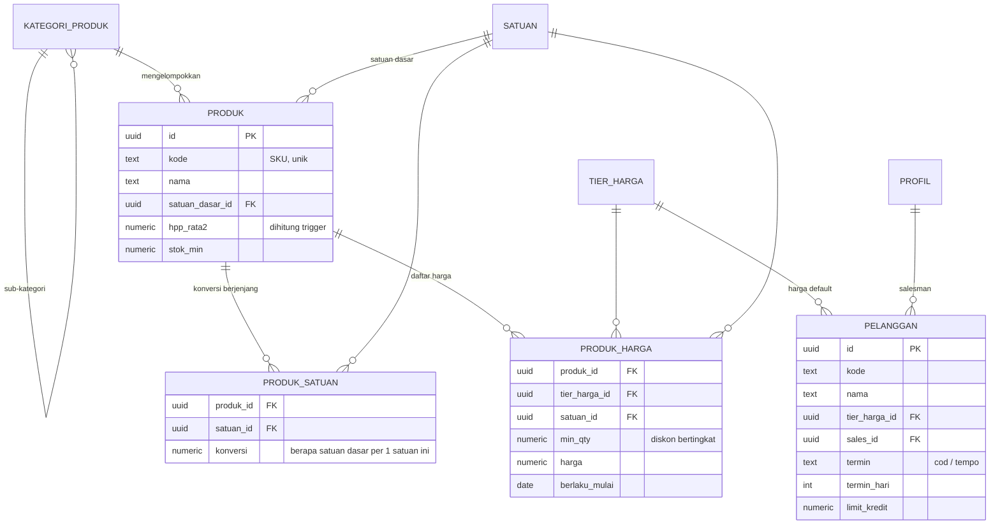
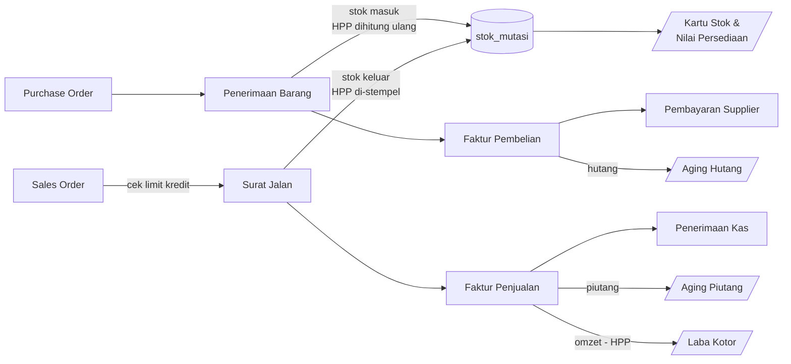

# Skema Database — Ayyubi Finance (Fase 1 & 2)

Postgres / Supabase. Penamaan tabel dan kolom memakai bahasa Indonesia
agar konsisten dengan istilah yang dipakai di lapangan.

Cakupan file ini: **Fase 1** (jual sampai terima uang) dan **Fase 2**
(beli, HPP, laba). CRM, akuntansi penuh, dan HR belum termasuk.

---

## 1. Ringkasan modul

| Migrasi | Isi |
|---|---|
| `0001_ekstensi_enum.sql` | Ekstensi, enum, penomoran dokumen otomatis |
| `0002_master_data.sql` | Profil, gudang, kategori, satuan, produk, satuan berjenjang, tier & daftar harga, pelanggan, supplier |
| `0003_inventori.sql` | Saldo stok, kartu stok, penyesuaian, transfer gudang |
| `0004_penjualan.sql` | SO → Surat Jalan → Faktur → Penerimaan Kas, retur jual |
| `0005_pembelian.sql` | PO → Penerimaan Barang → Faktur Beli → Pembayaran, retur beli |
| `0006_fungsi_trigger.sql` | HPP rata-rata bergerak, posting stok, total dokumen, limit kredit |
| `0007_view_laporan.sql` | Stok, kartu stok, aging piutang/hutang, laba kotor |
| `0008_rls.sql` | Row Level Security per peran |
| `0009_seed_awal.sql` | Satuan, tier harga, gudang, kategori awal |
| `0010_kas_bank.sql` | Akun kas/bank, saldo & kartu per akun -- **migrasi tambahan**, ditulis setelah 0001-0009 sudah dijalankan di database asli, jadi dirancang non-destruktif (backfill, bukan drop/replace) |
| `0011_pelanggan_crm.sql` | Field persiapan CRM di `pelanggan` + 4 tabel wilayah administratif (Provinsi/Kab-Kota/Kecamatan/Kelurahan), data resmi Kemendagri -- **butuh langkah tambahan**: 3 import CSV terpisah dari SQL (kab/kota, kecamatan, kelurahan), lihat README.md |
| `0012_pelanggan_tipe_sumber.sql` | Ganti total daftar `tipe_pelanggan` (Customer/Mitra/Horeka/Perusahaan, dari 5 nilai lama) + kolom `sumber` (ganti `kanal_akuisisi`) |

Total 44 tabel + 14 view (di luar ~91.600 baris data referensi wilayah).
Migrasi 0010 dan seterusnya adalah tambahan
inkremental di atas skema Fase 1 & 2 -- selalu jalankan berurutan sesuai
nomor, jangan lompat.

---

## 2. ERD

### 2.1 Master data



### 2.2 Inventori — semua pergerakan bermuara ke sini


`STOK_MUTASI` adalah buku besar persediaan: **append-only**, tidak boleh
di-`UPDATE` atau `DELETE` (dijaga trigger). Tabel `STOK` hanyalah saldo
hasil rekap agar query cepat.

### 2.3 Siklus penjualan (Fase 1)


### 2.4 Siklus pembelian (Fase 2)


### 2.5 Alur dokumen dan dampaknya ke stok / uang



---

## 3. Keputusan desain yang perlu diketahui

**Satuan berjenjang.** Stok, HPP, dan seluruh kolom `qty_dasar` selalu
dalam **satuan dasar**. Setiap baris transaksi menyimpan `satuan_id` +
`konversi` yang dipakai saat itu, lalu `qty_dasar` di-*generate* otomatis
(`qty * konversi`). Konversi disalin ke baris transaksi, bukan dibaca
ulang dari master, supaya dokumen lama tidak berubah ketika master
satuan diedit.

**HPP rata-rata bergerak (moving average).** Dipelihara di
`produk.hpp_rata2` per produk, lintas gudang:

```
HPP_baru = (qty_lama × HPP_lama + qty_masuk × harga_masuk) / (qty_lama + qty_masuk)
```

Hanya barang **masuk** yang menggerakkan HPP. Barang keluar memakai HPP
yang berlaku saat itu dan menyimpannya di `stok_mutasi.hpp_satuan`.
Biaya angkut di penerimaan barang (`biaya_tambahan`) dialokasikan
proporsional terhadap nilai baris, jadi ongkos kirim ikut masuk HPP.

**Snapshot HPP di faktur.** `faktur_penjualan_item.hpp_satuan` diisi
sekali saat faktur dibuat. Tanpa ini, laporan laba bulan lalu akan
berubah setiap kali ada pembelian baru yang menggeser rata-rata.

**Posting stok baru terjadi saat status `selesai`.** Dokumen berstatus
`draf` boleh diedit bebas tanpa menyentuh stok. Pembatalan tidak
menghapus baris kartu stok, melainkan membuat **mutasi balik**.

**Stok minus ditolak.** Trigger memblokir mutasi keluar yang membuat
saldo gudang negatif, kecuali jenis `saldo_awal` (untuk migrasi data).
Kalau bisnisnya memperbolehkan jual-dulu-kirim-belakangan, longgarkan di
`fn_mutasi_sebelum()`.

**Limit kredit.** Dicek saat Sales Order disetujui, hanya untuk pelanggan
bertermin `tempo` dengan `limit_kredit > 0`.

**Non-PKP, tidak ada PPN.** Ayyubi Finance belum PKP, jadi kolom
`ppn_persen`/`ppn_nilai` tetap ada di skema (supaya tidak perlu migrasi
ulang kalau suatu saat jadi PKP) tapi **selalu 0** dan **disembunyikan
dari form**. `dpp` dan `total` di kode aplikasi jadi identik.

**Kanal penjualan (`kanal_penjualan`).** Ayyubi jualan lewat dua pola
sekaligus: canvassing (sales bawa barang, transaksi tuntas di tempat)
dan online (Tokopedia/Shopee/TikTok/WhatsApp). Kolom `kanal` di
`sales_order` dan `faktur_penjualan` menandai asal order, dipakai untuk
laporan omzet per kanal.

Pesanan online **tidak** membuat satu baris `pelanggan` per pembeli —
platform sudah memegang data itu, dan volumenya bisa ratusan per bulan.
Sebagai gantinya, seed (`0009`) menyediakan empat akun pelanggan
agregat (`SHOPEE`, `TOKPED`, `TIKTOK`, `WA-UMUM`); order online
menunjuk ke akun agregat kanalnya, dan nama penerima paket yang
sesungguhnya disimpan di `sales_order.nama_penerima` (bukan relasi ke
tabel `pelanggan`). Kalau ada pembeli WA yang jadi langganan tetap dan
perlu dilacak/ditagih sendiri, buat baris `pelanggan` khusus untuknya —
akun `WA-UMUM` hanya untuk transaksi lepas.

Yang **tidak** termasuk di sini: sinkronisasi otomatis via API
marketplace (ambil order langsung dari Shopee/Tokopedia/TikTok). Order
online tetap diinput manual oleh staf ke Sales Order. Integrasi API
per platform adalah pekerjaan terpisah yang jauh lebih besar (autentikasi
per platform, webhook, pemetaan SKU, throttling) — taruh di backlog
fase lanjut kalau volumenya sudah menjustifikasi.

**Nomor dokumen.** Format `PREFIX/YYYY/MM/00001`, dihasilkan
`generate_nomor()` dan direset tiap bulan. Kirim `nomor` sebagai `null`
dari aplikasi — trigger yang mengisi.

**Kas & Bank (`akun_kas_bank`, ditambah lewat 0010).** Sebelum ini,
`penerimaan_kas`/`pembayaran_supplier` cuma punya kolom teks bebas
`bank_nama` — uangnya tidak benar-benar tertaut ke rekening/kas manapun,
tidak ada cara melihat saldo per akun. Sekarang setiap transaksi WAJIB
menunjuk `akun_id`. Saldo per akun dihitung **live lewat view**
(`v_saldo_kas_bank` = `saldo_awal` + semua penerimaan − semua
pembayaran berstatus bukan `dibatalkan`/`ditolak`), bukan kolom saldo
tersimpan yang perlu trigger — sengaja dihindari karena sesi ini sudah
2 kali menemukan bug "lupa cabang pembalikan saat dibatalkan" pada
trigger posting bergaya lama; view yang dihitung ulang tiap query tidak
punya kelas bug itu sama sekali. `v_kartu_kas_bank` memakai pola
window-function yang sama seperti `v_kartu_stok` untuk saldo berjalan.
Kolom `bank_nama` lama di kedua tabel transaksi **dibiarkan** (bukan
di-drop) karena 0010 ditulis setelah database sudah berisi data uji
coba — lihat migrasi 0010 untuk detail backfill-nya.

**Pelanggan: alamat berjenjang & field CRM (0011).** Dua kebutuhan
digabung jadi satu migrasi karena diminta di sesi yang sama:

1. *Field persiapan CRM* — `whatsapp`, `sosial_media`, `tanggal_lahir`,
   `kanal_akuisisi` (reuse enum `kanal_penjualan` — dari mana pelanggan
   ini pertama kali datang), `tag` (`text[]`, bebas: VIP/reseller/dst.).
   Semua nullable/opsional, murni supaya Fase 3 (CRM sungguhan —
   pipeline, follow-up, kampanye) tidak perlu migrasi "ubah struktur"
   yang menyakitkan setelah data pelanggan menumpuk. Yang **sengaja
   belum** ditambahkan karena butuh tabel/desain sendiri, bukan sekadar
   kolom: poin loyalti (perlu ledger earn/redeem), referral (FK
   self-referencing + UI pilih), tahap pipeline/status lead (itu
   `leads`/`opportunities`, bukan atribut pelanggan) — ditunda sampai
   Fase 3 benar-benar digarap.

2. *Alamat berjenjang resmi* — 4 tabel referensi (`wilayah_provinsi` →
   `wilayah_kabupaten_kota` → `wilayah_kecamatan` → `wilayah_kelurahan`),
   data asli Kemendagri (38 / 514 / 7.285 / 83.762 baris, dari
   `emsifa/api-wilayah-indonesia`), dropdown bertingkat di form
   Pelanggan. Dipilih ketimbang 4 kolom teks bebas karena tujuannya
   eksplisit: data untuk **analisis CRM & targeting iklan** ke depan —
   teks bebas ("Bandung" vs "Kota Bandung" vs "kota bdg") akan merusak
   agregasi itu. Kode wilayah dipakai apa adanya dari sumber (mis.
   `"32.73.01.1001"`) supaya gampang disinkronkan ulang kalau sumbernya
   update. Tabel `wilayah_*` murni referensi: RLS baca-saja untuk semua
   pengguna, tidak ada policy tulis sama sekali (aplikasi tidak pernah
   menulis ke situ). Data Kabupaten/Kota, Kecamatan, dan Kelurahan
   (91.561 baris gabungan) sengaja **tidak** ikut sebagai INSERT literal
   di migrasi — percobaan pertama (~280 KB SQL) gagal ditempel di SQL
   Editor Supabase ("request entity too large", batas Supabase sendiri).
   Disediakan sebagai 3 file CSV di `supabase/seed-data/`, diimpor lewat
   **Table Editor** satu per satu dengan urutan yang wajib (kab/kota →
   kecamatan → kelurahan, karena `kode`-nya foreign key berjenjang) —
   lihat README.md bagian atas untuk langkah lengkapnya. Hanya Provinsi
   (38 baris, kecil) yang tetap inline di migrasi sebagai SQL biasa.

Kolom `pelanggan.kota` (teks bebas, dari skema awal) **dibiarkan**
tidak dipakai lagi oleh form — digantikan `kabupaten_kode` yang
terstruktur — tapi tidak di-drop, pola yang sama dengan `bank_nama`.

**Tipe & Sumber pelanggan diganti total (0012).** `tipe_pelanggan`
sebelumnya 5 nilai (perorangan/toko/grosir/instansi/marketplace),
diganti jadi 4 (**Customer/Mitra/Horeka/Perusahaan**) — "Horeka"
(Hotel/Restoran/Kafe) ditambahkan karena Ayyubi bisnis F&B, segmen
B2B ini penting dan tidak tertangkap kategori lama. Postgres tidak
bisa menghapus nilai enum yang sudah dipakai (cuma bisa nambah), jadi
0012 bikin tipe enum baru lalu pindahkan data (peta nilai lama →
baru: perorangan/marketplace→customer, toko/grosir→mitra,
instansi→perusahaan), baru buang tipe lama — dibungkus DO block yang
mengecek dulu apakah enum lama masih ada, supaya migrasi ini aman
dijalankan berkali-kali tanpa salah petakan data yang sudah baru.

Kolom `kanal_akuisisi` (baru ditambah di 0011) **langsung di-drop**
(bukan dibiarkan) digantikan `sumber` (Relasi/Sosmed/Shopee/Tiktok/
Website/**Custom** + `sumber_custom` teks bebas kalau pilih Custom) —
konsepnya sama tapi daftar nilainya beda, dan kolom lama itu belum
sempat terpakai data sungguhan sama sekali (fiturnya baru saja jadi),
jadi drop langsung lebih bersih ketimbang menumpuk kolom mati. Ini
beda dari pola "jangan pernah drop" di kolom lain (`bank_nama`,
`kota`) yang sudah berpotensi ada datanya.

4 akun agregat marketplace dari seed 0009 (SHOPEE/TOKPED/TIKTOK/
WA-UMUM) ditata ulang: `tipe` jadi `customer`, `sumber` diisi sesuai
platform (Tokopedia & WhatsApp lewat `sumber = 'custom'` karena tidak
ada di daftar baku Sumber).

**ID pelanggan dijaga unik (`kode`, sudah `unique` sejak skema awal
0002) -- nomor HP SENGAJA tidak.** Sempat ditambah unique constraint
di `telepon` juga, tapi dibatalkan atas permintaan user: karena ID
sudah terstruktur & unik (prefix per Tipe + nomor urut, lihat bagian
prefix ID di bawah), itu dianggap cukup sebagai pembeda pelanggan --
nomor HP boleh sama (mis. satu keluarga/toko pakai nomor yang sama
untuk beberapa pelanggan berbeda). Di sisi form (`PelangganForm.tsx`),
pelanggaran unik ID dari Postgres (kode error `23505`) diterjemahkan
jadi pesan bahasa Indonesia yang jelas ("ID ... sudah dipakai
pelanggan lain") lewat `ramahkanErrorSimpan()`, bukan pesan teknis
Postgres apa adanya.

**Daftar Pelanggan: `v_limit_kredit` diganti `v_pelanggan_ringkas`
(0014).** Sejak form Pelanggan dipersingkat, Termin & Limit Kredit
tidak bisa diisi lagi lewat form (selalu default COD/0) -- kolom
Termin/Limit Kredit/Sisa Limit di daftar Pelanggan jadi percuma,
semua baris tampil "COD"/"-". `v_limit_kredit` cuma dipakai di SATU
tempat (`Pelanggan.tsx`), jadi aman diganti total lewat migrasi baru:
`drop view v_limit_kredit`, ganti `v_pelanggan_ringkas`.

Isi kolomnya sengaja dibuat mengikuti PERSIS field yang ada di form
Pelanggan (user: "cukup tampilkan semua yang tadi di input saja") --
`tipe`, `kontak_nama`, `sales_nama` (join ke `profil`), `telepon`,
`whatsapp`, `email`, `sumber`/`sumber_custom`, `tanggal_lahir`,
`sosial_media`. Dua pengecualian sengaja:
- **Piutang DIBUANG** -- user: "Master data tidak perlu ada piutang,
  piutang di munculkan di tempat lain" -- itu data transaksi, sudah
  ada tempatnya sendiri di halaman **Laporan Piutang**
  (`v_piutang_aging`), tidak perlu diulang di master data.
- **Alamat berjenjang digabung jadi satu kolom teks** (`alamat_lengkap`,
  lewat `concat_ws` + join ke 4 tabel `wilayah_*`) -- bukan 4 kolom
  wilayah terpisah seperti field-nya di form.

Tabelnya jadi lebar (12 kolom) -- `Table` sudah otomatis
`overflow-x-auto` (lihat `ui.tsx`), jadi discroll horizontal, bukan
dipotong/disembunyikan.

**Input uang pakai pemisah ribuan "1.000.000" (2026-09-05, murni
frontend, tanpa migrasi).** User tanya "Harga beli" di form Purchase
Order itu per satuan atau sudah gabungan -- jawabannya per satuan
(field DB namanya `harga_satuan`, subtotal dihitung trigger dari
`qty * harga_satuan`), diperjelas labelnya jadi "Harga beli / satuan"
(dan padanannya di SO/Retur: "Harga / satuan"). Sekalian diminta
format angka pakai titik ribuan biar tidak salah ketik nol.

Dibuat `InputAngka` di `src/components/ui.tsx` -- pembungkus `Input`
yang menampilkan angka terformat (`toLocaleString('id-ID')`, mis.
"6.500.000") sambil tetap menyimpan `number` biasa sebagai value.
Diketik live (bukan cuma format saat blur) -- posisi kursor dihitung
ulang berdasarkan jumlah DIGIT (bukan karakter) sebelum posisi
semula, supaya titik pemisah yang muncul/hilang saat mengetik tidak
mendorong kursor ke tempat salah. Value 0 ditampilkan kosong (bukan
"0") supaya gampang mulai ngetik dari nol tanpa masalah "0" nyangkut
di depan.

Dipasang HANYA di field nominal uang (bukan qty/persen/hari, yang
risiko salah-ketiknya beda dan biasanya angkanya kecil): Saldo awal
(Akun Kas & Bank), Harga beli/jual per satuan (PO, SO, Retur jual/beli,
harga jual Produk), Harga terima & Biaya tambahan (Penerimaan Barang),
Jumlah bayar per faktur (Penerimaan Kas, Pembayaran Supplier), HPP
(Penyesuaian Stok).

**Desain cetak Invoice dirombak sesuai contoh referensi (2026-09-05,
murni frontend).** User kirim screenshot template invoice (band hijau
di atas, "INVOICE" besar di kanan, baris info 3 kolom, tabel item
berkop warna, total digarisbawahi bar warna). Diterapkan ulang di
`FakturPenjualanCetak.tsx` dengan warna brand Ayyubi sendiri (pakai
utility `bg-primary`/`text-primary`/`text-primary-foreground` yang
sudah ada -- bukan warna hijau contoh langsung, supaya konsisten
dengan tema aplikasi yang sudah divalidasi CVD-safe) -- bukan tiru
persis warna templatenya. Field yang tidak ada padanan datanya di
sistem ini (metode pembayaran, tanda tangan "Accounts Manager", detail
kontak perusahaan) SENGAJA tidak dipaksakan ada -- tidak fabrikasi
data yang tidak dimiliki, cukup diganti kalimat penutup "Terima kasih"
generik. Status pembayaran (Lunas/Belum Bayar/Sebagian) ditonjolkan
sebagai pengganti "TOTAL DUE" di contoh (konsep beda: kita punya
status bayar bertingkat, bukan cuma "dibayar berapa").

**Ukuran kertas cetak: Surat Jalan A6, Invoice A4 (2026-09-05, murni
frontend).** User: label pengiriman (SJ) dicetak A6, invoice dicetak
A4. Diterapkan lewat `<style>{@media print { @page { size: ...; margin:
...; } }}</style>` inline di tiap komponen cetak (scoped per halaman,
bukan CSS global -- karena tiap dokumen cetak butuh ukuran kertas
beda, taruh di `index.css` akan berlaku salah untuk salah satu). Lebar
kontainer juga diset eksplisit pakai satuan mm (`w-[105mm]`/
`w-[210mm]`) supaya preview di layar sebelum print sudah proporsional
dengan ukuran kertas asli, bukan cuma benar pas dicetak.

Sekalian `SuratJalanCetak.tsx` dirapikan buat muat di A6 yang sempit:
font & padding diperkecil, blok "Kepada"+"Pengiriman" 2 kolom disatukan
jadi 1 kolom (2 kolom kepenuhan di lebar 105mm), field Gudang asal/
Sales Order dibuang (referensi internal, tidak perlu di label
pengiriman B2C), No. kendaraan/Sopir digabung ke blok Kepada.

**Cetak Surat Jalan disederhanakan untuk B2C + Invoice ditambah
(2026-09-05, lanjutan langsung dari cetak SJ, murni frontend).** User
kasih koreksi begitu lihat hasil cetak pertama: "untuk customer b2c,
tidak perlu ada surat jalan. yang perlu ada itu paket itu dikirim
pakai ekspedisi apa." Tiga perbaikan di `SuratJalanCetak.tsx`:
1. Header kiri cuma logo Ayyubi Food (dibuang teks "Ayyubi Finance /
   Dagang & Distribusi" di sampingnya).
2. Judul "SURAT JALAN" diganti nama ekspedisi (`sj.ekspedisi`) sebagai
   teks besar -- BELUM logo asli ekspedisi (JNE/J&T/dst.) karena tidak
   ada aset logo-nya di proyek ini; kalau user kirim file logo,
   tinggal ganti `<p>{sj.ekspedisi}</p>` jadi ``. Baris "Ekspedisi:
   ..." yang tadinya duplikat di blok "Pengiriman" juga dibuang karena
   sudah jadi judul.
3. Blok tanda tangan Pengirim/Penerima dihapus total.

Sekalian dibuat **Invoice** (`src/pages/FakturPenjualanCetak.tsx`,
route `faktur-penjualan/:id/cetak`) -- user tanya di mana invoice-nya,
ternyata belum ada versi cetaknya sama sekali (Faktur Penjualan
sendiri sebagai FITUR/menu sudah ada dari awal, cuma belum bisa
dicetak). Pola sama persis cetak SJ (route root di luar `Layout`,
tombol `print:hidden`, tombol "Cetak" di halaman detail buka tab
baru) -- isinya kop (cuma logo, tanpa tanda tangan, konsisten dengan
poin di atas), info pelanggan (nama, kontak, alamat gabungan via
nested embed ke 4 tabel wilayah lewat relasi `pelanggan`), tabel item
lengkap dengan harga/diskon/subtotal, dan ringkasan Subtotal/Total/
Terbayar/Sisa tagihan.

**Cetak Surat Jalan (2026-09-05, murni frontend, tanpa migrasi).** User:
"dimana saya bisa print orderan untuk saya serahkan ke jasa kirim" --
aplikasi ini belum punya fitur cetak/print sama sekali (dicek, tidak
ada `window.print`/`@media print` di mana pun sebelum ini). Dokumen
yang relevan untuk diserahkan ke kurir/jasa kirim adalah **Surat
Jalan** (bukan Sales Order -- SJ yang punya alamat kirim, nama/telepon
penerima, ekspedisi), jadi fitur cetak dipasang di situ.

Dibuat halaman baru `src/pages/SuratJalanCetak.tsx` di route
`surat-jalan/:id/cetak` -- SENGAJA didaftarkan sebagai route ROOT
terpisah di `App.tsx` (sejajar dengan `<Route element={<Layout />}>`,
bukan di dalamnya) supaya render TANPA sidebar/chrome aplikasi, cuma
kop surat + tabel item + kolom tanda tangan pengirim/penerima -- siap
cetak. Tombol "Kembali"/"Cetak" di halaman itu sendiri disembunyikan
saat print lewat utility bawaan Tailwind `print:hidden` (bukan CSS
custom). Link "Cetak" ditambah di halaman detail Surat Jalan, buka
tab baru (`target="_blank"`) supaya halaman detail aslinya tidak
hilang. Tetap butuh login (halaman ini ada di dalam gate sesi yang
sama, cuma di luar `Layout` -- akses tanpa session tetap kena redirect
ke Login seperti biasa).

**Ongkir pembelian sudah ADA, cuma beda halaman (dijelaskan ke user,
bukan fitur baru).** User: "saya juga tidak bisa isi ongkir untuk
pembelian" -- dicek, field "Biaya tambahan (ongkos angkut/bongkar)"
sudah ada dan berfungsi penuh (`penerimaan_barang.biaya_tambahan`,
sejak awal), TAPI letaknya di form **Penerimaan Barang** (saat barang
benar-benar diterima), bukan di **Purchase Order** (saat pesan) --
sengaja begitu karena ongkos riil biasanya baru diketahui saat barang
sampai, bukan saat pesan. User kemungkinan cuma belum sampai ke layar
Penerimaan Barang.

**Kolom "Total" live di baris tambah item (2026-09-05, murni frontend,
tanpa migrasi).** Lanjutan langsung dari penjelasan "Harga beli itu per
satuan" -- user minta ditambah kolom Total supaya kelihatan hasil
kali-nya sebelum klik Tambah, tidak perlu mengira-ngira sendiri.
Ditambah kolom "Total" (non-editable, cuma tampilan hasil hitung
`qty * harga_satuan * (1 - diskon_persen/100)`, format `rupiah()`)
di baris tambah item **Purchase Order, Sales Order, Retur Penjualan,
Retur Pembelian** -- 4 form yang punya pola "tambah baris item via
Combobox" yang identik. Retur (tidak punya Diskon%) hitungannya cuma
`qty * harga_satuan`. Grid kolom diperlebar 1 slot (`1fr`) untuk
menampung kolom baru ini. TIDAK diterapkan di Penerimaan Barang/
Penyesuaian Stok -- bentuk UI-nya beda (tabel baris-existing dengan sel
yang diedit langsung, bukan form tambah-baris-baru terpisah), butuh
pendekatan berbeda kalau nanti diminta.

**Script reset sebelum go-live (2026-09-05, `reset-sebelum-live.sql`).**
User: "ini kan masih uji coba ya, saya mau ketika deploy nanti,
angka-angka yang di input itu bisa 0 dulu semuanya." Diklarifikasi
dulu lewat AskUserQuestion (2 pertanyaan: master data ikut dihapus
atau tidak; saldo awal Kas & Bank ikut direset atau tidak) sebelum
menulis satu baris SQL pun -- ini operasi destruktif, salah asumsi di
sini jauh lebih mahal daripada di fitur biasa. Hasil: master data
(Produk/Pelanggan/Supplier/Kategori/Gudang/Akun Kas & Bank/Wilayah/
profil) TETAP, cuma transaksi & angka turunannya yang direset.

Dibuat `supabase/reset-sebelum-live.sql` -- **SENGAJA DI LUAR**
`supabase/migrations/`, supaya tidak ketiban dianggap bagian dari
urutan migrasi biasa (skrip ini destruktif & sekali-jalankan-saja,
beda sifat total dari migrasi skema yang idempotent by design). Isinya:
satu `TRUNCATE ... CASCADE` untuk 29 tabel transaksi (semua dokumen +
item + alokasi + stok_mutasi + stok + dokumen_counter, terverifikasi
lengkap lewat cross-check ke semua `create table` di seluruh file
migrasi), plus `UPDATE produk SET hpp_rata2 = 0` dan
`UPDATE akun_kas_bank SET saldo_awal = 0`. Dibungkus `begin`/`commit`
biar atomic. Didokumentasikan di README.md root sebagai section
terpisah "Sebelum mulai pakai sungguhan (go-live)", bukan di daftar
migrasi yang perlu dijalankan.

**PO/SO yang dibatalkan bisa dibuka lagi jadi Draf (2026-09-05, murni
frontend, tanpa migrasi).** User tunjuk PO berstatus "Dibatalkan"
(Total Rp 0, tidak pernah punya item) minta bisa diedit lagi. Dicek:
`Batalkan` HANYA bisa dipanggil dari status `draf` (bukan dari
`disetujui`/`sebagian`) -- artinya dokumen yang sampai ke status
`dibatalkan` PASTI belum pernah lewat proses Setujui (yang mengunci
stok/efek finansial), jadi aman dibuka lagi ke `draf` tanpa perlu
membalik efek apa pun. Ditambah tombol "Buka Lagi jadi Draf" untuk
status `dibatalkan` di **Purchase Order** dan **Sales Order** (2 form
yang punya pola draf->dibatalkan persis sama). Diperiksa juga
Penyesuaian Stok/Retur/Surat Jalan/Penerimaan Barang -- SENGAJA TIDAK
diberi tombol serupa, karena `dibatalkan` di situ dicapai dari status
`selesai` (bukan `draf`) yang berarti ADA efek stok nyata yang sudah
dibalik trigger -- membuka lagi ke draf di situ jauh lebih berisiko
(perlu re-apply efek, bukan sekadar ganti status).

**Audit menyeluruh: data master yang perlu "ikut" ke dokumen transaksi
(0018, 2026-09-05).** User minta prinsip umum, bukan cuma Sales Order:
"semua data yang ada di master data itu, ketika di orderan/pembelian,
mestinya kalau datanya diambil ikut semua dong, disesuaikan dengan
data apa yang perlu diambil." Diaudit SEMUA form yang memilih Pelanggan/
Supplier:
- **Purchase Order** -- sudah lengkap, cuma `termin_hari` yang relevan
  dari master Supplier (PO tidak butuh alamat, barang masuk KE kita).
- **Faktur Penjualan/Pembelian, Penerimaan Kas, Pembayaran Supplier,
  Retur Penjualan/Pembelian** -- pelanggan/supplier cuma dipilih untuk
  memfilter daftar dokumen outstanding (SJ/PB/faktur) yang mau
  digabung/dibayar/diretur -- tidak ada field alamat/kontak di
  tabelnya, jadi memang tidak ada yang perlu ditarik.
- **Surat Jalan** -- INI yang ketinggalan. Sudah ikut `alamat_kirim`
  dari SO (dari awal), tapi TIDAK ikut `nama_penerima`/
  `telepon_penerima` (field baru di SO dari 0017) -- padahal ini
  persis info yang dibutuhkan sopir/kurir (tahu serahkan ke siapa,
  bisa hubungi siapa kalau alamat susah dicari). 0018 menambah 2
  kolom itu ke `surat_jalan`, di-carry otomatis dari SO sumbernya
  (pola sama `alamat_kirim`), tetap bisa diedit manual di form Surat
  Jalan Baru kalau beda dari SO.

**Sales Order: pilih Pelanggan -> alamat kirim & telepon terisi
otomatis (0017, 2026-09-05).** User: "kita sudah buat master data
customer, kenapa saat pilih customer alamat dan nomor HP tidak terisi
otomatis?" -- benar, `pilihPelanggan()` di `SalesOrderForm.tsx`
sebelumnya cuma menarik `tier_harga_id`/`termin`/`termin_hari` dari
pelanggan terpilih, alamat & telepon dibiarkan kosong padahal datanya
sudah ada di master Pelanggan sejak 0011. Diperbaiki: query saat pilih
pelanggan diperluas, embed join ke 4 tabel `wilayah_*` (pola sama
`Supplier.tsx`) untuk menyusun `alamat_kirim` (concat alamat + nama
wilayah), dan ambil `whatsapp`/`telepon` untuk field baru
**Telepon/WA penerima**. Kolom itu belum ada di `sales_order` -- 0017
menambah `telepon_penerima` (pasangan `nama_penerima` yang sudah ada,
sama-sama field override kalau penerima beda dari akun pelanggan
terdaftar, mis. pesanan online). Auto-isi ini MENIMPA tanpa guard
kalau ganti pelanggan (konsisten dengan `tier_harga_id`/`termin` yang
memang sudah begitu dari awal di fungsi yang sama) -- field-nya tetap
bisa diedit manual setelah terisi.

**Alamat Supplier disamakan dengan Pelanggan -- wilayah berjenjang
(0016, 2026-09-05).** User: "input alamatnya di buat kaya bagian
customer ya". Tabel `supplier` belum punya kolom wilayah sama sekali
(beda dari `pelanggan` yang sudah dapat di 0011) -- 0016 menambah 4
kolom (`provinsi_kode`/`kabupaten_kode`/`kecamatan_kode`/
`kelurahan_kode`, referencing tabel `wilayah_*` yang sama, pola persis
0011). Kolom `kota` (teks bebas lama) DIBIARKAN tidak dipakai form
lagi, tidak di-drop -- pola sama seperti `pelanggan.kota` sebelumnya.

`SupplierForm.tsx` sekarang pakai 4 `Combobox` wilayah + Alamat, identik
strukturnya dengan `PelangganForm.tsx`. Karena logikanya (filter lokal
`cariOpsi`) sekarang dipakai 2 form, `buatCariWilayah()` DIPINDAH dari
`PelangganForm.tsx` ke `src/lib/queries.ts` (di-export, diimpor kedua
form) -- supaya tidak duplikasi kode.

Efek samping: daftar Supplier (`Supplier.tsx`) yang tadinya menampilkan
kolom "Kota" (teks bebas, bakal selalu kosong untuk supplier baru sejak
form-nya diganti) diubah embed join `kabupaten_kode(nama)` lewat
PostgREST, fallback ke `kota` lama kalau kosong -- supaya tidak
mengulang masalah "kolom selalu kosong" yang sudah pernah kejadian di
daftar Pelanggan.

**SKU Produk diprefix otomatis dari kode Kategori (2026-09-05, murni
frontend, tanpa migrasi).** User minta pola sama seperti prefix ID
Pelanggan per Tipe: pilih Kategori -> SKU otomatis diawali kode
kategorinya. `kategori_produk.kode` sudah ada dari skema awal (unique)
-- TIDAK perlu kolom baru, cukup ubah alur "+ Tambah kategori baru..."
di `ProdukForm.tsx`: sebelumnya `kode` auto-slugify dari nama lengkap
(bisa panjang, mis. "KERUPUK-PEDAS-ORIGINAL"), sekarang user ETIK
sendiri "Kode awal" pendek (mis. "MKR") terpisah dari Nama, dibatasi 10
karakter. Pilih/buat kategori -> field Kode (SKU) di form Produk Baru
auto-terisi `<kode>-` (fungsi `pilihKategori`, pola guard sama persis
`ubahTipe` di `PelangganForm.tsx` -- tidak menimpa kalau user sudah
ketik nomor). Kategori yang SUDAH ada dari sebelum perubahan ini
kode-nya tetap yang lama (hasil auto-slugify) -- tidak ada migrasi data,
cuma kategori baru ke depannya yang pakai kode pendek pilihan user.

**4 akun agregat marketplace disembunyikan dari daftar Pelanggan (0015).**
User lihat SHOPEE/TIKTOK/TOKPED/WA-UMUM tercampur di daftar Pelanggan,
minta dihapus -- setelah diklarifikasi (2x AskUserQuestion), maksudnya
BUKAN hapus permanen (4 akun ini masih dipakai alur pesanan online
sebagai pelanggan generik, lihat bagian "Kanal jualan dobel" di atas),
tapi disembunyikan dari TAMPILAN saja. Ditambah kolom
`pelanggan.akun_agregat boolean default false`, di-set `true` untuk
ke-4 kode itu, lalu difilter di `v_pelanggan_ringkas`
(`where pl.aktif and not pl.akun_agregat`). Kolom baru ini SENGAJA
bukan hardcode daftar kode di query (supaya kalau nanti nambah kanal
online baru, tinggal set flag-nya, tidak perlu ubah kode lagi). Pencarian
pelanggan di form transaksi lain (`cariPelanggan` combobox di SO/Faktur/
dst.) TIDAK disentuh -- itu query langsung ke tabel `pelanggan`, ke-4
akun ini harus tetap bisa dipilih di sana untuk pesanan online.

**Seluruh UI dikecilkan ke 80% (2026-09-04, `src/index.css`, murni
CSS).** User minta "font dll dikecilin ke 80%". Karena hampir semua
ukuran Tailwind (font, padding, gap, radius, ukuran ikon lucide via
`h-4 w-4` dst.) dalam satuan `rem`, cukup satu baris: `html { font-size:
80%; }` di `@layer base` -- seluruh tampilan ikut mengecil proporsional
tanpa perlu ganti className satu-satu di puluhan file. Border-width
(1px) dan efek blur (`backdrop-filter: blur(20px)`) TIDAK ikut mengecil
(itu bukan satuan rem) -- tapi itu memang tidak masalah, border 1px
tetap tajam itu wajar meski teks mengecil.

**Filter kolom (checklist) di daftar Pelanggan (2026-09-04, murni
frontend).** User: banyak baris yang bakal kosong ("-") di kolom
opsional, minta bisa milih sendiri kolom mana yang mau tampil. Dibuat
`KolomPicker` (langsung di `Pelanggan.tsx`, belum ada alasan
diekstrak jadi komponen bersama karena baru satu tempat pakai) --
tombol "Kolom" + panel checklist, pola outside-click sama seperti
`Combobox.tsx`. ID/Nama/Tipe SELALU tampil (kolom inti); 9 kolom
lain (Kontak, Sales, Telepon, WhatsApp, Email, Sumber, Tanggal lahir,
Media sosial, Alamat) bisa dicentang/lepas. Default tampil cuma
WhatsApp + Sumber + Alamat -- yang paling sering terisi; sisanya
disembunyikan default karena Kontak/Telepon cuma relevan buat Horeka/
Perusahaan (jarang), Tanggal lahir/Media sosial/Email masih jarang
diisi di awal. Pilihan user disimpan di `localStorage`
(`ayyubi-pelanggan-kolom`) -- per-browser, bukan per-akun (tidak ada
tabel/kolom DB untuk ini, sengaja, ini preferensi tampilan bukan data
bisnis).

**Notifikasi "Tersimpan" (toast) ditambah di SEMUA form (2026-09-04,
tanpa migrasi -- ini perubahan frontend murni).** User laporan harus
klik "Simpan" 2x. Ternyata bukan bug klik -- klik pertama sudah
berhasil, tapi aplikasi ini dari awal TIDAK PERNAH punya notifikasi
sukses (tidak ada toast/library sejenis di `package.json`), jadi user
tidak yakin sudah tersimpan dan klik lagi. Paling kentara di alur buat
pelanggan/produk/dll baru: begitu sukses, halaman diam-diam pindah
dari mode "buat baru" ke mode "edit" (URL & judul berganti halus,
gampang tidak disadari) -- klik kedua sebenarnya cuma UPDATE ulang
data yang sama.

Dibuat `src/components/Toast.tsx` -- modul singleton kecil (bukan
context/provider, supaya bisa dipanggil `toast('pesan')` dari mana
saja tanpa hook) dengan array module-level + Set of subscriber,
di-render sekali lewat `<Toaster />` yang dipasang di `App.tsx` (luar
`<Rute />`, jadi tidak remount tiap ganti halaman). Toast otomatis
hilang 3 detik, ada tombol tutup manual. TIDAK pakai library eksternal
(tidak ada di `package.json` sebelumnya, dan tidak perlu -- kasusnya
simpel: satu jenis notifikasi sukses/error, auto-dismiss).

Dipasang di titik sukses SEMUA form transaksi & master data (Pelanggan,
Produk -- termasuk tambah/hapus satuan & harga, Supplier, Akun Kas &
Bank, Sales/Purchase Order -- termasuk tambah/hapus item & ubah status,
Surat Jalan, Faktur Penjualan/Pembelian, Penerimaan Kas/Barang,
Pembayaran Supplier, Retur Penjualan/Pembelian, Penyesuaian Stok) --
setiap `insert`/`update` yang sebelumnya cuma diam-diam `navigate()`
atau `invalidateQueries()` sekarang juga `toast('pesan sesuai aksi')`
dulu. Toggle checkbox "Aktif" SENGAJA tidak diberi toast -- checkbox-nya
sendiri sudah kelihatan berubah, tidak ambigu seperti tombol Simpan.

**Kontak & Telepon disembunyikan kecuali Horeka/Perusahaan, dropdown
Wilayah jadi combobox ketik-cari (2026-09-04, tanpa migrasi baru).**
Field "Kontak" (nama PIC) dan "Telepon" cuma tampil kalau Tipe = Horeka
atau Perusahaan -- Customer/Mitra (mayoritas B2C perorangan) dianggap
cukup dengan WhatsApp saja, form jadi lebih pendek untuk kasus umum.
Nilainya TIDAK dihapus kalau field disembunyikan (cuma disembunyikan
dari tampilan) -- ganti Tipe bolak-balik tidak menghilangkan data yang
sudah terisi. Dropdown Provinsi/Kabupaten-Kota/Kecamatan/Kelurahan
diganti dari `<select>` polos jadi `Combobox` (komponen yang sama
dipakai untuk cari produk/pelanggan/supplier) supaya bisa diketik,
bukan scroll manual di antara puluhan/ratusan opsi -- pencariannya
LOKAL (filter array yang sudah dimuat penuh lewat `staleTime: Infinity`
di hook `useWilayah*`), bukan query baru ke Supabase tiap ketikan.

**Form Pelanggan dipersingkat (setelah 0012, tanpa migrasi baru).**
Field Tier harga, NPWP, Termin, Tempo (hari), Limit kredit, Tag, dan
Catatan dihapus dari `PelangganForm.tsx` — dianggap terlalu panjang
untuk input harian, sementara kolomnya di database **tidak disentuh
sama sekali** (tidak ada migrasi baru untuk ini). Konsekuensinya:
field-field itu memakai default kolom untuk pelanggan baru (Termin
COD, Limit kredit 0, dst) dan tidak bisa lagi diisi/diubah lewat form
— kalau nanti perlu diisi (mis. Mitra/Horeka/Perusahaan yang butuh
termin tempo atau limit kredit), harus lewat SQL manual atau form ini
dibuka kembali. Media sosial, Sumber, dan Tanggal lahir tetap ada
karena masih relevan untuk CRM sehari-hari.

---

## 4. Cara menjalankan

```bash
supabase db reset
```

Atau jalankan berurutan `0001` → `0009` di SQL Editor Supabase.

Setelah user pertama mendaftar, naikkan perannya:

```sql
update profil set peran = 'owner' where id = '<uuid-user>';
```

---

## 5. Contoh alur penuh (uji cepat)

```sql
-- 1. Produk dengan satuan berjenjang: PCS (dasar), LUSIN = 12, DUS = 144
insert into produk (kode, nama, kategori_id, satuan_dasar_id)
select 'SKU-001', 'Sabun Batang', k.id, s.id
from kategori_produk k, satuan s where k.kode = 'UMUM' and s.kode = 'PCS';

insert into produk_satuan (produk_id, satuan_id, konversi)
select p.id, s.id, v.konv
from produk p, satuan s,
     (values ('PCS', 1), ('LSN', 12), ('DUS', 144)) as v(kode, konv)
where p.kode = 'SKU-001' and s.kode = v.kode;

-- 2. Beli 10 DUS @ Rp 900.000 + ongkos angkut Rp 200.000
--    -> HPP per PCS = (9.000.000 + 200.000) / 1.440 = Rp 6.388,89
insert into penerimaan_barang (supplier_id, gudang_id, biaya_tambahan, status)
values ('<supplier>', '<gudang>', 200000, 'draf') returning id;

insert into penerimaan_barang_item (pb_id, produk_id, satuan_id, konversi, qty, harga_satuan)
values ('<pb>', '<produk>', '<satuan DUS>', 144, 10, 900000);

update penerimaan_barang set status = 'selesai' where id = '<pb>';  -- stok & HPP jalan

-- 3. Cek hasilnya
select kode, nama, qty, hpp_rata2, nilai_persediaan from v_stok_produk;
select * from v_kartu_stok order by tanggal, id;
```

---

## 6. Yang belum ada (sengaja ditunda)

| Kebutuhan | Fase |
|---|---|
| Pipeline CRM, kunjungan salesman, target & komisi | 3 |
| Batch / expired date / serial number | 3 |
| Stock opname terstruktur | 3 |
| COA, jurnal umum, neraca, arus kas | 4 |
| e-Faktur / perpajakan | 4 |
| Multi-cabang (dimensi di atas gudang) | 4 |

Kolom `produk.pakai_batch` sudah disiapkan sebagai penanda agar
penambahan batch di fase 3 tidak perlu mengubah struktur transaksi.
